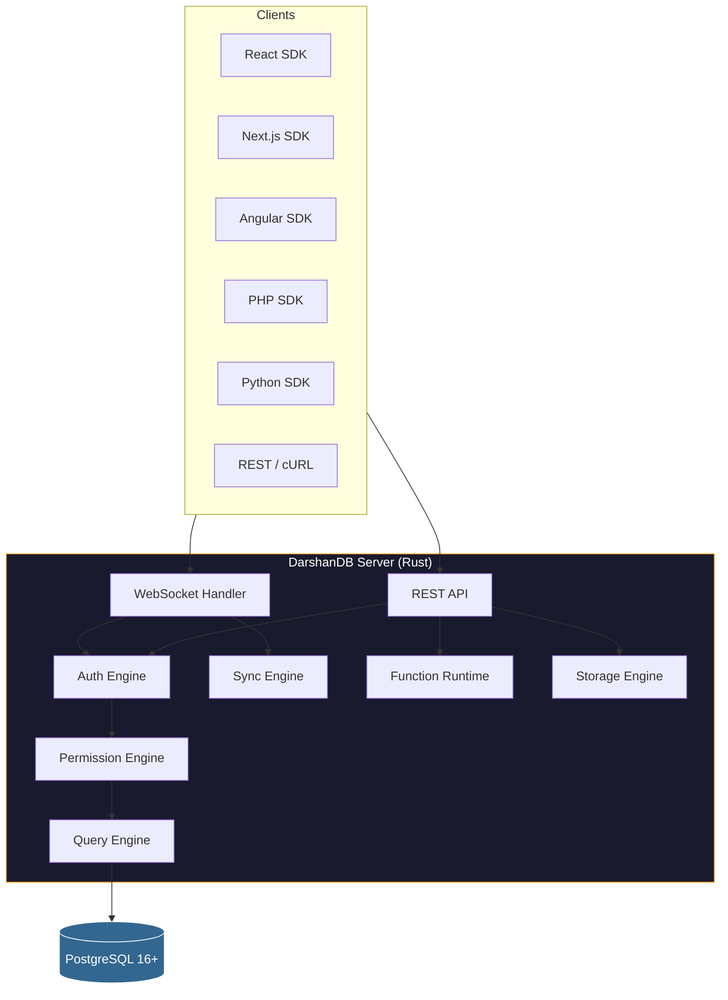

<div align="center">


<br/>

[](LICENSE)
[](https://www.rust-lang.org)
[](https://www.postgresql.org)
[](https://github.com/darshjme/darshandb)

<br/>

**An experimental self-hosted Backend-as-a-Service exploring triple-store architecture over PostgreSQL.**

> **Alpha software.** The subsystems exist and compile, but end-to-end integration is in progress. This is a working codebase, not a production-ready product yet. Contributions and feedback welcome.

</div>

---

## What is DarshanDB?

"Darshan" means "vision" in Sanskrit. DarshanDB is an experiment in building a complete BaaS from a single Rust binary, using a triple-store (Entity-Attribute-Value) data model over Postgres instead of traditional tables.

The goal: give developers the real-time query experience of InstantDB, the server functions of Convex, the Postgres foundation of Supabase, and the self-hosted simplicity of a single binary. Whether we get there is an open question. This repo is the attempt.

### What exists today

- **Triple store engine** over PostgreSQL with schema inference and DarshanQL query language
- **Real-time sync engine** with WebSocket handler, delta diff computation, presence rooms
- **Auth system** with Argon2id password hashing, JWT RS256, OAuth provider framework, MFA/TOTP
- **Permission engine** with row-level security rules that compile to SQL WHERE clauses
- **Server function runtime** with registry, argument validation, and cron scheduler
- **REST API** with content negotiation, SSE subscriptions, OpenAPI spec generation
- **Storage engine** with local filesystem and S3-compatible backends, signed URLs
- **CLI** with commands for dev server, migrations, seeding, logs, backups
- **Client SDKs** for React, Angular, Next.js, PHP, Python (framework-agnostic core)
- **Admin dashboard** in React + Vite + Tailwind with data explorer, schema viz, logs

### What's not done yet

- **End-to-end data flow** is not wired: a React query does not yet hit Postgres through the WebSocket and come back as a live subscription. The integration layer connecting these subsystems is the critical next step.
- **The function runtime** uses subprocess execution, not actual V8 isolates. It's a placeholder that validates the API surface.
- **No published packages** on npm or crates.io yet.
- **No install script** at `darshandb.dev`. The domain is reserved but there's no download page.
- **Performance claims** in earlier commits were theoretical, not measured. We've removed them until we can benchmark real end-to-end flows.

### What's genuinely good

- **438 Rust tests** passing with zero clippy warnings, zero fmt issues
- **92 TypeScript tests**, 141 Python tests, 52 PHP tests across SDK packages
- **Security-first design**: the auth and permission modules have real depth (constant-time TOTP, JWT audience validation, SQL parameterization, path traversal prevention, timing-safe HMAC comparison)
- **The architectural thinking**: EAV triple store with reactive dependency tracking is a genuinely interesting approach to building a real-time database

## Architecture



> **Note:** The arrows represent the intended data flow. Individual modules exist and have tests, but the full request path from client to Postgres and back is not yet integrated.

## Project Structure

```
darshandb/
├── packages/
│   ├── server/          # Rust: triple store, query, sync, auth, functions, API
│   ├── cli/             # Rust: darshan dev/deploy/push/pull/seed
│   ├── client-core/     # TypeScript: framework-agnostic client SDK
│   ├── react/           # React hooks (useQuery, useMutation, usePresence, useAuth)
│   ├── angular/         # Angular signals + RxJS
│   ├── nextjs/          # Next.js App Router + Pages Router
│   └── admin/           # Admin dashboard (React + Vite + Tailwind)
├── sdks/
│   ├── php/             # PHP + Laravel SDK
│   └── python/          # Python + FastAPI/Django SDK
├── docs/                # Documentation (12 guides + strategy docs)
├── examples/            # Example apps (todo, chat, nextjs, plain HTML, cURL)
└── deploy/              # Docker, Kubernetes Helm chart
```

## Technology Stack

| Layer | Choice | Status |
|-------|--------|--------|
| Server | Rust (Axum + Tokio) | Compiles, tests pass |
| Database | PostgreSQL 16+ with pgvector | Schema defined, queries execute in tests |
| Wire Protocol | JSON over WebSocket (MsgPack planned) | Handler exists, not end-to-end |
| Client SDKs | TypeScript | Build and type-check |
| Admin UI | React + Vite + Tailwind | Builds, renders mock data |
| Auth | Argon2id + RS256 JWT | Unit tested |
| CLI | Rust (clap) | Compiles, commands defined |

## Running Locally

```bash
# Prerequisites: Rust 1.70+, Node.js 20+, PostgreSQL 16+

# Clone
git clone https://github.com/darshjme/darshandb.git
cd darshandb

# Run Rust tests
cargo test --workspace

# Run TypeScript tests
npm install && npm test --workspaces --if-present

# Start Postgres (Docker)
docker compose up postgres -d

# Start the server (will connect to Postgres, serve REST API + WebSocket)
cargo run --bin darshandb-server
```

## Roadmap

The immediate priority is getting **one end-to-end path working**:

```
React useQuery() → WebSocket → Query Engine → Triple Store → Postgres
       ↑                                                        |
       └──── Sync Engine ← Dependency Tracker ← Mutation ←─────┘
```

Once a client can subscribe to a query and receive live updates when data changes through the mutation API, the project reaches its first real milestone.

After that:
- Publish `@darshan/client` and `@darshan/react` to npm
- Build the install script and `darshan dev` experience
- Benchmark real performance (not theoretical)
- Harden for production use cases

See `docs/strategy/` for longer-term thinking on AI/ML integration, Web3, enterprise features, and scalability.

## Contributing

We welcome contributions. The most valuable work right now is in the integration layer. See [CONTRIBUTING.md](CONTRIBUTING.md).

```bash
cargo fmt          # Format Rust
cargo clippy       # Lint Rust
cargo test         # Test Rust (438 tests)
npm test           # Test TypeScript (92 tests)
```

## License

MIT. See [LICENSE](LICENSE).

---

<div align="center">

**Built by [Darsh Joshi](https://darshj.ai)** from Ahmedabad, India.

An experiment in building the backend I always wanted.

</div>
