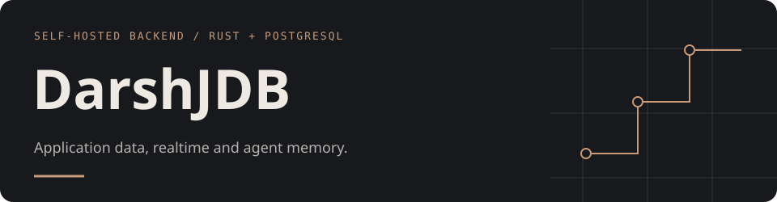
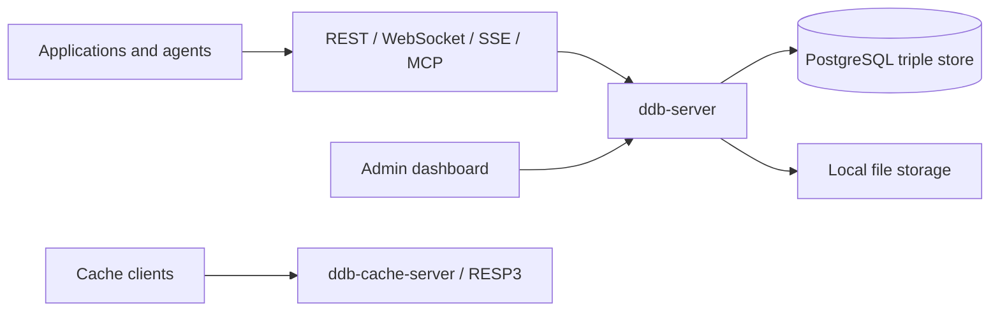

# DarshJDB

**A self-hosted backend in Rust, built around a PostgreSQL triple store.**

DarshJDB gives applications a shared place for data, authentication, queries, realtime subscriptions and files. Its storage model records entity–attribute–value triples with transaction history, so application data can be queried as documents and connected as a graph.

The server also exposes search and agent-memory APIs. Framework clients, an admin dashboard and a separate RESP3 cache server live in the same repository.

**Status: alpha, v0.4.0.** Start with a local development deployment. Read the [operating notes](docs/OPERATING-NOTES.md) before exposing it to users or relying on a particular API path.

[Documentation](docs/README.md) · [API reference](docs/api-reference.md) · [Query language](docs/query-language.md) · [Changelog](CHANGELOG.md) · [MIT license](LICENSE)

## What’s in the repository

| Capability | Implementation |
| :--- | :--- |
| Data and queries | PostgreSQL triple storage, DarshJQL, transactions, retractions and historical reads. |
| Application backend | Authentication, permission rules, REST APIs, WebSocket and SSE subscriptions. Authorization coverage varies by mutation path; see the operating notes. |
| Search and relationships | PostgreSQL full-text search, pgvector-backed entity search, hybrid ranking and graph traversal. |
| Agent memory | Sessions, working/episodic/semantic/archival records, context assembly and MCP integration. Current memory recall uses text matching. |
| Files and administration | Local file storage, chunked uploads and an embedded admin dashboard. |
| Cache | A separate `ddb-cache-server` binary with a RESP3 interface. |
| Clients | Source packages for TypeScript, React, Next.js, Angular, Python and PHP. See each package’s README for its API. |

## Architecture


```mermaid
flowchart LR
    Clients[Applications and agents] --> API[REST / WebSocket / SSE / MCP]
    API --> Server[ddb-server]
    Server --> PG[(PostgreSQL triple store)]
    Server --> Files[Local file storage]
    Admin[Admin dashboard] --> Server
    CacheClients[Cache clients] --> Cache[ddb-cache-server / RESP3]
```

The HTTP server requires PostgreSQL. The optional `embedded-db` feature manages a local PostgreSQL instance; it does not make the HTTP server SQLite-based. The cache server is a separate process, even when both binaries are packaged in one image.

## Local quickstart

Use Docker with Compose, Git and a POSIX shell. This builds from source rather than assuming an image tag or package-registry release is available.

```sh
git clone https://github.com/darshjme/darshjdb.git
cd darshjdb

# In this fresh checkout, create local secrets and bind published ports to loopback.
cat > .env <<EOF
POSTGRES_PASSWORD=$(openssl rand -hex 24)
DDB_JWT_SECRET=$(openssl rand -hex 32)
DARSH_CACHE_PASSWORD=$(openssl rand -hex 24)
DDB_STORAGE_KEY=$(openssl rand -hex 32)
DDB_HOST_PORT=127.0.0.1:7700
DDB_CACHE_HOST_PORT=127.0.0.1:7701
EOF

# The base Compose file does not pass the storage key into the server.
cat > docker-compose.override.yml <<'EOF'
services:
  darshjdb:
    environment:
      DDB_STORAGE_KEY: ${DDB_STORAGE_KEY:?Set DDB_STORAGE_KEY}
EOF

docker compose up --build -d
docker compose ps
docker compose logs --tail=50 darshjdb
curl --fail http://localhost:7700/health
```

The initial build and database startup take time. Retry the health request after the server starts, then open **[localhost:7700/admin](http://localhost:7700/admin)**. Keep `.env` private and retain the storage key with your deployment secrets. Stop the stack with `docker compose down`; named volumes retain its data.

The development stack contains the application server, the cache server and PostgreSQL with extensions. Redis and Qdrant are not required by this Compose configuration. It is a single-node setup, not a high-availability deployment.

## Develop locally

For a source build, use a recent Rust toolchain with 2024-edition support, Node.js **20+**, and PostgreSQL. The Docker build currently uses Rust 1.92 and Node.js 22.

```sh
npm ci
npm run build --workspace=packages/admin
cargo build --locked --bin ddb-server

# Set DATABASE_URL, DDB_JWT_SECRET and DDB_STORAGE_KEY in your environment first.
cargo run --locked --bin ddb-server
```

Build the dashboard before compiling a server intended to serve it: its assets are embedded at compile time. Configuration comes from defaults, TOML files and environment variables; the server also reads `.env`. See [configuration and startup](docs/OPERATING-NOTES.md#configuration-and-startup).

Run checks locally with `cargo test --locked --workspace` and `npm test`. Some checks need services or package-specific setup; consult the relevant package before running them. GitHub Actions is disabled.

## Important boundaries

- PostgreSQL is required for the HTTP server. Vector search and time-series APIs additionally depend on their database extensions and successful schema setup.
- Startup applies embedded migrations and tracks them in `_ddb_migrations`. A failed migration can be logged without aborting startup; a healthy process does not prove every optional feature is ready.
- Agent-memory recall currently uses SQL text matching, even when embedding columns or workers are present. Entity vector search is a separate path.
- File storage uses the local filesystem. Per-transaction audit roots and cross-replica realtime behavior depend on the write path; do not assume uniform guarantees across APIs.

See [operating notes](docs/OPERATING-NOTES.md) for source references and deployment details. Alpha version numbers are not a guarantee of API stability or production readiness.

## Where to go next

- **Understand the model:** [triple store](docs/triple-store.md), [queries](docs/query-language.md), [relations](docs/relations.md).
- **Build an app:** [core client](packages/client-core/README.md), [React](packages/react/README.md), [Next.js](packages/nextjs/README.md), [Angular](packages/angular/README.md).
- **Use another language:** [Python](sdks/python/README.md), [PHP](sdks/php/README.md), [TypeScript SDK](sdks/typescript/README.md).
- **Operate a deployment:** [security](docs/security.md), [subscriptions](docs/subscriptions.md), [storage backends](docs/STORAGE_BACKENDS.md).

Created and maintained by **[Darshankumar Joshi](https://github.com/darshjme)**. Licensed under [MIT](LICENSE).
