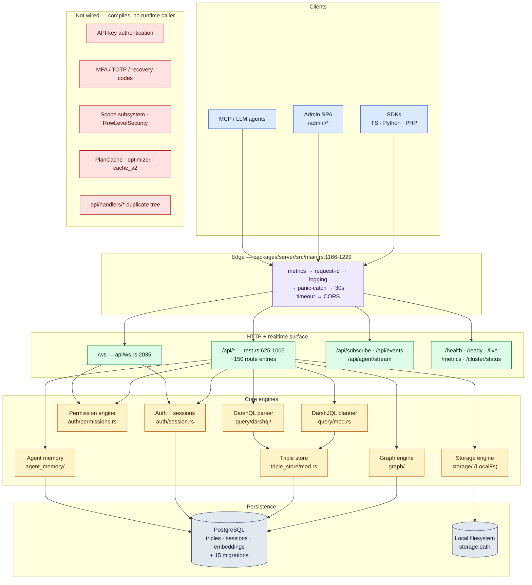
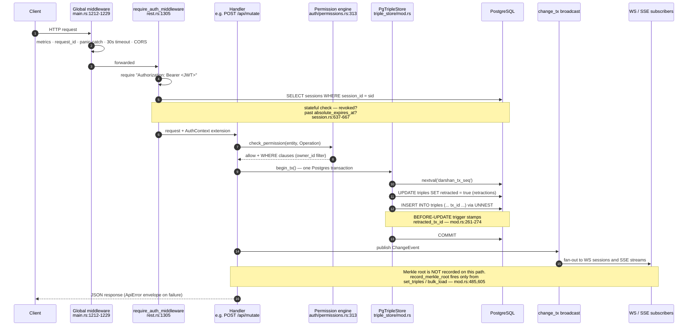

# DarshJDB — Features and Functionality

**What it is.** DarshJDB is a single self-hosted Rust process (`ddb-server`, Axum + Tokio) that
stores all application data as append-only `(entity, attribute, value)` triples in one PostgreSQL
table and exposes them over REST, WebSocket, SSE and the Model Context Protocol, bundled with auth,
row-level permissions, file storage, pgvector search, graph traversal and an agent-memory API.
It is alpha software at v0.4.0: it is not published to any package registry, it has not been run
under production traffic, and several subsystems in the source tree compile but are not reachable
at runtime — those are itemised below rather than omitted.

**Who it is for.** Developers who want a Firebase/Supabase-shaped backend they can run themselves on
one Postgres, who value an immutable audit-friendly write model over raw throughput, and who are
willing to read source. It is not for teams needing multi-tenancy, a stable API contract, or
production SLAs — none of those exist here.

- Repository: `github.com/darshjme/darshjdb`
- Branch documented: `fix/e2e-security-audit-2026-07-25`
- Commit documented: `199e22232a1e5205b938f102cedf0520eb456688` (2026-07-26)
- Author: Darshankumar Joshi · MIT

---

## Status vocabulary

| Status | Meaning |
| --- | --- |
| **Implemented** | A real code path, reachable at runtime through a mounted route, CLI command or wired background task. |
| **Partial** | Reachable, but with a stated caveat that materially limits it. |
| **Not wired** | The code exists and compiles, but nothing at runtime constructs or calls it. Every such entry names what is missing. |
| **Planned** | Not present in the code at all, or present only as a hardcoded placeholder. |

No performance numbers appear in this document. `CHANGELOG.md` 0.4.0 records the previous ones as
fabricated and removed; `cargo bench` (criterion) in `packages/server/` is the only sanctioned way to
produce numbers, and this repository publishes none.

---

## Capability map

---

## Request and write path

---

## 1. Data model and storage engine

### Triple store — **Implemented**

All user data lives in one table: `triples(entity_id UUID, attribute TEXT, value JSONB,
value_type SMALLINT, tx_id BIGINT, created_at, retracted BOOL, retracted_tx_id BIGINT, expires_at)`.
The entity's type is itself a `:db/type` triple; user fields are namespaced `{entity}/{field}`.
Six indexes are created idempotently at boot (entity+attribute partial, GIN on value, tx_id,
entity+tx, attribute partial, expires_at partial).

- DDL and indexes: `packages/server/src/triple_store/mod.rs:193-291`
- Bulk insert via `UNNEST` inside a transaction: `triple_store/mod.rs:319-366`
- The same schema is also expressed in `packages/server/migrations/001_initial.sql:10-92` — **two
  sources that must be kept in sync by hand.**

### Transactions — **Implemented**

One monotonic `tx_id` from `darshan_tx_seq` is allocated per logical write and stamped on every
triple in it. `POST /api/mutate` opens one Postgres transaction for the whole mutation array,
applies retractions and inserts, runs the forward-chaining rule engine inside it, then commits —
all-or-nothing.

- Sequence: `triple_store/mod.rs:236-237`; `next_tx_id_in_tx`: `mod.rs:294-312`
- Mutate handler: `packages/server/src/api/rest.rs:2635-2754`

**Caveat.** The retraction trigger allocates its own `nextval` for `retracted_tx_id`
(`triple_store/mod.rs:261-274`), so a retraction issued inside transaction *N* is stamped with a
tx id greater than *N*.

### Soft delete and TTL — **Implemented**

Deletes are `UPDATE triples SET retracted = true`; nothing is physically removed, which is what makes
point-in-time reads possible. A background expiry sweeper retracts triples past `expires_at` every
30 s, wrapped in `spawn_singleton_task` so only one replica runs it (`main.rs:412-418`).

### SQLite backend — **Not wired**

`SqliteStore` and `SqliteDialect` are complete, with capability gates that refuse `Contains`,
vector, hybrid, DDL and graph traversal rather than emitting wrong SQL
(`packages/server/src/query/dialect.rs:392-484`).

*What is missing:* the crate feature is off by default (`packages/server/Cargo.toml:116` `default = []`,
`:131`; `packages/server/src/store/sqlite.rs:50` `#![cfg(feature = "sqlite-store")]`) and `main.rs`
never constructs a `SqliteStore`. The running server is always PostgreSQL.

---

## 2. Query languages

### DarshJQL (JSON DSL) — **Implemented**

`POST /api/query` with body `{"query": {...}}`. Parsed into a typed AST and compiled into triple
self-joins, one INNER JOIN per predicate, all values bound as parameters.

- Parser: `query/mod.rs:222-305`; AST: `query/mod.rs:27-49`
- Operators `Eq, Neq, Gt, Gte, Lt, Lte, Contains, Like`: `query/mod.rs:112-130`, `:422-487`
- Request shape: `rest.rs:2454-2460` (the `query` field is required)

Clauses must be given in verbose struct form `{attribute, op, value}` with PascalCase operators.
Predicates are ANDed only — there is no OR or NOT. `Like` requires the caller to supply `%`
wildcards. `Contains` is refused on the SQLite dialect (`query/mod.rs:469-478`).

### `$nested` reference resolution — **Implemented**

`$nested: [{via_attribute, sub_query}]` collects every referenced UUID across all parent rows and
fetches them in one `WHERE entity_id = ANY($1::uuid[])` per level, turning N+1 into 1+P. Recursion
is capped at depth 3 and deeper levels are **silently dropped**, not rejected
(`query/mod.rs:660-709`, `:952-1044`, cap at `:353`, drop at `:665-667`).

### `$order` — **Partial (does not reach the client)**

The planner can emit a correlated-subselect `ORDER BY` (`query/mod.rs:599-620`), but
`execute_query` groups rows into a `HashMap` and then sorts entity keys by UUID unconditionally
(`query/mod.rs:900-901`), discarding the SQL ordering. Additionally, whenever `$limit` is set the
planner takes the page-bound branch and emits **no** `ORDER BY` at all (`query/mod.rs:584`,
`:625-630`). The identical UUID re-sort exists in the DarshQL executor
(`query/darshql/executor.rs:308-309`).

**Results are always returned in entity-UUID order. Do not rely on `$order`.**

### `$limit` / `$offset` — **Partial**

SQL `LIMIT` counts triple rows, not entities, so the planner selects a bounded page of entity ids in
a CTE and the executor applies offset/limit over grouped entities in Rust
(`query/mod.rs:581-582`, `:902-912`). Pagination is stable only with respect to entity-UUID order.
`$offset` without `$limit` emits no SQL bound — the full result set is fetched and skipped in memory.

### `$search` — **Implemented**

Postgres full-text via `to_tsvector('english', value #>> '{}') @@ plainto_tsquery('english', $n)`
(`query/mod.rs:491-501`, `query/dialect.rs:340-344`). Hard-coded to the `english` configuration; no
ranking is applied.

### `$semantic` — **Partial**

Works when the caller supplies a pre-computed `vector`; joins `embeddings` and filters cosine
distance (`query/mod.rs:507-528`). The **text form does nothing** — it logs `tracing::warn!` and the
clause is dropped, so the request silently degrades to a plain type query (`query/mod.rs:522-527`).
Use `POST /api/search/semantic` instead.

### `$hybrid` — **Not wired**

A complete CTE plan (text_ranked + vector_ranked + FULL OUTER JOIN with weighted Reciprocal Rank
Fusion, k=60) exists at `query/mod.rs:716-838`.

*What is missing:* `plan_hybrid_query` is called only from `run_query` (`query/mod.rs:1196-1200`),
and `run_query` has no non-test callers. The live handler calls `plan_query_with_permission`
unconditionally (`rest.rs:2514`). Sending `$hybrid` to `/api/query` is ignored. Working hybrid
search exists only at `POST /api/search/hybrid`, which reimplements RRF in Rust
(`rest.rs:5053-5098`).

### DarshQL (SurrealQL-style string language) — **Partial read, broken write**

`POST /api/darshql` and `POST /api/sql/darshql` (aliases). Hand-written lexer plus recursive-descent
parser covering record ids `table:id`, graph traversals `->edge` / `<-edge`, type casts `<int>field`,
computed fields `count(->posts) AS n`, WHERE with AND/OR and 10 operators, ORDER BY, LIMIT, START,
GROUP BY, FETCH (`query/darshql/parser.rs:379-471`, AST at `query/darshql/ast.rs:11-24`).

- **SELECT works** (with the same UUID re-sort defect as DarshJQL).
- **`GROUP BY` and `FETCH` are parsed and then ignored** — the executor never reads
  `SelectStatement.group_by` or `.fetch` (`parser.rs:490-495`, `:516-520` vs
  `query/darshql/executor.rs:219-383`).
- **Every write statement fails at runtime.** `CREATE`, `UPDATE`, `INSERT`, `RELATE`,
  `DEFINE TABLE` and `DEFINE FIELD` all funnel through `insert_triple`, which calls
  `nextval('tx_id_seq')` (`query/darshql/executor.rs:734`). That sequence is never created anywhere
  in the project — the only sequence is `darshan_tx_seq` (`triple_store/mod.rs:236`,
  `migrations/001_initial.sql:60`), and a repo-wide search for `tx_id_seq` returns exactly one hit:
  the call site. These statements error with `relation "tx_id_seq" does not exist`. No integration
  test covers DarshQL writes.
- `DELETE` is the one write that works, because it issues its own
  `UPDATE triples SET retracted = true` (`executor.rs:467-470`).

### Raw SQL passthrough — **Implemented**

`POST /api/sql`, admin-only. Query text is whitelisted and every call is appended to
`admin_audit_log` (`rest.rs:651`, handler `rest.rs:2324-2338`, table bootstrapped `main.rs:1065`).

### Query plan cache and optimizer — **Not wired**

`PlanCache` (SHA-256 shape-keyed LRU, `query/mod.rs:1081-1223`), `query::optimizer`,
`query::index_advisor`, `query::cache_v2::MultiTierCache` and `query::reactive` all exist.

*What is missing:* no non-test caller. The response-level cache that actually runs is
`crate::cache::QueryCache`, keyed on query JSON + user id + permission clauses
(`rest.rs:2500-2531`).

---

## 3. Records, mutations and batching

| Capability | Route | Status |
| --- | --- | --- |
| Create / list records | `POST` / `GET /api/data/{entity}` | Implemented |
| Read / update / delete a record | `GET` / `PATCH` / `DELETE /api/data/{entity}/{id}` | Implemented |
| Transactional mutation array | `POST /api/mutate` | Implemented |
| Batch pipeline | `POST /api/batch` | Partial |
| Dependency-wave parallel batch | `POST /api/batch/parallel` | Implemented |
| Batch metrics | `GET /api/batch/metrics` | Implemented |
| Bulk load (admin) | `POST /api/admin/bulk-load` | Implemented |

Routes: `rest.rs:655-659`, `:755-763`, `:695`. Handlers: `rest.rs:2812, 2856, 3052, 3148, 3364`.
All five CRUD handlers call `extract_auth_context` then `check_permission`, and list/get honour the
row-level `WHERE` clauses the permission engine returns. List limit defaults to 50, capped at 1000.

**Batch caveats.** Both batch handlers reject empty batches and enforce `MAX_BATCH_OPS`
(`api/batch.rs:107-137`, `:718-748`). But the module doc at `api/batch.rs:9-11` claiming "a mutation
in op N is visible to a query in op N+1" is **false** — query ops read via `state.pool`
(`api/batch.rs:281`), outside the shared transaction. Batch query ops also call `query::plan_query`
with **no permission filter** and never extract an auth context (`api/batch.rs:268`), so they bypass
row-level security.

---

## 4. Authentication and sessions

Exactly **one** auth middleware is mounted: `require_auth_middleware` (`rest.rs:1305`), applied to the
protected router and to eight self-stated sub-routers (`rest.rs:842, 867, 882, 899, 913, 927, 939,
959, 976`) plus the MCP router (`mcp/mod.rs:1282`). It accepts **only** `Authorization: Bearer <JWT>`.

| Capability | How to use | Status |
| --- | --- | --- |
| Password signup / signin (Argon2id, 64 MiB, t=3, p=4) | `POST /api/auth/signup`, `/signin` | Implemented |
| Login throttling + account lockout | automatic on `/signin` | Implemented |
| JWT issuance (RS256 or HS256, 15 min, iss+aud) | all auth routes | Implemented |
| Stateful session check on every request | automatic | Implemented |
| Refresh-token rotation | `POST /api/auth/refresh` | Implemented |
| Device-fingerprint binding | `X-Device-Fingerprint` on refresh | Implemented (refresh only) |
| Logout | `POST /api/auth/signout` | Implemented |
| Current user | `GET /api/auth/me` | Implemented (`rest.rs:639`) |
| Magic link (passwordless) | `POST /api/auth/magic-link`, `/verify` | Implemented |
| OAuth2, 12 providers, PKCE-S256 | `POST /api/auth/oauth/{provider}`, `GET .../callback` | Implemented |
| Concurrent session cap (5) + per-device eviction | automatic | Implemented |
| 24 h absolute session lifetime | automatic | Implemented |
| Admin bootstrap user | `ddb start --user <email> --pass <pw>` | Implemented |
| Dev-mode bearer bypass | `DDB_DEV=1` + printed token | Implemented |
| List my sessions / sign out everywhere | — | **Not wired** |
| API-key authentication | — | **Not wired** |
| MFA (TOTP + recovery codes) | — | **Not wired** |
| Scope subsystem (`DEFINE SCOPE`) | — | **Not wired** |
| JWT previous-key rotation window | — | **Not wired** |

Key citations: Argon2id `auth/providers.rs:56, :66, :82-120` with a constant-time dummy verify at
`:100`; throttle `rest.rs:1227-1275`, thresholds `:1151-1157`; JWT claims and signing
`auth/session.rs:404-421`, validation `:184-208`; stateful check `auth/session.rs:622-684`;
refresh rotation `:430-540`; device mismatch kills the session `:475-488`; absolute lifetime
`:286, :653-667`; session cap `:290, :317-364`; magic links `auth/magic_link.rs:92-133, :256-298`
(atomic single-use at `:283-295`); OAuth PKCE and HMAC state `auth/providers.rs:254-309`.

### Not-wired auth detail — what exactly is missing

- **API-key authentication.** `api_keys::validate_api_key` (`api_keys/mod.rs:219`) has zero callers.
  The only middleware that reads `X-API-Key` is `auth::middleware::auth_middleware`
  (`auth/middleware.rs:93-149`), which is never mounted because `AuthLayer`
  (`auth/middleware.rs:40`) is never constructed anywhere in the repo. *Missing:* the `AuthLayer`
  construction and mount. **Downstream impact:** the PHP SDK sends `X-Api-Key` on every request
  (`sdks/php/src/Client.php:275`) and the server ignores it — PHP callers must also hold a Bearer
  JWT. Key *management* (mint / list / revoke / rotate) works; the minted keys authenticate nothing.
- **MFA.** `TotpManager` (`auth/mfa.rs:34`) is complete and unit-tested, but `AuthOutcome::MfaRequired`
  (`auth/mod.rs:90`) is *matched* at `rest.rs:1602` and never *constructed* —
  `PasswordProvider::authenticate` returns only Success or Failed (`providers.rs:104-119`).
  *Missing:* enroll / verify / challenge endpoints and a construction site for `MfaRequired`.
  `RecoveryCodeManager` (`auth/mfa.rs:181`) additionally reads and writes a `recovery_codes` table
  that **does not exist in any migration**. The `mfa_code` field on `/api/auth/verify`
  (`rest.rs:1697-1699`), the OpenAPI `mfa_code` property (`api/openapi.rs:1443`) and the client
  handling in `packages/client-core/src/auth.ts:248-251` are unreachable scaffolding.
- **Scope subsystem.** `ScopeManager` (`auth/scope.rs:258`) implements per-scope session TTL, signin
  conditions, custom JWT claims, per-scope session caps and scoped API keys. *Missing:* a caller —
  and its `_api_keys` and `_scopes` tables have no migration, so every query in the module would
  fail even if reached.
- **Session listing / revoke-all.** `SessionManager::list_sessions` and `revoke_all_sessions`
  (`auth/session.rs:574-589`, `:558-571`) are correct. *Missing:* any HTTP route. There is no "my
  devices" or "sign out everywhere" surface, and no password-change endpoint exists at all.
- **JWT previous-key rotation.** `KeyManager::new` accepts a previous public key and a unit test
  proves the grace window works (`auth/session.rs:121-126, :195-203, :815-836`). *Missing:* every
  production construction passes `None` (`main.rs:317`, `packages/cli/src/cmd_start.rs:147-153`), and
  no config key or env var supplies one. The JWKS endpoint referenced by its doc-comment
  (`session.rs:95`) does not exist.

### Duplicate unrouted handler tree — **Not wired, and a hazard**

`packages/server/src/api/handlers/{auth,auth_oauth,data,data_mutation,admin,query,graph,schema,search}.rs`
are complete second copies of the live `rest.rs` handlers. Nothing routes them — `rest.rs` imports
only `handlers::admin::BulkLoadRequest` (the type) and `handlers::helpers` (`rest.rs:66-67`).

Two reasons this matters:

1. **They have drifted.** `api/handlers/auth.rs:36-48` creates a `sessions` table with no
   `ip_address`, `last_active_at`, `absolute_expires_at`, `revoked_at` or `revoke_reason` — the
   pre-hardening schema. The live `ensure_auth_schema` (`rest.rs:1067-1099`) adds all of them.
   Documenting behaviour from these files would misdescribe the product.
2. **`api/handlers/helpers.rs:106-115` contains a `require_admin_role` that trusts UNVERIFIED JWT
   claims** — it base64-decodes the payload with no signature check (`helpers.rs:143-163`). It is
   `pub` and unconditional, whereas the equivalent in `rest.rs:4490` is correctly `#[cfg(test)]`-gated
   (`rest.rs:4489`). Dead today; a privilege-escalation landmine if anyone ever wires
   `api/handlers/admin.rs` into the router.

---

## 5. Authorization

### Permission engine — **Implemented**

Rule tree of `Allow / Deny / RoleCheck / WhereClause / FieldRestriction / Composite(And|Or)` evaluated
against `AuthContext`, producing an allow decision plus accumulated `WHERE` fragments, allowed fields
and restricted fields. Denials become 403.

- Engine: `auth/permissions.rs:313`, `:443-470`
- Production entry: `check_permission` at `rest.rs:4540-4568`, called from `rest.rs:2476, 2824, 2867,
  3062, 3159, 3374`; WS path `api/ws.rs:1272-1283`

Note: `evaluate_permission` (`permissions.rs:411`), documented as "the primary entry point", is **not**
used in production — every mounted handler uses `check_permission` + `get_rule_with_fallback` +
`evaluate_rule_public`.

### Default rules — **Implemented, and the only rules that exist**

Wildcard `*`: read/update/delete/subscribe require `owner_id = $user_id` OR the admin role; create is
allowed for any authenticated user. `users` is stricter: read/update filter on `id = $user_id`;
create and delete are admin-only (`auth/default_permissions.rs:25-108`).

### Custom permission rules — **Not wired**

`PermissionEngine::load_from_config` (`auth/permissions.rs:347-373`) deserialises
`{entity: {operation: rule}}`.

*What is missing:* no config file, env var or endpoint calls it — the only references are its two own
unit tests (`permissions.rs:631, :826`). **An operator cannot customise authorization.** The module
doc at `permissions.rs:11-22` advertising JSON/YAML rule loading is not achievable today.

### Row-level ownership — **Implemented, hand-written per handler**

When the evaluated rule produced WHERE clauses, single-record fetches compare the record's `owner_id`
(or, for `users`, its own id) against `auth_ctx.user_id` and 403 on mismatch; collection reads push
the clause into a `PermissionFilter` compiled to `EXISTS (SELECT 1 FROM triples ...)`
(`query/mod.rs:139-175`, `:540-567`). `PermissionFilter::from_clauses` **fails closed** — an
unrepresentable clause returns `InvalidQuery` rather than running unfiltered.

**Caveat.** Enforcement is not centralised. The read path looks up `owner_id` then falls back to `id`
(`rest.rs:3092-3096`); the PATCH path matches on an attribute *suffix* `/owner_id`
(`rest.rs:3169-3173`). An entity storing ownership under an unexpected attribute name can be readable
but not patchable, or vice versa. **Row-level security is applied on `/api/query` only** —
`POST /api/batch` (`api/batch.rs:268`) and `POST /api/views/{id}/query`
(`views/handlers.rs:249`) both call `plan_query` with no filter.

### SurrealDB-style row-level security — **Not wired**

`RowLevelSecurity`, `TablePermissions`, `PermExpr`, an in-memory evaluator and a parameterised SQL
compiler all exist (`auth/row_level.rs:175, :391, :484, :585`).

*What is missing:* a caller. Every reference outside the file is its own tests or the re-export at
`auth/mod.rs:51-54`. The claim at `auth/mod.rs:25` that DarshJDB has "SurrealDB-style per-table,
per-operation permission expressions" describes code no request path reaches.

### Multi-tenancy — **Planned (absent)**

DarshJDB is single-tenant. There is no tenant identifier on `AuthContext` (`auth/mod.rs:69-82`), in
`AccessClaims` (`auth/session.rs:43-59`), on the `sessions` table (`rest.rs:1067-1099`), or in any
migration. Isolation between users is the per-record `owner_id` filter and nothing else. The
collaboration module's Workspaces group resources under a shared permission boundary but add no
isolation at the storage, query, cache or token layer.

### Rate limiting — **Partial**

Token buckets keyed by SHA-256 token prefix (100 req/min authenticated) or client IP (20 req/min
anonymous). Emits `X-RateLimit-Limit/Remaining/Reset` and `Retry-After` on 429
(`rest.rs:539-608`, limits at `auth/middleware.rs:277-284`).

*Not applied to:* the tables, aggregate, webhooks, api-keys, plugins, automations, agent-memory and
MCP sub-routers (merged at `rest.rs:996-1004` with no limiter), and `main.rs:1210-1229` adds no global
one. Only the cache sub-router carries it separately (`rest.rs:961-964`).
`X-RateLimit-Remaining` is hardcoded to `limit - 1` (`rest.rs:600`), not the real remaining budget.
Buckets are per-process, so N replicas multiply the effective limit by N.

### Admin gating — **Implemented, with three exceptions**

`require_admin_auth` (`rest.rs:4432-4442`) re-validates the Bearer token through
`SessionManager::validate_token` and then requires the literal role `"admin"`. Applied to
`/api/admin/{schema,schema/{c},functions,sessions,cache,storage,bulk-load}`, `POST /api/sql`, and
`/api/admin/audit/anchors` (`anchor/handlers.rs:46`).

**Security exception.** The three Merkle-audit routes `GET /api/admin/audit/verify/{tx_id}`,
`/api/admin/audit/chain` and `/api/admin/audit/proof/{entity_id}` take `_headers` and perform **no
admin-role check** (`audit/handlers.rs:22-26, 56-58, 87-91`). Despite the `/admin/` path they are
reachable by any authenticated caller.

Two more open-by-default surfaces worth knowing: `GET /api/activity` accepts a `?user=` override with
no role check (`activity/handlers.rs:250`), and `POST /api/embeddings` / `GET /api/embeddings/{id}`
call no `check_permission` at all (`rest.rs:4722-4783`) — any authenticated user can write or read
any entity's embeddings.

---

## 6. Realtime

### WebSocket — **Implemented**

`ANY /ws` (`main.rs:1175`, route `api/ws.rs:2035-2041`). The first frame must be
`{"type":"auth","token":"<JWT>"}`; a non-auth first frame is rejected with `auth-err` and the socket
closes (`ws.rs:482-515`). Messages are `#[serde(tag = "type", rename_all = "kebab-case")]`
(`ws.rs:142`, `:200`), JSON or MessagePack.

Client messages: `auth`, `sub`, `unsub`, `mut`, `pres-join`, `pres-state`, `pres-leave`,
`live-select`, `kill`, `pub-sub`, `pub-unsub`, `batch` (`ws.rs:143-199`).
Server messages: `auth-ok`, `auth-err`, `sub-ok`, `sub-err`, `diff`, `sub`, `unsub-ok`, `mut-ok`,
`mut-err`, `pres-snap`, `pres-diff`, `live-select-ok`, `live-select-err`, `live-event`, `kill-ok`,
`kill-err`, `pub-sub-ok`, `pub-unsub-ok`, `pub-event`, `batch-result`, `error` (`ws.rs:201-318`).

**Caveat.** `ws_handler` does not extract `ConnectInfo` — it passes `None` as `peer_addr`
(`ws.rs:327`), so `peer_ip` degrades to the string `"unknown"` (`ws.rs:350`) and any per-IP logic on
the WS path is inert. WS sessions also pass an empty `device_fingerprint` and the literal
user-agent `"websocket"` (`ws.rs:485`), so they carry no device forensics.

### SSE — **Implemented**

| Stream | Route |
| --- | --- |
| Query subscription | `GET /api/subscribe?q=<darshjql-json>` (`rest.rs:679`, handler `:3939-3953`) |
| Pub/sub channel | `GET /api/events?channel=<pattern>` (`rest.rs:681`, handler `:4042-4056`) |
| Agent row stream | `GET /api/agent/stream?session_id=&q=` (`mcp/mod.rs:1180-1220`) |

`POST /api/events/publish` publishes into the shared `PubSubEngine` (`rest.rs:682`, `:4093-4107`).
The agent stream always terminates with a frame carrying `done: true`, with error text included in
that terminal frame on failure.

### Cross-replica fan-out — **Implemented**

A Postgres `LISTEN`/`NOTIFY` listener republishes change events into this replica's broadcast
channel, so WS subscribers attached to any replica see writes from any other. It reconnects
automatically if the listener session dies (`cluster::notify_listener::spawn`, `main.rs:602`).

### Live queries — **Implemented**

`LIVE SELECT` over `POST /api/darshql` is detected by the handler and routed to the live-query
subscription path (`rest.rs:2162-2176`); `state.live_queries` is wired at `main.rs:1061`. Over WS,
use the `live-select` / `kill` message pair.

---

## 7. Search and embeddings

| Capability | Route | Status |
| --- | --- | --- |
| Store an embedding | `POST /api/embeddings` | Implemented (**no permission check**) |
| List an entity's embeddings | `GET /api/embeddings/{entity_id}` | Implemented (**no permission check**) |
| Semantic search (pgvector) | `POST /api/search/semantic` | Implemented |
| Full-text search | `GET /api/search/text` | Implemented |
| Hybrid search (RRF in Rust) | `POST /api/search/hybrid` | Implemented |
| Server-side embedding generation endpoint | — | **Planned** |

Handlers: `rest.rs:4722-4746, 4769-4783, 4822-4842, 4936-4950, 5053-5077`. Routes: `rest.rs:718-722`.

**Callers must supply the query vector themselves.** There is no HTTP endpoint that turns text into
a vector. Automatic embedding does exist as a background pipeline: when `DDB_EMBEDDING_PROVIDER` is
`openai` or `ollama`, an `EmbeddingManager` subscribes to the change broadcast and embeds configured
attributes (`main.rs:699-732`, providers at `embeddings/provider.rs:140, :188`). With the provider
unset or `none` the pipeline logs "embedding pipeline disabled" and does nothing (`main.rs:731`).

---

## 8. Graph

Two **independent, non-interoperating** graph models exist. Edges created through one are invisible
to the other.

1. **`_edges` table — Implemented.** `POST /api/graph/relate`, `POST /api/graph/traverse`,
   `GET /api/graph/{neighbors,outgoing,incoming}/{table}/{id}`, `DELETE /api/graph/edge/{edge_id}`
   (`rest.rs:724-732`). BFS/DFS/shortest-path per `TraversalConfig`
   (`graph/edge.rs:187-212`, `graph/traverse.rs:133-295`). Engine wired at `main.rs:991`.
2. **DarshQL `RELATE` — writes `:edge/in` / `:edge/out` triples** (`query/darshql/executor.rs:519-521`)
   — but see §2: `RELATE` fails at runtime on the `tx_id_seq` defect.

---

## 9. Schema

| Capability | Route | Status |
| --- | --- | --- |
| Define / list / drop tables | `GET`,`POST /api/schema/tables`; `DELETE /api/schema/tables/{t}` | Implemented |
| Define / drop fields | `POST`,`DELETE /api/schema/tables/{t}/fields[/{f}]` | Implemented |
| Define indexes | `POST /api/schema/tables/{t}/indexes` | Implemented |
| Migration history per table | `GET /api/schema/tables/{t}/migrations` | Implemented |
| Strict schema definitions | `GET`,`POST /api/admin/schema/{collection}` | Partial |
| Delete a strict schema definition | — | **Planned** |
| Inferred schema introspection | `GET /api/admin/schema` | Implemented |

Routes `rest.rs:734-751`, `:687-690`, `:691`. `SchemaRegistry` wired at `main.rs:999`; handlers return
500 `"Schema registry not initialised"` if it were absent (`rest.rs:5592-5595`).
Strict-schema handlers return 500 if `state.strict_schema` is unset (`rest.rs:2351-2353`). No DELETE
route exists — the source comment at `rest.rs:685-686` states deletion is "left as future work".

**Not wired:** `SchemaMigrationEngine::{diff, apply_migration, record_migration, backfill_defaults}`
have zero production call sites. *Missing:* a route or startup hook that invokes them; the
`/migrations` route reads recorded history only.

---

## 10. History, snapshots and audit

| Capability | Route | Status |
| --- | --- | --- |
| Version history | `GET /api/data/{e}/{id}/history` | Partial |
| Point-in-time read | `GET /api/data/{e}/{id}?at=<timestamp>` | Implemented |
| Read a specific version | `GET /api/data/{e}/{id}/history/{version}` | Partial |
| Restore a version | `POST /api/data/{e}/{id}/restore/{version}` | Implemented |
| Undo last transaction | `POST /api/data/{e}/{id}/undo` | Implemented |
| Undelete | `POST /api/data/{e}/{id}/undelete` | Implemented |
| Snapshots create/list/restore/diff | `POST`,`GET /api/snapshots`; `/{id}/restore`, `/{id}/diff` | Implemented |
| Merkle transaction verify | `GET /api/admin/audit/verify/{tx_id}` | Implemented (**no admin check**) |
| Merkle chain walk | `GET /api/admin/audit/chain` | Implemented (**no admin check**) |
| Inclusion proof | `GET /api/admin/audit/proof/{entity_id}` | Implemented (**no admin check**) |
| Blockchain anchor receipts | `GET /api/admin/audit/anchors` | Implemented (admin-gated) |

Routes `rest.rs:809-841`, `:698-714`. Handlers `history/handlers.rs:67-85, 164-182, 218-233`;
`audit/handlers.rs:22-108`; `anchor/handlers.rs:39-72`.

**Three defects to know before relying on this.**

1. **Merkle coverage is partial.** `record_merkle_root` is called only from
   `PgTripleStore::set_triples` and `bulk_load` (`triple_store/mod.rs:485, 605`). The `/api/mutate`,
   PATCH, batch, WebSocket, history-restore and snapshot-restore paths all use `set_triples_in_tx`
   and write **no root**. Treat the audit chain as advisory, not as a guarantee.
2. **Version history mis-reconstructs retracted attributes.** `build_versions` keys off the mutable
   `retracted` boolean grouped by the *assertion* transaction
   (`history/versions.rs:113-117`), so a triple asserted at tx1 and retracted at tx5 appears absent
   at tx1. `retracted_tx_id` — which snapshots and `get_entity_at` do use — is not consulted here.
   The codebase's own comment at `triple_store/mod.rs:242-247` explains exactly why the flag carries
   no temporal information.
3. **Snapshots record no author.** `create_snapshot_handler` passes `None` for `created_by` with the
   comment "TODO: extract from auth context" (`history/handlers.rs:227`).

This whole family also returns bare `StatusCode` rather than the `ApiError` envelope
(`history/handlers.rs:71`, `audit/handlers.rs:26`), so error shapes differ from the rest of the API.

---

## 11. File storage

| Capability | Route | Status |
| --- | --- | --- |
| Single-shot upload (multipart or raw) | `POST /api/storage/upload` | Implemented |
| Download (signed URL supported) | `GET /api/storage/{*path}` | Implemented |
| Delete | `DELETE /api/storage/{*path}` | Implemented |
| Chunked / resumable upload | `POST /api/storage/upload/init`; `PUT .../chunk/{i}`; `GET .../status` | Implemented |
| Object listing | `GET /api/admin/storage` (admin) | Implemented |
| Image transforms | query params accepted | **Planned** |
| S3 backend | — | **Planned (removed)** |

Routes `rest.rs:663-677`, `:696`. Handlers `rest.rs:3529-3543, 3646-3666, 3759-3778`;
chunked `api/chunked_upload.rs:215-245, 283-313, 472-502`.

- **Backend is local filesystem only.** `main.rs:765-771` always constructs `LocalFsBackend`.
  `CHANGELOG.md` (Unreleased) records that the dead `S3Backend` and the four AWS SDK crates were
  **deleted** to clear RUSTSEC-2026-0098/0099/0104 — nothing constructed it.
- **Image transform params are accepted and ignored** (`api/handlers/storage.rs:173`).
- **Inconsistent path hardening.** `storage_get` runs the path through
  `chunked_upload::sanitize_storage_path`; `storage_delete` uses only `path.contains("..")`
  (`rest.rs:3769`).
- `DDB_STORAGE_KEY` signs URLs and **panics at startup if unset outside dev mode**
  (`main.rs:772-789`).

---

## 12. Collaboration and Airtable-style surfaces

| Capability | Route | Status |
| --- | --- | --- |
| Saved views | `POST`,`GET /api/views`; `GET`,`PATCH`,`DELETE /api/views/{id}`; `POST /api/views/{id}/query` | Implemented |
| Field definitions | `POST`,`GET /api/fields`; `GET`,`PATCH`,`DELETE /api/fields/{id}` | Implemented |
| Table configs | `POST`,`GET /api/tables`; `GET`,`PATCH`,`DELETE /api/tables/{id}`; `/duplicate`, `/stats` | Implemented |
| Aggregation, summary, chart | `POST /api/aggregate[/summary|/chart]` | Implemented |
| Record links | `POST`,`DELETE /api/data/{e}/{id}/link`; `GET .../linked/{attr}` | Implemented |
| Lookups and rollups | `GET /api/data/{e}/{id}/{lookup|rollup}/{field}` | Partial |
| Comments | `GET`,`POST /api/data/{e}/{id}/comments`; `PATCH`,`DELETE /api/comments/{id}` | Implemented |
| Activity log | `GET /api/data/{e}/{id}/activity`; `GET /api/activity` | Implemented |
| Notifications | `GET /api/notifications[/count]`; `PATCH .../read-all`, `/{id}/read` | Implemented |
| Share links | `POST /api/share`; `GET`,`DELETE /api/share/{token}` | Implemented |
| Collaborators | `POST`,`GET /api/collaborators`; `PATCH`,`DELETE /api/collaborators/{id}` | Implemented |
| Workspaces | `POST`,`GET /api/workspaces`; `PATCH /api/workspaces/{id}` | Implemented |
| Import CSV / JSON | `POST /api/import/{csv,json}`; `GET /api/import/status/{job_id}` | Partial |
| Export CSV / JSON | `GET /api/export/{csv,json}` | Implemented |
| Formulas | — | **Not wired** |
| Cascade delete / update | — | **Not wired** |
| Field value validation | — | **Not wired** |

Mount points: `rest.rs:765, 767, 769-771, 773, 775-805, 807, 857-870, 872-885`.
Rollups support `count, sum, average, min, max, count_all, count_values, count_empty, array_join,
concatenate` (`relations/handlers.rs:305-321`).

Caveats:

- `GET /api/views` **requires** `?type=` and 400s without it (`views/handlers.rs:120-123`).
- The lookup cache is not wired — `relations/handlers.rs:147` passes `None` with the comment
  "TODO: wire lookup cache from AppState", so lookups recompute on every call.
- The import `JobTracker` is created fresh inside `build_router` (`rest.rs:770`), so **import job
  state is per-process and lost on restart**.
- `GET /api/share/{token}` sits behind `require_auth_middleware`, so a share link still requires a
  logged-in caller.
- Table and aggregation handlers take `State` + headers but never read `AuthContext`, so tables are
  global rather than per-user scoped (`tables/handlers.rs:114-132`, `aggregation/handlers.rs:62-140`).
- `formulas::*`, `relations::cascade_delete/cascade_update` and `fields::validation::validate_value`
  have zero production call sites. *Missing:* any handler that calls them.

---

## 13. Time series

`POST`/`GET /api/ts/{entity_type}`, `GET /api/ts/{entity_type}/agg`, `GET /api/ts/{entity_type}/latest`
(`rest.rs:753`, routes `api/ts.rs:53-58`). `entity_type` is validated for length (≤128), leading
character and charset before touching SQL (`api/ts.rs:67-91`).

**Status: Implemented on a TimescaleDB-capable Postgres; broken on vanilla Postgres.**
Migration `20260414090000_timescale.sql` *is* embedded and applied by the runner
(`packages/server/src/migrations.rs:82-84`), but its first statement,
`CREATE EXTENSION IF NOT EXISTS timescaledb CASCADE` (line 17), is **not** wrapped in the
error-swallowing `DO` block that guards the rest of the file (lines 34-45). On a Postgres where the
`timescaledb` extension is unavailable, that statement aborts the whole migration, the `time_series`
table is never created, and `/api/ts/*` fails. The shipped `docker-compose.yml` uses
`timescale/timescaledb-ha:pg16-latest` (`docker-compose.yml:108`), so the compose path works.

---

## 14. Server-side functions

`POST /api/fn/{name}` (`rest.rs:661`, handler `:3463-3477`). Functions are loaded from
`DDB_FUNCTIONS_DIR` (default `./darshan/functions`) and require a `_darshan_harness.js` sibling file;
without it the registry logs "function harness not found, function execution disabled" and functions
are disabled (`main.rs:809-822`).

Three backends, selected by `DDB_FUNCTION_RUNTIME` (`main.rs:845-933`):

| Value | Backend | Requires |
| --- | --- | --- |
| unset / unknown | Node subprocess (`ProcessRuntime`) — the default | Node on `PATH` |
| `mlua` | Embedded Lua 5.4 with a hardened sandbox | build with `--features mlua-runtime` |
| `v8` | Embedded V8 isolate | build with `--features v8` |

Requesting a backend the binary was not built with logs a warning and **falls back to the subprocess
runtime** rather than failing (`main.rs:890-895`, `:917-922`).

**Partial:** the Lua host bridge is not complete — several `ddb.*` host calls raise a Lua error by
design (`functions/mlua.rs:67`, `:687`).

---

## 15. Caching — three separate caches, and one dead field

This is the single most confusing area of the codebase. Read this before assuming anything is shared.

| Cache | Reached by | Status |
| --- | --- | --- |
| `crate::cache::QueryCache` | `POST /api/query` response cache, keyed on query + user + permission clauses (`rest.rs:2500-2531`) | Implemented |
| `ddb_cache_http_handle()` — a `OnceLock<Arc<DdbCache>>` | `/api/cache/*` REST twin (`rest.rs:949-964`, handle at `rest.rs:1011-1021`) | Implemented |
| `shared_ddb_cache` — built at `main.rs:806` | The Lua `ddb.kv.*` host API via `MluaContext` (`main.rs:869`) | Implemented |
| `ddb-cache-server` binary — its own `DdbCache` (`packages/cache-server/src/main.rs:22`) | RESP3 protocol on TCP | Implemented, **separate process, separate memory** |

**Verified defect.** `main.rs:976-979` claims it replaces `AppState`'s cache with the shared handle
"so Lua writes are visible to subsequent REST GETs and vice versa". `app_state.ddb_cache` is assigned
at `main.rs:979` and **never read anywhere in the workspace** — a repo-wide search for `.ddb_cache`
returns that single assignment. The `/api/cache/*` routes use the independent `OnceLock` instance.
**Lua `ddb.kv.*` writes are not visible through `/api/cache/*`, and vice versa.**

### `/api/cache/*` REST twin — **Implemented**

`GET /api/cache/stats`, `GET /api/cache/keys`, `GET`/`PUT`/`DELETE /api/cache/{key}`,
`GET /api/cache/{key}/ttl`, `POST /api/cache/{key}/expire`, `POST`/`GET /api/cache/hash/{key}`,
`POST /api/cache/list/{key}/push`, `GET /api/cache/list/{key}`, `POST`/`GET /api/cache/zset/{key}`,
`DELETE /api/cache/{key}/delete` (`packages/cache-server/src/http.rs:50-68`).

This is the **only** sub-router that is rate-limited. `require_cache_admin_middleware`
(`rest.rs:1029-1047`) restricts every mutating method plus `/cache/keys` and `/cache/stats` to admins,
because the cache is process-wide and **not namespaced per tenant** — the code says so at
`rest.rs:1023-1028`. Plain `GET`s of a known key stay open to any authenticated caller.

### RESP3 protocol server — **Implemented (separate binary)**

`ddb-cache-server`, default port 7701, `DARSH_CACHE_PORT` / `DARSH_CACHE_PASSWORD`
(`packages/cache-server/src/main.rs:1-33`). Commands implemented
(`packages/cache-server/src/dispatch.rs:65-114`):

`AUTH HELLO PING QUIT · GET SET DEL EXISTS EXPIRE TTL KEYS · HSET HGET HGETALL HDEL HLEN ·
LPUSH RPUSH LPOP RPOP LRANGE · ZADD ZRANGE ZRANGEBYSCORE ZRANK ZREM ZSCORE ·
SUBSCRIBE UNSUBSCRIBE PUBLISH · XADD XREAD XRANGE · BFADD BFEXISTS PFADD PFCOUNT · INFO`

**Not wired:** `DdbUnifiedCache` (`packages/cache/src/unified.rs:53`), the read-through/write-through
L1+L2 layer, is referenced only by its own tests. *Missing:* a construction site in either binary.
Its Prometheus counters (`ddb_cache_l1_hits_total`, `ddb_cache_memory_bytes`) therefore never move.

---

## 16. Agent memory and MCP

### Agent memory — **Implemented, with a caveat that matters**

`POST /api/agent/sessions`, `DELETE /api/agent/sessions/{id}`,
`POST /api/agent/sessions/{id}/messages`, `GET /api/agent/sessions/{id}/context[/export]`,
`POST /api/agent/sessions/{id}/search`, `GET /api/agent/sessions/{id}/{timeline,stats}`,
`POST`/`GET /api/agent/facts` (`rest.rs:969-979`, routes `agent_memory/handlers.rs:60-71`).
Postgres-persisted sessions and messages via `AgentMemoryRepo`, model-aware token counting, a
working-memory tier, a `ContextBuilder` for windowed context assembly plus export. Every handler
re-checks the `AuthContext` extension and scopes reads by `auth.user_id`
(`agent_memory/handlers.rs:284, :362`).

**"Semantic recall" is a SQL `LIKE` scan, not vector search.** `AgentMemoryRepo::semantic_recall`
runs `lower(content) LIKE $2 ORDER BY length(content) ASC, created_at DESC`
(`agent_memory/repo.rs:234-249`). Its own doc-comment calls it "the slice-12 fallback used until
pgvector recall lands" (`repo.rs:219-223`).

**And a worker writes a column no reader queries.** When `DARSH_EMBEDDING_PROVIDER` is set,
`ddb_agent_memory::spawn_embedding_worker` (`main.rs:740-759`) computes embeddings and writes
`embedding`, `content_tokens` and `embedded_at` on `memory_entries` and `agent_facts`. HNSW cosine
indexes are created for both columns (`agent_memory/schema.rs:188-200`). **Nothing reads the
`embedding` column** — the only search path is the `LIKE` scan above. Migration
`20260725010000_embedding_worker_columns.sql` exists specifically because the write-back used to fail
silently and re-bill the provider every tick (see its header comment, lines 4-8). Enabling the worker
today costs provider calls and produces vectors that are never queried.

### MCP — **Implemented**

`POST /api/mcp` (JSON-RPC; `-32700` on parse failure) and `GET /api/agent/stream`
(`mcp/mod.rs:1278-1287`, handler `:1142-1155`). Both carry `require_auth_middleware_public`
(`rest.rs:1295-1302`). A unit test asserts the tool catalogue holds at least ten entries
(`mcp/mod.rs:1308-1311`). Neither route is rate-limited.

---

## 17. Extensibility: webhooks, plugins, automations, connectors

### Webhooks — **Implemented**

`POST`/`GET /api/webhooks`, `GET`/`PATCH`/`DELETE /api/webhooks/{id}`,
`GET /api/webhooks/{id}/deliveries`, `POST /api/webhooks/{id}/test` (`rest.rs:887-902`,
routes `webhooks/handlers.rs:87-98`). Postgres-persisted, with a 32-byte `OsRng` signing secret
returned **once** at creation, delivery-history listing and a manual test-fire backed by
`WebhookSender`.

### API key management — **Implemented (management only)**

`POST`/`GET /api/api-keys`, `DELETE /api/api-keys/{id}`, `POST /api/api-keys/{id}/rotate`
(`rest.rs:904-916`, routes `api_keys/handlers.rs:86-91`). Keys are `ddb_key_<64 hex>` from 32 bytes of
`OsRng`; only the SHA-256 hash and a 16-char display prefix are stored; `key_hash` is never
re-serialised (`api_keys/mod.rs:87-88`). Scopes, per-key rate limit and expiry are stored.

**The minted keys authenticate nothing** — see §4. Doc drift: `api_keys/handlers.rs:85, :97` says
"Mount at /api/keys"; the actual mount is `/api/api-keys`.

### Plugins — **Partial**

`GET`/`POST /api/plugins`, `GET`/`PATCH`/`DELETE /api/plugins/{id}`,
`POST /api/plugins/{id}/configure` (`rest.rs:918-930`, routes `plugins/handlers.rs:112-122`).
Install (409 on duplicate id), list with state, fetch detail + config, activate/deactivate via
`PATCH {action}`, uninstall, configure.

*What is missing:* the `PluginRegistry` and its `HookRegistry` are constructed **inside**
`build_router` (`rest.rs:921-924`) with no persistence layer. **All installed plugins vanish on
restart and are not shared across replicas.**

### Plugin marketplace — **Planned**

`GET /api/plugins/marketplace` returns a hardcoded three-item vector (`slack-notifications`,
`data-validation`, `audit-log`), each with `downloads: 0`, plus the literal note *"Marketplace is a
planned feature. These are built-in plugins."* (`plugins/handlers.rs:330-359`). This is the **only**
route on the whole surface whose handler is a stub; its own test is named `marketplace_stub`
(`plugins/handlers.rs:505`).

### Automations — **Partial**

`POST`/`GET /api/automations`, `GET`/`PATCH`/`DELETE /api/automations/{id}`,
`POST /api/automations/{id}/run`, `GET /api/automations/{id}/runs[/{run_id}]`
(`rest.rs:932-942`, routes `automations/handlers.rs:183-196`). Execution is real —
`manual_trigger` builds an `ActionContext` from the request body and calls
`state.engine.execute(&workflow, None, context)`, storing the run
(`automations/handlers.rs:341-395`).

Two limits:

1. `AutomationState::new()` is constructed inside `build_router` (`rest.rs:935-936`), so workflows and
   runs live in `RwLock<HashMap>` only — **nothing is persisted**.
2. **Automations never fire automatically.** The only reference to the automations module in the whole
   routing and startup path is `rest.rs:935-936`; nothing in `main.rs` or any data-write path wires the
   automations `event_bus` / `trigger` modules. Workflows run **only** when explicitly POSTed to
   `/run`. *Missing:* a subscription from the change broadcast into the automations trigger module.

### Connectors — **Implemented (env-gated)**

`packages/server/src/connectors/{log,webhook}.rs`; a `ConnectorManager` subscribes to the change
broadcast and fans out (`main.rs:690-694`).

### Rules engine — **Implemented (file-gated)**

Forward-chaining rules loaded from `DDB_RULES_FILE` / `rules.file_path`, default
`./darshan/rules.json` (`main.rs:623-637`). If the file is absent or empty, no engine is built and
`/api/mutate` simply skips the rule pass.

---

## 18. Admin dashboard

`GET /admin` (308 redirect), `GET /admin/`, `GET /admin/{*path}` — a Vite SPA baked into the binary via
`include_dir!(packages/admin/dist)` (`admin/static_assets.rs:42, :50-55`). Unknown paths fall back to
`index.html`; content type is inferred with `mime_guess`; paths containing `..` return 400
(`static_assets.rs:87-110`). Mounted at the root specifically so it does not shadow `/api/admin/*`
(comment at `static_assets.rs:46-49`).

**The SPA shell and its assets are completely unauthenticated at the HTTP layer.** Access control
depends entirely on the `/api/*` calls the SPA makes. If `packages/admin/dist/index.html` is missing
at build time, the crate ships a stub.

---

## 19. Clustering and horizontal scaling

| Capability | Status |
| --- | --- |
| Advisory-lock leader election primitives | Implemented (`cluster/mod.rs:128-157`, `:206-238`) |
| `LISTEN`/`NOTIFY` cross-replica change fan-out | Implemented (`main.rs:602`) |
| `GET /cluster/status` (node id, uptime, leader_for, version) | Implemented (`cluster/status.rs:42-62`) |
| Singleton background tasks actually registered | **1 of 6** |

Six lock constants are declared: `LOCK_ANCHOR_WRITER`, `LOCK_EMBEDDING_WORKER`,
`LOCK_MEMORY_SUMMARISER`, `LOCK_SESSION_CLEANUP`, `LOCK_EXPIRY_SWEEPER`,
`LOCK_CHUNKED_UPLOAD_CLEANUP` (`cluster/mod.rs:58-78`). **Only `LOCK_EXPIRY_SWEEPER` is passed to
`spawn_singleton_task`** (`main.rs:415-418`). The other five appear only in `cluster/mod.rs`'s own
tests and in `packages/server/tests/cluster_test.rs`. *Missing:* `spawn_singleton_task` calls for the
anchor writer, embedding worker, memory summariser, session cleanup and chunked-upload cleanup — those
tasks either do not run or run on **every** replica without coordination.

Consequently `/cluster/status`'s `leader_for` list can only ever contain the expiry sweeper. The
endpoint is deliberately unauthenticated (comment at `cluster/status.rs:6-8`) and discloses node
identity and leadership topology publicly.

---

## 20. SDK parity

Three SDKs ship in `sdks/`. **None is published to npm, PyPI or Packagist.** The table reflects source
read on this commit, not runtime testing.

| Capability | TypeScript (`sdks/typescript/src/client.ts`) | Python (`sdks/python/src/darshjdb/client.py`) | PHP (`sdks/php/src/`) |
| --- | --- | --- | --- |
| signup / signin / signout | Yes (`:206`, `:162`, `:239`) | Yes (`:273`, `:221`, `:314`) | Yes (`AuthClient.php:36, 57, 108`) |
| `authenticate(token)` | Yes (`:251`) | Yes (`:326`) | Yes (`Client.php:157`) |
| Current user (`/api/auth/me`) | No | No | Yes (`AuthClient.php:127`) |
| Refresh token | No | No | Yes (`AuthClient.php:144`) |
| OAuth | No | No | Yes (`AuthClient.php:82`) |
| select / create / update / delete | Yes (`:287`, `:358`, `:398`, `:424`) | Yes (`:354`, `:374`, `:423`, `:467`) | Yes (`QueryBuilder.php:135, 148, 162, 175`) |
| `insert` (multi-record via `/api/mutate`) | Yes (`:372`) | Yes (`:395`) | `transact()` (`Client.php:115`) |
| DarshJQL query | Yes — wraps `{query: …}` (`:450`) | Yes — wraps `{query: …}` (`:513`) | **Broken** — see below |
| Raw query passthrough | Yes (`:477`) | Yes (`:534`) | Yes (`Client.php:87`, same defect) |
| Rejects SQL strings on `/api/query` | Yes (`:78`) | Yes (`:115`) | No |
| Live query over WebSocket | Yes (`:504`, `live.ts`) | Yes (`:558`) | **No realtime at all** |
| SSE subscribe (`/api/subscribe`) | No | Yes (`:670`, `:715`) | No |
| Graph relate | Yes (`:526`) | Yes (`:746`) | No |
| Call server function | Yes (`:571`) | Yes (`:788`) | Yes (`Client.php:129`) |
| Batch | Yes (`:594`) | Yes (`:810`) | No |
| Storage upload / download | Yes (`:610`, `:641`) | Yes (`:841`, `:878`) | Upload/delete/list/URL (`StorageClient.php`) |
| Health / version | **Broken** — see below | **Broken** — see below | No |
| Sends `X-Api-Key` | No | No | **Yes — server ignores it** (`Client.php:275`) |
| Laravel service provider + facade | — | — | Yes (`Laravel/ServiceProvider.php`) |
| Agent memory, MCP, webhooks, api-keys, views, aggregation, history | No | No | No |

### Three concrete parity defects

1. **`health()` and `version()` are broken in TypeScript and Python.** Both call `/api/health`
   (`typescript/src/client.ts:668, :679`; `python/.../client.py:907, :919`). That route does not
   exist: the health router is merged at the **root** (`main.rs:1177`), giving `/health`, `/ready`
   and `/live`, and a search for `"/health"` in `rest.rs` returns only a doc-comment. `health()`
   therefore always returns `false` and `version()` raises.
2. **PHP `query()` sends the wrong shape twice over.** `Client::query()` posts the descriptor
   **unwrapped** (`Client.php:89`), but the server's `QueryRequest` requires a `query` field
   (`rest.rs:2454-2460`). And `QueryBuilder::buildDescriptor()` emits
   `{collection, where, order, limit, offset, select}` (`QueryBuilder.php:185-207`), which is not the
   DarshJQL shape (`{type, $where, $order, $limit, $offset}` — `query/mod.rs:222-305`).
   `$client->data('x')->get()` cannot succeed against a real server.
3. **PHP has no realtime and no batch.** There is no WebSocket or SSE client in `sdks/php/`.

TypeScript and Python are the two SDKs that track the server's actual query contract. PHP tracks an
older, different one; its tests (`sdks/php/tests/`) exercise mocked transports, so the drift does not
surface there.

---

## 21. Configuration reference

Source order, later overriding earlier (`packages/server/src/config/mod.rs:743-763`):

1. built-in defaults
2. `config.toml` (optional, repo-local)
3. `config.local.toml` (optional)
4. `DDB__*` env vars (separator `__`)
5. `DARSH__*` env vars

`.env` is loaded first via `dotenvy` (best-effort). `DdbConfig` uses `deny_unknown_fields`
(`config/mod.rs:89`), so a typo in `config.toml` is a startup error, not a silent no-op.

### config.toml keys and defaults

| Section.key | Default | Env form |
| --- | --- | --- |
| `server.host` | `localhost` | `DDB__SERVER__HOST` |
| `server.port` | `7700` | `DDB__SERVER__PORT` (legacy `DDB_PORT`) |
| `server.cache_port` | `7701` | `DDB__SERVER__CACHE_PORT` — **not read by any binary; see below** |
| `server.bind_addr` | `0.0.0.0` | `DDB__SERVER__BIND_ADDR` (legacy `DDB_BIND_ADDR`) |
| `server.tls_cert_path` | unset | `DDB__SERVER__TLS_CERT_PATH` (legacy `DDB_TLS_CERT`) |
| `server.tls_key_path` | unset | `DDB__SERVER__TLS_KEY_PATH` (legacy `DDB_TLS_KEY`) |
| `server.log_level` | `info` | `DDB__SERVER__LOG_LEVEL` |
| `database.url` | unset (secret) | `DDB__DATABASE__URL` (legacy `DATABASE_URL`) |
| `database.pool_min` / `pool_max` | `2` / `20` | `DDB__DATABASE__POOL_MIN` / `_MAX` |
| `database.acquire_timeout_secs` | `5` | `DDB__DATABASE__ACQUIRE_TIMEOUT_SECS` |
| `database.idle_timeout_secs` | `600` | `DDB__DATABASE__IDLE_TIMEOUT_SECS` |
| `database.max_lifetime_sec` | `1800` | `DDB__DATABASE__MAX_LIFETIME_SEC` |
| `auth.jwt_secret` | unset (secret) | `DDB__AUTH__JWT_SECRET` (legacy `DDB_JWT_SECRET`) |
| `auth.jwt_private_key_path` / `jwt_public_key_path` | unset | legacy `DDB_JWT_PRIVATE_KEY` / `DDB_JWT_PUBLIC_KEY` |
| `auth.jwt_expiry_seconds` | `900` | `DDB__AUTH__JWT_EXPIRY_SECONDS` |
| `auth.refresh_expiry_hours` | `720` | `DDB__AUTH__REFRESH_EXPIRY_HOURS` |
| `auth.session_absolute_hours` | `8760` | `DDB__AUTH__SESSION_ABSOLUTE_HOURS` |
| `cors.origins` | `[]` | `DDB__CORS__ORIGINS` (legacy `DDB_CORS_ORIGINS`, comma list) |
| `dev.mode` | `false` | `DDB__DEV__MODE` (legacy `DDB_DEV=1\|true\|yes`) |
| `dev.bind_addr` | `127.0.0.1` | `DDB__DEV__BIND_ADDR` |
| `cache.l1_max_bytes` | `134217728` (128 MiB) | `DDB__CACHE__L1_MAX_BYTES` |
| `cache.l1_ttl_default_sec` | `300` | `DDB__CACHE__L1_TTL_DEFAULT_SEC` |
| `cache.cache_password` | unset (secret) | `DDB__CACHE__CACHE_PASSWORD` |
| `embedding.provider` | `none` | `DDB__EMBEDDING__PROVIDER` |
| `embedding.model` | `text-embedding-3-small` | `DDB__EMBEDDING__MODEL` |
| `embedding.api_key` / `endpoint` / `dimensions` | unset / unset / `1536` | `DDB__EMBEDDING__*` |
| `llm.provider` / `model` | `none` / `gpt-4o-mini` | `DDB__LLM__*` |
| `llm.api_key` / `base_url` | unset | `DDB__LLM__*` |
| `storage.backend` | `local` | `DDB__STORAGE__BACKEND` |
| `storage.path` | `./darshan/storage` | `DDB__STORAGE__PATH` (escape hatch `DDB_STORAGE_DIR`) |
| `storage.bucket` / `region` | unset | `DDB__STORAGE__*` — inert, S3 backend was deleted |
| `schema.mode` | `flexible` | `DDB__SCHEMA__MODE` |
| `anchor.chain` | `none` | `DARSH__ANCHOR__CHAIN` (legacy `DARSH_BLOCKCHAIN_ANCHOR`) |
| `anchor.every_n_tx` | `1000` | `DARSH__ANCHOR__EVERY_N_TX` |
| `memory.working_tier_size` | `64` | `DDB__MEMORY__WORKING_TIER_SIZE` |
| `memory.episodic_tier_size` | `2048` | `DDB__MEMORY__EPISODIC_TIER_SIZE` |
| `memory.summarise_threshold` | `256` | `DDB__MEMORY__SUMMARISE_THRESHOLD` |
| `memory.importance_decay_lambda` | `0.001` | `DDB__MEMORY__IMPORTANCE_DECAY_LAMBDA` |
| `rules.file_path` | `./darshan/rules.json` | `DDB__RULES__FILE_PATH` (legacy `DDB_RULES_FILE`) |

Defaults are all in `config/mod.rs:521-620`; the legacy-env shim is `config/mod.rs:634-723`.

**`server.cache_port` is a dead config key.** It is defined (`config/mod.rs:133-134`), defaulted and
asserted by a test (`config/tests.rs:107`), but no binary reads it — the RESP3 server reads
`DARSH_CACHE_PORT` instead (`packages/cache-server/src/server.rs:26`). *Missing:* a read of
`cfg.server.cache_port` in either `main.rs`.

### Flat env vars read directly (not part of the typed tree)

| Variable | Effect | Citation |
| --- | --- | --- |
| `DDB_DEV=1` | Dev mode; mints a random per-boot bearer token printed at startup; **refuses to bind a non-loopback address** | `rest.rs:339-360`, `main.rs:1255-1273` |
| `DDB_STORAGE_KEY` | Signs storage URLs. **Panics at startup if unset and not in dev mode** | `main.rs:772-789` |
| `DDB_STORAGE_DIR` | Overrides `storage.path` | `main.rs:764` |
| `DDB_FUNCTIONS_DIR` | Function source directory, default `./darshan/functions` | `main.rs:797-798` |
| `DDB_FUNCTION_RUNTIME` | `v8` \| `mlua` \| unset (subprocess) | `main.rs:845-849` |
| `DDB_METRICS_ALLOWED_IPS` | Allow-list for `/metrics`; `*` disables the check; default `127.0.0.1,::1` | `observability/metrics.rs:114-151` |
| `DDB_SKIP_MIGRATIONS` | Skips the embedded migration runner | `migrations.rs:124-127` |
| `DDB_EMBEDDING_PROVIDER` | `openai` \| `ollama` \| `none` — auto-embedding pipeline | `embeddings/mod.rs:80-96` |
| `DARSH_EMBEDDING_PROVIDER` | Agent-memory embedding worker (separate switch) | `main.rs:741-753` |
| `DDB_OAUTH_{PROVIDER}_CLIENT_ID` / `_CLIENT_SECRET` | Registers one of 12 OAuth providers | `rest.rs:157-313` |
| `DDB_OAUTH_STATE_SECRET` | HMAC key for OAuth state and derived PKCE verifier; **ephemeral per process if unset or <32 bytes** | `rest.rs:316-327` |
| `SMTP_HOST` / `_USERNAME` / `_PASSWORD` / `_FROM` / `_PORT` | Magic-link delivery over SMTP | `auth/magic_link.rs:143-210` |
| `SENDGRID_API_KEY` / `SENDGRID_FROM` | Magic-link delivery over SendGrid | `auth/magic_link.rs:213-248` |
| `DARSH_CACHE_PORT` / `DARSH_CACHE_PASSWORD` | RESP3 cache server bind and AUTH | `packages/cache-server/src/main.rs:6-7` |
| `DDB_URL` / `DDB_TOKEN` | CLI global flags `--url` / `--token` | `packages/cli/src/main.rs:35-40` |

---

## 22. Operational surface

### Ports

| Port | Process | Notes |
| --- | --- | --- |
| 7700 | `ddb-server` | HTTP + WebSocket + SSE + admin SPA + probes |
| 7701 | `ddb-cache-server` | RESP3 TCP, separate binary and separate memory |

`docker-compose.yml:33-37, 73-76` publishes both; the compose Postgres is
`timescale/timescaledb-ha:pg16-latest` (`:108`), which ships timescaledb, pgvector, postgis and
pg_cron.

### Health and readiness

| Route | Behaviour | Auth |
| --- | --- | --- |
| `GET /health` | `{status, version, author}`, no I/O | Public |
| `GET /ready` | Acquires a pool connection within 500 ms and checks the L1 cache predicate; 200 or 503 with a machine-readable reason | Public |
| `GET /live` | Always 200 | Public |
| `GET /health/full` | Pool size/idle, uptime, WS connection count, `SELECT 1`, triple count, pool latency snapshot; 503 when the DB is unreachable | Public |
| `GET /health/ready` | Simpler K8s readiness probe | Public |
| `GET /health/db` | active / idle / size / max / min + `utilization_pct` | Public |
| `GET /cluster/status` | `{node_id, uptime_secs, leader_for, version}` | Public |

`observability/health.rs:86-156`; legacy handlers `main.rs:1402-1508`; cluster `cluster/status.rs:48-62`.

**The legacy `/health/*` routes and `/cluster/status` are unauthenticated and disclose internal
topology** — pool sizing, triple count, WS connection count, node identity, leadership. Put them
behind your reverse proxy if that matters.

### Metrics

`GET /metrics`, Prometheus text exposition v0.0.4 (`observability/metrics.rs:357-388`). Access is
gated **only** by an IP allow-list from `DDB_METRICS_ALLOWED_IPS`, matched against the raw
`ConnectInfo` peer address — a reverse proxy in front makes every request appear to come from the
proxy IP. There is no token auth.

Seventeen metric names are declared (`observability/metrics.rs:62-80`) and all seventeen are primed
to zero at startup (`metrics.rs:236-266`), so they appear in the scrape output. **Only
`ddb_http_requests_total` and `ddb_http_latency_seconds` are actually incremented at runtime**, from
the HTTP middleware (`metrics.rs:330-345`). Paths are normalised so UUIDs collapse
(`/api/entities/<uuid>` → `/api/entities`) to bound label cardinality.

The other fifteen — `ddb_ws_connections_active`, `ddb_ws_messages_total`,
`ddb_query_duration_seconds`, `ddb_triple_writes_total`, `ddb_triple_reads_total`,
`ddb_cache_l1_hits_total`, `ddb_cache_l1_misses_total`, `ddb_cache_memory_bytes`,
`ddb_agent_sessions_active`, `ddb_memory_entries_total`, `ddb_embeddings_pending`,
`ddb_embeddings_generated_total`, `ddb_memory_compressions_total`, `ddb_tx_total`,
`ddb_tx_duration_seconds` — have no increment site in `ddb-server`. *Missing:* instrumentation calls
in the WS, query, triple-store and transaction paths. Some near-equivalents are emitted by sibling
crates under **different** names: `packages/cache/src/l1.rs:249-294` uses singular
`ddb_cache_l1_hit_total` / `_miss_total`, and `packages/agent-memory/src/worker.rs:263-317` emits
`ddb_embedding_write_failures_total`, `ddb_embeddings_generated_total` and `ddb_embeddings_pending`
only when the agent-memory worker is enabled.

### Migrations

Fifteen SQL files are embedded in the binary with `include_str!` and applied at boot against a
checksum ledger (`packages/server/src/migrations.rs:40-101`, runner `:123-160`). A drift between the
recorded checksum and the embedded file is **logged as a warning, not re-applied**
(`migrations.rs:149-155`). An individual migration failure is counted in `MigrationReport::failed`
and retried next boot rather than aborting startup. A unit test asserts `MIGRATIONS` stays in sync
with the `migrations/` directory (`migrations.rs:209-214`).

Files: `001_initial`, `002_views_fields_tables`, `20260414002020_kv_store`,
`20260414002030_magic_link_tokens`, `20260414002030_session_hardening`,
`20260414002048_login_attempts`, `20260414002423_chunked_uploads`,
`20260414003000_pgvector_bootstrap`, `20260414004000_schema_definitions_and_audit`,
`20260414055500_agent_memory`, `20260414090000_timescale`, `20260414100000_anchor_receipts`,
`20260414130000_sessions_cascade`, `20260725000000_retraction_tx_id`,
`20260725010000_embedding_worker_columns`.

### Middleware order and error shape

Outermost first (`main.rs:1212-1229`): Prometheus HTTP metrics → request-id + JSON span → legacy
request logging → `CatchPanicLayer` (panics → 500) → `TimeoutLayer` 30 s → 504 `GATEWAY_TIMEOUT`
(`main.rs:41`) → CORS.

Errors map through `ApiError::into_response` (`api/error.rs:184-220`) to
`{"error": {code, message, status, retry_after_secs}}` with any structured `details` merged at the
response root and a `Retry-After` header on rate-limit errors. Status mapping at `error.rs:64-72`.
**The history and audit handler families bypass this** and return bare `StatusCode`
(`history/handlers.rs:71`, `audit/handlers.rs:26`).

No global `DefaultBodyLimit` layer is present; body size limits are enforced per handler.

### CORS

Four branches (`main.rs:1076-1125`): explicit `*` → allow any; explicit list → that list; dev mode
with no list → six localhost origins; **production with no list → `allow_origin` is not set, so
cross-origin is denied**. `max-age` 86400 in all branches; `allow_methods` and `allow_headers` are
`Any` in every branch, including the wildcard one.

### TLS

`axum_server` + rustls when both `server.tls_cert_path` and `server.tls_key_path` are set, otherwise
plain HTTP (`main.rs:1286-1328`). **Only the plain-HTTP branch installs `with_graceful_shutdown`
(`main.rs:1327`); the TLS branch does not** — TLS deployments drop in-flight requests on SIGTERM.

Bind resolution: `dev.bind_addr` → `server.bind_addr` → `DDB_BIND_ADDR`, defaulting to `127.0.0.1` in
dev and `0.0.0.0` otherwise; dev mode hard-refuses any non-loopback bind (`main.rs:1242-1278`).
Both listeners use `into_make_service_with_connect_info::<SocketAddr>()`, so `ConnectInfo`-dependent
code works.

### CLI (`ddb`)

`packages/cli/src/main.rs:59-232`.

| Command | Purpose |
| --- | --- |
| `ddb start` | Start the server. `--storage postgres\|memory --conn <url> --bind 0.0.0.0:7700 --user --pass --log --strict --no-banner` |
| `ddb sql` | Interactive DarshQL REPL. `--conn --user --pass --ns --db --pretty` |
| `ddb export` | Export all data. `--conn --output --format` |
| `ddb import <file>` | Import data. `--conn --yes` |
| `ddb version` | Version info |
| `ddb upgrade` | Self-update via `self_update` + the GitHub release backend. `--version --yes` |
| `ddb dev` | Local dev server. `--port 7700 --watch` |
| `ddb init [name]` | Scaffold a project |
| `ddb deploy` | Build and push a Docker image. `--tag --registry --yes` |
| `ddb push` | Push local functions. `--dir darshan/functions --dry-run` |
| `ddb pull` | Pull schema, generate TypeScript types. `--output darshan/generated` |
| `ddb seed [file]` | Run a seed file |
| `ddb status` | Server health and status |

Global flags `--url` (`DDB_URL`) and `--token` (`DDB_TOKEN`).

**`ddb start --user --pass` puts the admin password in shell history and the process table, and
overwrites the roles of any existing account with that email** (`cmd_start.rs:545-572`).

### API documentation surface

`GET /api/openapi.json`, `GET /api/docs` (Scalar viewer), `GET /api/types.ts` (generated TS types) —
all three **unauthenticated by design** (`rest.rs:848-851`, merged at `:988` with no auth layer).

**The OpenAPI document is hand-maintained, not generated from the router.** `openapi.rs` contains
72 `paths.insert(` calls against roughly 150 registered route entries, and
`/auth/oauth/{provider}/callback` has no entry at all. The spec is genuine but incomplete.

---

## 23. Known limitations

Stated plainly, in the spirit of the CHANGELOG 0.4.0 honesty pass.

1. **`$order` does not order results.** `execute_query` re-sorts by entity UUID after grouping
   (`query/mod.rs:900-901`), and with `$limit` set the planner emits no `ORDER BY` at all
   (`:584`). Every DarshJQL and DarshQL SELECT returns entity-UUID order.
2. **Every DarshQL write statement fails.** `CREATE`, `UPDATE`, `INSERT`, `RELATE`, `DEFINE TABLE`,
   `DEFINE FIELD` all call `nextval('tx_id_seq')` (`query/darshql/executor.rs:734`); that sequence
   does not exist. No test covers this path. Use `/api/mutate` or `/api/data/*` for writes.
3. **The Merkle audit chain does not cover the main write paths.** Roots are recorded only from
   `set_triples` and `bulk_load` (`triple_store/mod.rs:485, 605`). `/api/mutate`, PATCH, batch, WS,
   history-restore and snapshot-restore write none. Advisory, not a guarantee.
4. **Version history is wrong for retracted attributes.** `build_versions` uses the mutable
   `retracted` flag instead of `retracted_tx_id` (`history/versions.rs:113-117`), so an attribute
   asserted at tx1 and retracted at tx5 appears absent at tx1.
5. **Three `/api/admin/audit/*` routes perform no admin check.** `verify`, `chain` and `proof` take
   `_headers` and are reachable by any authenticated user (`audit/handlers.rs:22-26, 56-58, 87-91`).
6. **Rate limiting is not global.** Eight sub-routers — tables, aggregate, webhooks, api-keys,
   plugins, automations, agent-memory, MCP — carry no limiter (`rest.rs:996-1004`), and
   `X-RateLimit-Remaining` is a constant `limit - 1` (`rest.rs:600`). Buckets are per-process.
7. **Row-level security is applied on `/api/query` only.** `POST /api/batch` (`api/batch.rs:268`) and
   `POST /api/views/{id}/query` (`views/handlers.rs:249`) call `plan_query` with no permission
   filter.
8. **`/api/embeddings` has no permission check** (`rest.rs:4722-4783`), and `GET /api/activity`
   accepts a `?user=` override with no role check (`activity/handlers.rs:250`).
9. **Authorization cannot be customised.** `load_from_config` has no caller
   (`auth/permissions.rs:347-373`); `auth/default_permissions.rs` is the only rule set that ever
   exists.
10. **API keys authenticate nothing.** Management works; `validate_api_key` has zero callers
    (`api_keys/mod.rs:219`) because `AuthLayer` is never constructed. The PHP SDK's `X-Api-Key`
    header is ignored (`sdks/php/src/Client.php:275`).
11. **There is no MFA.** `AuthOutcome::MfaRequired` is matched but never constructed
    (`rest.rs:1602` vs `auth/providers.rs:104-119`); the `recovery_codes` table has no migration.
12. **There is no multi-tenancy.** No tenant identifier exists anywhere. Workspaces group resources;
    they do not isolate at the storage, query, cache or token layer.
13. **Agent-memory recall is a SQL `LIKE` scan**, not vector search (`agent_memory/repo.rs:234-249`),
    and the embedding worker fills a column that nothing reads (`main.rs:740-759` vs `repo.rs:236`).
14. **Plugins, automations and import jobs are process-local.** Their registries are constructed
    inside `build_router` (`rest.rs:770, 921-924, 935-936`) with no persistence — all state is lost
    on restart and is not shared across replicas.
15. **Automations never fire on data changes.** Nothing wires their `event_bus` / `trigger` modules;
    they run only on explicit `POST /api/automations/{id}/run`.
16. **Three separate caches, one dead field.** `AppState.ddb_cache` is assigned at `main.rs:979` and
    read nowhere; Lua `ddb.kv.*` and `/api/cache/*` operate on different instances; the RESP3 server
    is a different process entirely.
17. **Fifteen of seventeen Prometheus metrics never move.** They are primed to zero at startup
    (`metrics.rs:236-266`) and have no increment site.
18. **Five of six cluster singleton locks are unused.** Only the expiry sweeper is registered
    (`main.rs:415-418`); the anchor writer, embedding worker, memory summariser, session cleanup and
    chunked-upload cleanup are not coordinated across replicas.
19. **`/api/ts/*` requires a TimescaleDB-capable Postgres.** The unguarded `CREATE EXTENSION` at
    `migrations/20260414090000_timescale.sql:17` aborts the migration on vanilla Postgres and the
    `time_series` table is never created.
20. **The OpenAPI spec covers roughly half the surface** — 72 `paths.insert(` calls versus about
    150 route entries — and is maintained by hand.
21. **TLS deployments have no graceful shutdown** (`main.rs:1286-1328`).
22. **The admin SPA is served unauthenticated** (`admin/static_assets.rs:50-55`); so are
    `/health/full`, `/health/db` and `/cluster/status`.
23. **`api/handlers/helpers.rs:106-115` contains an admin check that trusts unverified JWT claims.**
    It is unreachable today because nothing routes `api/handlers/admin.rs` — do not wire that module
    without fixing it first.
24. **Login lockout is keyed on email only** (`rest.rs:1227-1275`), so a distributed attacker can
    lock a victim out, and one attacker IP is not throttled across different emails. Client IP comes
    from the first `X-Forwarded-For` hop with no trusted-proxy allow-list (`rest.rs:1554-1561`).
25. **No published benchmarks.** `cargo bench` (criterion) in `packages/server/` is the only
    sanctioned way to produce numbers. The previous ones were fabricated and removed in 0.4.0.
26. **Three dependency advisories are accepted, not fixed** — RUSTSEC-2023-0071 (`rsa`,
    MySQL-only path), RUSTSEC-2026-0194 and RUSTSEC-2026-0195 (`quick-xml` via `self_update`, S3
    release backend unused). Each is listed in `.cargo/audit.toml` with a written justification.
    `cargo audit` additionally reports 16 informational warnings that are **not** suppressed.

---

## 24. Not-wired index

Every item below compiles and is exported, but nothing at runtime constructs or calls it.

| Subsystem | Symbol / path | What is missing |
| --- | --- | --- |
| API-key auth | `api_keys::validate_api_key` (`api_keys/mod.rs:219`), `auth::middleware::AuthLayer` (`auth/middleware.rs:40`) | `AuthLayer` is never constructed or mounted |
| Scopes | `auth::scope::ScopeManager` (`auth/scope.rs:258`) | No caller; `_api_keys` and `_scopes` tables have no migration |
| MFA | `auth::mfa::TotpManager` (`mfa.rs:34`), `RecoveryCodeManager` (`mfa.rs:181`) | No enroll/verify route; `MfaRequired` never constructed; `recovery_codes` table absent |
| Row-level security DSL | `auth::row_level::RowLevelSecurity` (`row_level.rs:585`) | No caller on any request path |
| Custom permission rules | `PermissionEngine::load_from_config` (`permissions.rs:347`) | No config file, env var or endpoint invokes it |
| JWT key rotation | `KeyManager` previous-key args (`session.rs:121-126`) | Every construction passes `None`; no config surface; no JWKS endpoint |
| Session listing / revoke-all | `session.rs:558-589` | No HTTP route |
| Hybrid query planner | `plan_hybrid_query` (`query/mod.rs:716`) | Only `run_query` calls it; `run_query` has no production caller |
| Plan cache / optimizer | `PlanCache` (`query/mod.rs:1081`), `query::optimizer`, `query::index_advisor`, `query::cache_v2`, `query::reactive` | No production call sites |
| Duplicate handler tree | `api/handlers/{auth,auth_oauth,data,data_mutation,admin,query,graph,schema,search}.rs` | No route mounts them; they have drifted from `rest.rs` |
| Unverified-JWT admin check | `api/handlers/helpers.rs:106-115` | Only callable from the unrouted `handlers/admin.rs` |
| Formulas | `formulas::*` | No handler calls them |
| Cascades | `relations::cascade_delete/cascade_update` | No caller |
| Field validation | `fields::validation::validate_value` | No caller |
| Schema migration engine | `SchemaMigrationEngine::{diff, apply_migration, record_migration, backfill_defaults}` | No route or startup hook invokes them |
| Point-in-time store API | `TripleStore::get_entity_at` | No production caller |
| Interning pools | `EntityPool`, `AttributePool` | No production caller |
| Unified L1+L2 cache | `DdbUnifiedCache` (`packages/cache/src/unified.rs:53`) | Never constructed outside its own tests |
| `AppState.ddb_cache` | assigned `main.rs:979` | Never read anywhere in the workspace |
| `server.cache_port` | `config/mod.rs:133` | No binary reads it; RESP3 server uses `DARSH_CACHE_PORT` |
| SQLite store | `store::sqlite::SqliteStore` | Feature off by default; `main.rs` never constructs it |
| 5 cluster singleton locks | `LOCK_ANCHOR_WRITER`, `LOCK_EMBEDDING_WORKER`, `LOCK_MEMORY_SUMMARISER`, `LOCK_SESSION_CLEANUP`, `LOCK_CHUNKED_UPLOAD_CLEANUP` | No `spawn_singleton_task` call |
| Agent-memory `embedding` column | written by `packages/agent-memory/src/worker.rs` | No reader; `semantic_recall` is a `LIKE` scan |
| S3 storage backend | removed | Deleted in Unreleased to clear three RUSTSEC advisories; `storage.bucket`/`region` config keys are now inert |

---

*Document generated 2026-07-26 against commit `199e2223`, branch `fix/e2e-security-audit-2026-07-25`.
Every claim above cites a file and line read on that commit. Where a claim could not be verified by
reading code, it is not made.*
