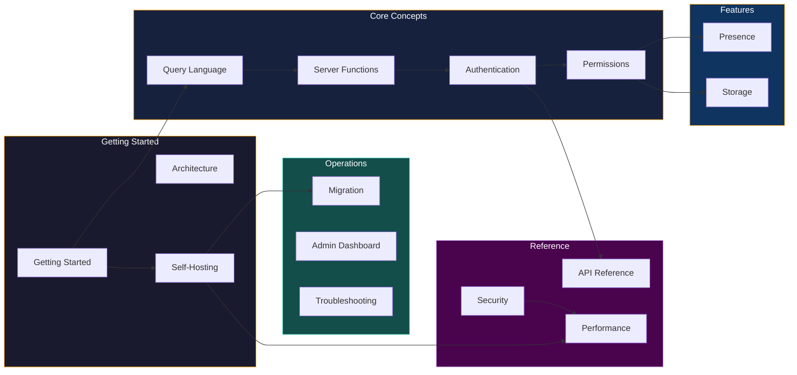

# DarshJDB Documentation

Complete reference for building applications with DarshJDB -- the self-hosted backend-as-a-service compiled into a single Rust binary.

---

## Quick Start

> **New to DarshJDB?** Start here: **[Getting Started](getting-started.md)** -- install and connect your first app in under 5 minutes.

---

## Table of Contents

### Foundations

| Guide | Description | Time |
|-------|-------------|------|
| [Getting Started](getting-started.md) | Install DarshJDB, start the dev server, connect from React/Next.js/Python/PHP | 5 min |
| [Architecture](architecture.md) | Deep dive into internals -- triple store, query pipeline, sync engine, with diagrams | 15 min |
| [Self-Hosting](self-hosting.md) | Deploy with Docker, bare metal, or Kubernetes with monitoring and backups | 10 min |

### Core Concepts

| Guide | Description |
|-------|-------------|
| [Query Language (DarshanQL)](query-language.md) | Declarative queries -- filtering, sorting, relations, aggregations, pagination, full-text and vector search |
| [Server Functions](server-functions.md) | Queries, mutations, actions, cron jobs, internal functions, and the V8 sandboxed runtime |
| [Authentication](authentication.md) | Email/password, magic links, OAuth, MFA (TOTP + WebAuthn), session management, token refresh |
| [Permissions](permissions.md) | Zero-trust row-level security, field-level access, role hierarchy, multi-tenant patterns |

### Real-Time and Storage

| Guide | Description |
|-------|-------------|
| [Presence](presence.md) | Real-time presence -- rooms, cursors, typing indicators, online status tracking |
| [Storage](storage.md) | File uploads, signed URLs, image transforms, resumable uploads, S3/R2/MinIO backends |

### Reference

| Guide | Description |
|-------|-------------|
| [REST API Reference](api-reference.md) | Every HTTP endpoint with curl examples, response schemas, WebSocket protocol, error codes |
| [Security Architecture](security.md) | 11 layers of defense-in-depth, threat model, OWASP coverage, compliance notes |
| [Performance Tuning](performance.md) | Connection pools, query limits, WebSocket tuning, capacity planning checklist |

### Operations

| Guide | Description |
|-------|-------------|
| [Migration Guide](migration.md) | Schema migrations, version upgrades, strict mode, rollback procedures |
| [Admin Dashboard](admin-dashboard.md) | Data explorer, schema viewer, function registry, user management, storage browser |
| [Troubleshooting](troubleshooting.md) | Common errors, diagnostic commands, and solutions |

---

## Packages

DarshJDB is a monorepo. Each package has its own README with install instructions and usage examples.

| Package | Path | npm / crate | Description |
|---------|------|-------------|-------------|
| Server | [`packages/server`](../packages/server/) | `ddb-server` (crate) | Rust server -- triple store, query engine, sync, auth, functions, storage |
| CLI | [`packages/cli`](../packages/cli/) | `ddb` (binary) | CLI -- `ddb dev`, deploy, migrations, backups |
| Client Core | [`packages/client-core`](../packages/client-core/) | `@darshjdb/client` | Framework-agnostic TypeScript SDK -- queries, mutations, sync, offline |
| React | [`packages/react`](../packages/react/) | `@darshjdb/react` | React hooks, `DarshanProvider`, Suspense support |
| Angular | [`packages/angular`](../packages/angular/) | `@darshjdb/angular` | Angular signals (17+), RxJS observables, route guards, SSR |
| Next.js | [`packages/nextjs`](../packages/nextjs/) | `@darshjdb/nextjs` | Server Components, App Router, Server Actions, middleware |
| Admin | [`packages/admin`](../packages/admin/) | `@darshjdb/admin` | Admin dashboard -- React + Vite + Tailwind |

## External SDKs

| SDK | Install | Description |
|-----|---------|-------------|
| PHP | `composer require darshan/darshan-php` | Laravel ServiceProvider, Eloquent-style query builder |
| Python | `pip install darshjdb` | Async client, FastAPI and Django integration |

---

## Additional Resources

- [Main README](../README.md) -- Architecture diagrams, feature overview, and quickstart
- [Contributing Guide](../CONTRIBUTING.md) -- How to contribute to DarshJDB
- [Changelog](../CHANGELOG.md) -- Version history and release notes
- [Security Audit](SECURITY_AUDIT.md) -- Detailed security assessment
- [License](../LICENSE) -- MIT License

---

## Documentation Map

