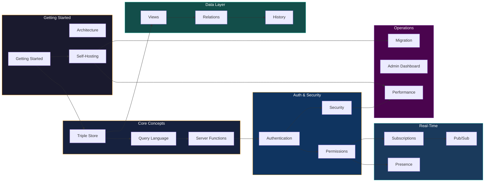

# DarshJDB Documentation

> Self-hosted Backend-as-a-Service. Single Rust binary. Triple-store EAV over PostgreSQL.

## Quick Links

| | |
|---|---|
| [Getting Started](getting-started.md) | Set up DarshJDB in 5 minutes |
| [API Reference](api-reference.md) | All REST + WebSocket endpoints |
| [DarshJQL Reference](DARSHQL.md) | Complete query language spec |
| [Architecture](architecture.md) | System design deep dive |

---

## Table of Contents

### Getting Started
- [Installation & Quick Start](getting-started.md)
- [Self-Hosting Guide](self-hosting.md) -- Docker, bare metal, Kubernetes
- [Migration Guide](migration.md) -- Upgrading between versions
- [Migrating from Convex](migrating-from-convex.md)
- [Troubleshooting](troubleshooting.md)

### Core Concepts
- [Architecture](architecture.md) -- System design, triple store, EAV model
- [Triple Store & EAV](triple-store.md) -- How data is stored (Entity-Attribute-Value)
- [DarshJQL Query Language](DARSHQL.md) -- Complete reference (1000+ lines)
- [Query Language Quick Start](query-language.md) -- Examples and patterns

### Data Modeling
- [Tables](guide/tables.md) -- Table management, templates, migration
- [Fields](guide/fields.md) -- 25 typed fields, validation, type conversion
- [Views](guide/views.md) -- Grid, Form, Kanban, Gallery, Calendar views
- [Relations](guide/relations.md) -- Links, Lookups, Rollups
- [Formulas](guide/formulas.md) -- Expression parser, 32 functions, dependency graph
- [Aggregation](guide/aggregation.md) -- GROUP BY, 18 functions, time-series charts

### Authentication & Security
- [Authentication](authentication.md) -- Password, OAuth, MFA, magic links
- [Permissions](permissions.md) -- Row-level security, field-level filtering
- [API Keys](guide/api-keys.md) -- Scoped keys, rate limiting
- [Security](security.md) -- Defense-in-depth, threat model
- [Security Audit](SECURITY_AUDIT.md) -- Detailed security assessment

### Real-Time
- [Subscriptions](subscriptions.md) -- WebSocket live queries, incremental diffs
- [Presence](presence.md) -- Online status, cursors, ephemeral state
- [Pub/Sub](guide/pubsub.md) -- Channels, pattern matching, SSE

### Automation & Extensions
- [Automations](guide/automations.md) -- Triggers, actions, workflow DAG
- [Webhooks](guide/webhooks.md) -- Outbound HTTP, HMAC signing, retry
- [Plugins](guide/plugins.md) -- Hook system, registry, built-in plugins
- [Server Functions](server-functions.md) -- TypeScript execution in V8 sandbox

### Data Operations
- [Import & Export](guide/import-export.md) -- CSV, JSON, NDJSON streaming
- [Storage](storage.md) -- S3, R2, local filesystem, signed URLs
- [History & Snapshots](guide/history.md) -- Version reconstruction, undo, restore

### Collaboration
- [Comments & Activity](guide/activity.md) -- Threaded comments, audit trail
- [Sharing](guide/sharing.md) -- Share links, collaborators, workspaces
- [Notifications](guide/notifications.md) -- In-app notification system

### Infrastructure
- [Admin Dashboard](admin-dashboard.md) -- Built-in management UI
- [Event Bus](guide/events.md) -- Internal event system, KB extraction
- [Caching](guide/caching.md) -- Multi-tier cache, invalidation
- [Performance](performance.md) -- Benchmarks, optimization tips
- [Merkle Audit Trail](guide/audit.md) -- Hash chain, tamper detection

### SDKs & Packages

| Package | Path | npm / crate | Description |
|---------|------|-------------|-------------|
| Server | [`packages/server`](../packages/server/) | `ddb-server` (crate) | Rust server -- triple store, query engine, sync, auth, functions, storage |
| CLI | [`packages/cli`](../packages/cli/) | `ddb` (binary) | CLI -- `ddb dev`, deploy, migrations, backups |
| Client Core | [`packages/client-core`](../packages/client-core/) | `@darshjdb/client` | Framework-agnostic TypeScript SDK -- queries, mutations, sync, offline |
| React | [`packages/react`](../packages/react/) | `@darshjdb/react` | React hooks, `DarshanProvider`, Suspense support |
| Angular | [`packages/angular`](../packages/angular/) | `@darshjdb/angular` | Angular signals (17+), RxJS observables, route guards, SSR |
| Next.js | [`packages/nextjs`](../packages/nextjs/) | `@darshjdb/nextjs` | Server Components, App Router, Server Actions, middleware |
| Admin | [`packages/admin`](../packages/admin/) | `@darshjdb/admin` | Admin dashboard -- React + Vite + Tailwind |
| PHP | `composer require darshan/darshan-php` | -- | Laravel ServiceProvider, Eloquent-style query builder |
| Python | `pip install darshjdb` | -- | Async client, FastAPI and Django integration |

### Comparisons
- [Comparison Matrix](benchmarks/COMPARISON_MATRIX.md)
- [Performance Analysis](benchmarks/PERFORMANCE_ANALYSIS.md)
- [vs Firebase](benchmarks/vs-firebase.md)
- [vs Supabase](benchmarks/vs-supabase.md)
- [vs Convex](benchmarks/vs-convex.md)
- [vs PocketBase](benchmarks/vs-pocketbase.md)
- [vs InstantDB](benchmarks/vs-instantdb.md)
- [vs Appwrite](benchmarks/vs-appwrite.md)
- [vs Neon](benchmarks/vs-neon.md)

### Strategy & Internal
- [Code Architecture](../CODE.md)
- [Endpoint Audit](../ENDPOINT_AUDIT.md)
- [SDK Audit](../SDK_AUDIT.md)
- [Scalability Strategy](strategy/SCALABILITY_STRATEGY.md)
- [AI/ML Strategy](strategy/AI_ML_STRATEGY.md)
- [Enterprise Strategy](strategy/ENTERPRISE_STRATEGY.md)
- [DX Strategy](strategy/DX_STRATEGY.md)
- [Blockchain Learnings](strategy/BLOCKCHAIN_LEARNINGS.md)
- [GraphDB Learnings](strategy/GRAPHDB_LEARNINGS.md)
- [Web3 Strategy](strategy/WEB3_STRATEGY.md)
- [Quantum Strategy](strategy/QUANTUM_STRATEGY.md)

---

## API Quick Reference

All endpoints are prefixed with `/api/`. Authenticated routes require `Authorization: Bearer <token>`.

### Auth

| Method | Endpoint | Description |
|--------|----------|-------------|
| POST | `/api/auth/signup` | Create account with email + password |
| POST | `/api/auth/signin` | Sign in, returns JWT (or MFA challenge) |
| POST | `/api/auth/signout` | Invalidate session |
| POST | `/api/auth/refresh` | Rotate access + refresh tokens |
| GET | `/api/auth/me` | Get current authenticated user |
| GET | `/api/auth/sessions` | List active sessions for current user |
| POST | `/api/auth/magic-link` | Send a magic link email |
| POST | `/api/auth/verify` | Verify magic link or email token |
| POST | `/api/auth/mfa/verify` | Submit MFA TOTP code |
| POST | `/api/auth/oauth/{provider}` | Initiate OAuth2 flow (google, github, etc.) |
| GET | `/api/auth/oauth/{provider}/callback` | OAuth2 callback handler |

### Data (CRUD)

| Method | Endpoint | Description |
|--------|----------|-------------|
| GET | `/api/data/{entity}` | List records in a collection |
| POST | `/api/data/{entity}` | Create a new record |
| GET | `/api/data/{entity}/{id}` | Get a single record by ID |
| PATCH | `/api/data/{entity}/{id}` | Update a record (partial) |
| DELETE | `/api/data/{entity}/{id}` | Delete a record |

### Query & Mutation

| Method | Endpoint | Description |
|--------|----------|-------------|
| POST | `/api/query` | Execute a DarshJQL query |
| POST | `/api/mutate` | Execute a mutation (insert/update/retract) |
| POST | `/api/sql` | Execute raw DarshJQL SQL-style query |
| POST | `/api/batch` | Execute multiple operations in one request |
| POST | `/api/batch/parallel` | Execute operations in parallel |
| GET | `/api/batch/metrics` | Get batch execution metrics |

### Views

| Method | Endpoint | Description |
|--------|----------|-------------|
| GET | `/api/views` | List all views |
| POST | `/api/views` | Create a new view (Grid, Kanban, etc.) |
| GET | `/api/views/{id}` | Get a view definition |
| PATCH | `/api/views/{id}` | Update a view |
| DELETE | `/api/views/{id}` | Delete a view |
| POST | `/api/views/{id}/query` | Execute a view's query |

### Fields

| Method | Endpoint | Description |
|--------|----------|-------------|
| GET | `/api/fields/` | List all fields for a table |
| POST | `/api/fields/` | Create a new field definition |
| GET | `/api/fields/{id}` | Get a single field |
| PATCH | `/api/fields/{id}` | Update field config |
| DELETE | `/api/fields/{id}` | Delete a field |

### Schema & Tables

| Method | Endpoint | Description |
|--------|----------|-------------|
| GET | `/api/schema/tables` | List all tables |
| POST | `/api/schema/tables` | Define a new table |
| DELETE | `/api/schema/tables/{table}` | Remove a table |
| POST | `/api/schema/tables/{table}/fields` | Define a field on a table |
| DELETE | `/api/schema/tables/{table}/fields/{field}` | Remove a field from a table |
| POST | `/api/schema/tables/{table}/indexes` | Create an index |
| GET | `/api/schema/tables/{table}/migrations` | Get migration history for a table |

### Relations

| Method | Endpoint | Description |
|--------|----------|-------------|
| POST | `/api/data/{entity}/{id}/link` | Add a link between records |
| DELETE | `/api/data/{entity}/{id}/link` | Remove a link |
| GET | `/api/data/{entity}/{id}/linked/{attribute}` | Get linked records |
| GET | `/api/data/{entity}/{id}/lookup/{field}` | Resolve a lookup field |
| GET | `/api/data/{entity}/{id}/rollup/{field}` | Compute a rollup aggregation |

### Graph

| Method | Endpoint | Description |
|--------|----------|-------------|
| POST | `/api/graph/relate` | Create a graph edge between records |
| POST | `/api/graph/traverse` | Run a graph traversal query |
| GET | `/api/graph/neighbors/{table}/{id}` | Get all neighbors of a node |
| GET | `/api/graph/outgoing/{table}/{id}` | Get outgoing edges |
| GET | `/api/graph/incoming/{table}/{id}` | Get incoming edges |
| DELETE | `/api/graph/edge/{edge_id}` | Delete a graph edge |

### Import & Export

| Method | Endpoint | Description |
|--------|----------|-------------|
| POST | `/api/import/csv` | Import data from CSV |
| POST | `/api/import/json` | Import data from JSON |
| GET | `/api/import/status/{job_id}` | Check import job status |
| GET | `/api/export/csv` | Export data as CSV |
| GET | `/api/export/json` | Export data as JSON |

### Collaboration & Sharing

| Method | Endpoint | Description |
|--------|----------|-------------|
| POST | `/api/share` | Create a share link |
| GET | `/api/share/{token}` | Access a shared resource |
| DELETE | `/api/share/{id}` | Revoke a share link |
| POST | `/api/collaborators` | Invite a collaborator |
| GET | `/api/collaborators` | List collaborators |
| PATCH | `/api/collaborators/{id}` | Update collaborator role |
| DELETE | `/api/collaborators/{id}` | Remove a collaborator |
| POST | `/api/workspaces` | Create a workspace |
| GET | `/api/workspaces` | List workspaces |
| PATCH | `/api/workspaces/{id}` | Update a workspace |

### Comments & Activity

| Method | Endpoint | Description |
|--------|----------|-------------|
| GET | `/api/data/{entity}/{id}/comments` | List comments on a record |
| POST | `/api/data/{entity}/{id}/comments` | Add a comment to a record |
| PATCH | `/api/comments/{id}` | Edit a comment |
| DELETE | `/api/comments/{id}` | Delete a comment |
| GET | `/api/data/{entity}/{id}/activity` | Get activity log for a record |
| GET | `/api/activity` | Query activity across all records |

### Notifications

| Method | Endpoint | Description |
|--------|----------|-------------|
| GET | `/api/notifications` | List notifications |
| GET | `/api/notifications/count` | Get unread notification count |
| PATCH | `/api/notifications/read-all` | Mark all notifications as read |
| PATCH | `/api/notifications/{id}/read` | Mark a single notification as read |

### History & Snapshots

| Method | Endpoint | Description |
|--------|----------|-------------|
| GET | `/api/data/{entity}/{id}/history` | Get version history for a record |
| GET | `/api/data/{entity}/{id}/history/{version}` | Get a specific version |
| POST | `/api/data/{entity}/{id}/restore/{version}` | Restore to a specific version |
| POST | `/api/data/{entity}/{id}/undo` | Undo the last change |
| POST | `/api/data/{entity}/{id}/undelete` | Undelete a soft-deleted record |
| GET | `/api/snapshots` | List database snapshots |
| POST | `/api/snapshots` | Create a database snapshot |
| POST | `/api/snapshots/{id}/restore` | Restore from a snapshot |
| GET | `/api/snapshots/{id}/diff` | Diff a snapshot against current state |

### Storage

| Method | Endpoint | Description |
|--------|----------|-------------|
| POST | `/api/storage/upload` | Upload a file |
| GET | `/api/storage/{path}` | Download / serve a file |
| DELETE | `/api/storage/{path}` | Delete a file |

### Server Functions

| Method | Endpoint | Description |
|--------|----------|-------------|
| POST | `/api/fn/{name}` | Invoke a server-side function |

### Real-Time

| Method | Endpoint | Description |
|--------|----------|-------------|
| GET | `/api/subscribe` | SSE subscription endpoint |
| GET | `/api/events` | SSE event stream (all changes) |
| POST | `/api/events/publish` | Publish a custom event |
| WS | `/ws` | WebSocket connection (subscriptions, mutations, presence, pub/sub) |

### Admin

| Method | Endpoint | Description |
|--------|----------|-------------|
| GET | `/api/admin/schema` | Get inferred schema from triple store |
| GET | `/api/admin/functions` | List registered server functions |
| GET | `/api/admin/sessions` | List active WebSocket sessions |
| POST | `/api/admin/bulk-load` | Bulk load triples (UNNEST insert) |
| GET | `/api/admin/cache` | Get cache statistics |
| GET | `/api/admin/storage` | List stored files |

### Developer Tools

| Method | Endpoint | Description |
|--------|----------|-------------|
| GET | `/api/openapi.json` | OpenAPI 3.1 specification |
| GET | `/api/docs` | Interactive API documentation (Swagger UI) |
| GET | `/api/types.ts` | Auto-generated TypeScript type definitions |

---

## Documentation Map

---

## Additional Resources

- [Main README](../README.md) -- Architecture diagrams, feature overview, and quickstart
- [Contributing Guide](../CONTRIBUTING.md) -- How to contribute to DarshJDB
- [Changelog](../CHANGELOG.md) -- Version history and release notes
- [License](../LICENSE) -- MIT License

---

Built by [Darshankumar Joshi](https://darshj.ai). MIT Licensed.
