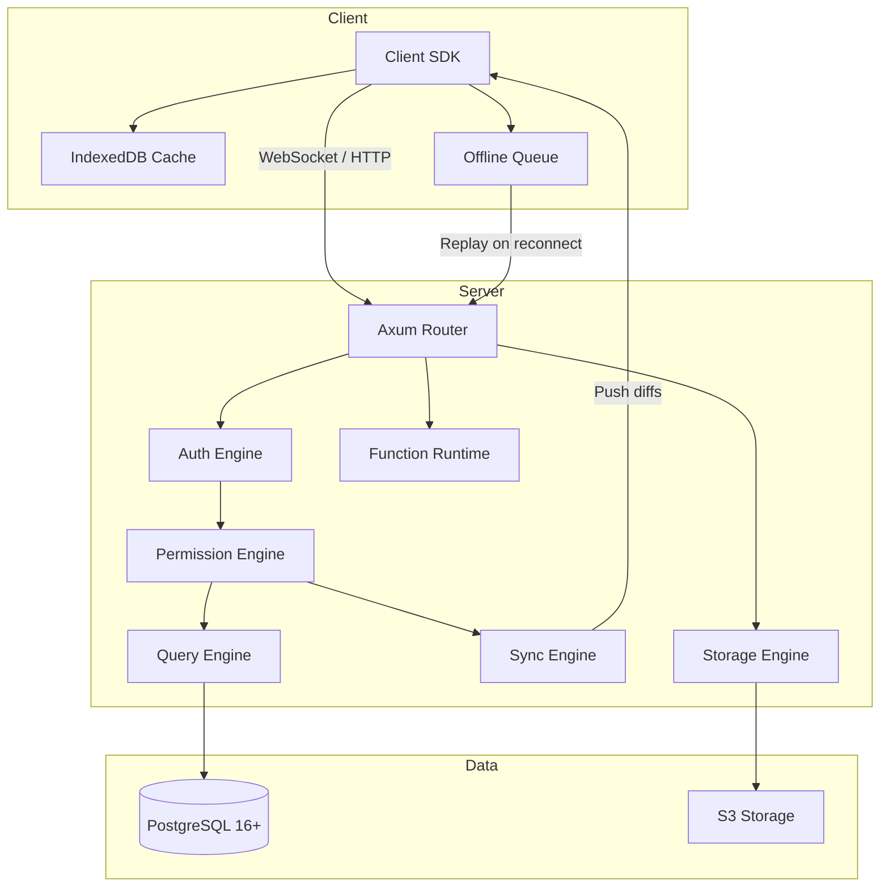
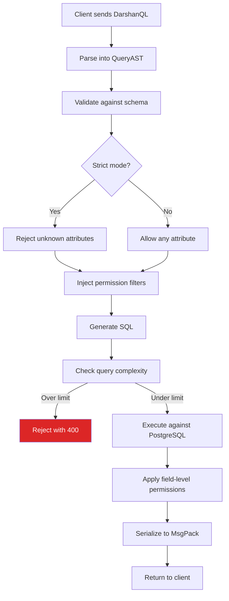
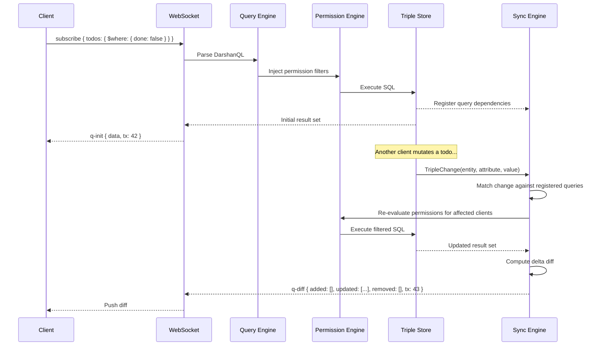
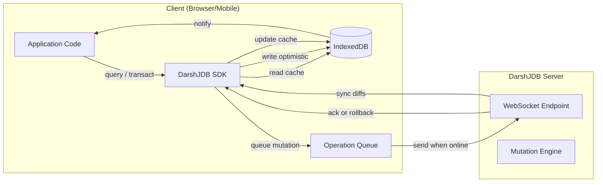
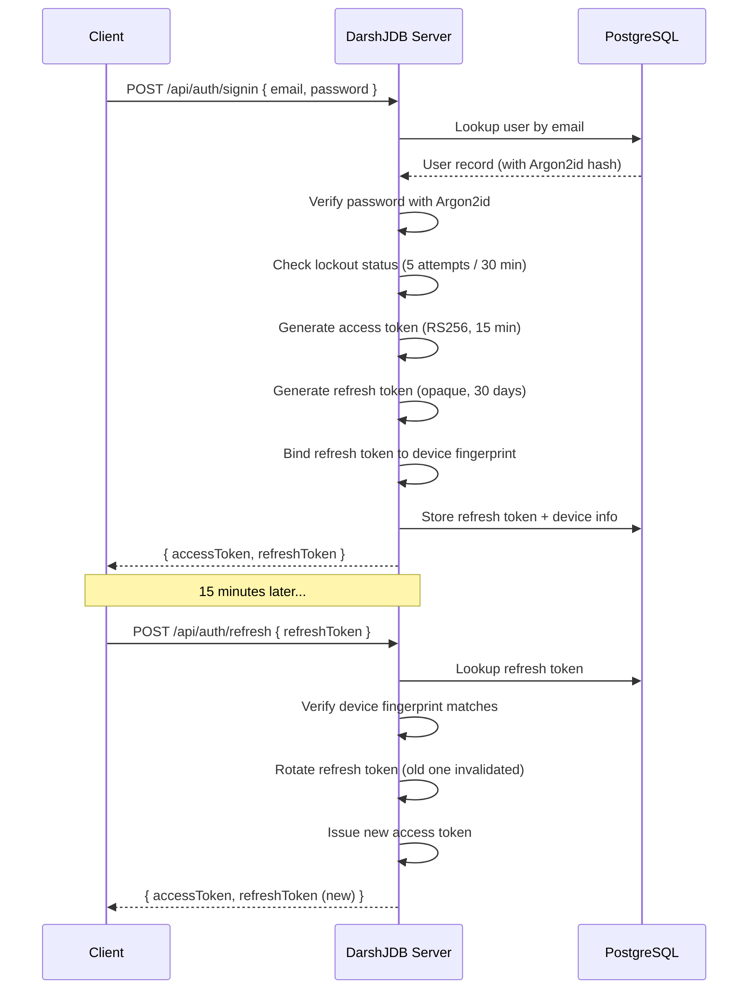
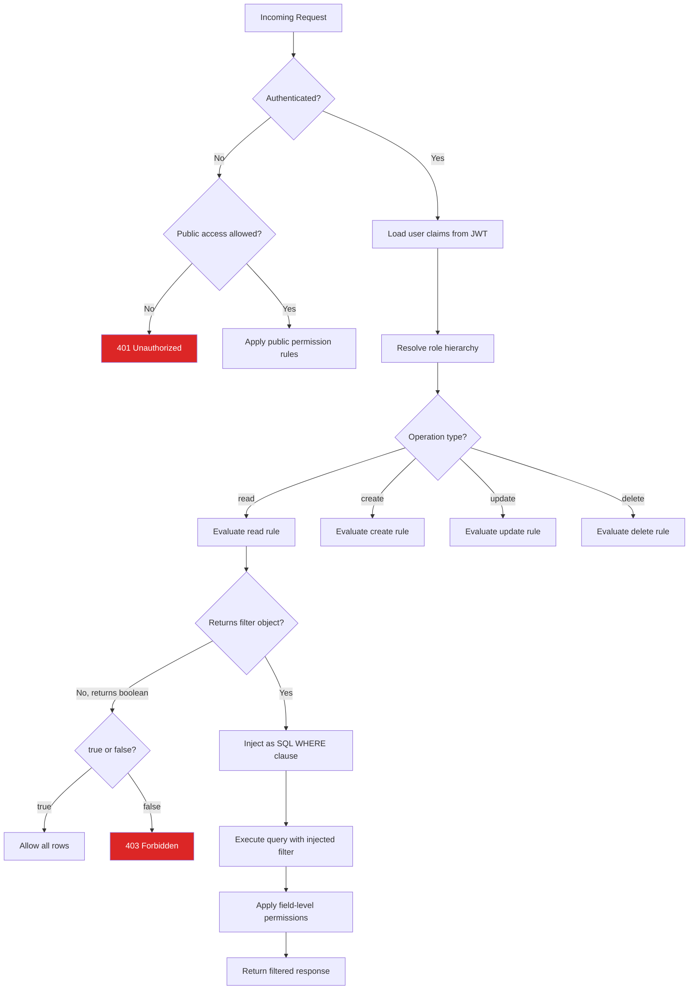
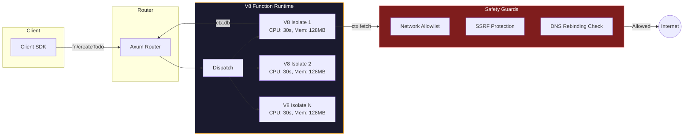
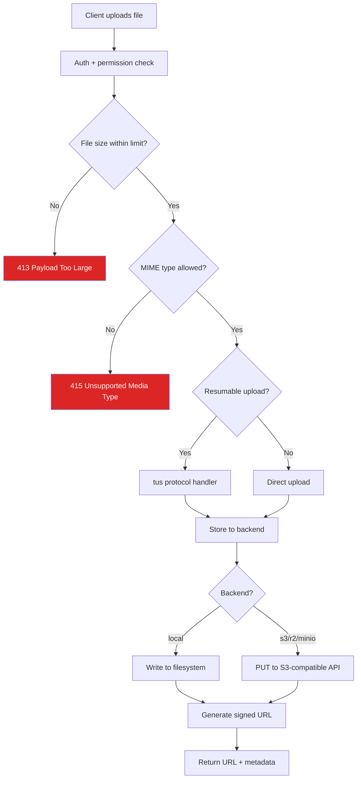

# Architecture

A deep dive into how DarshJDB works -- from a client query to a real-time push.

## System Overview



## The Triple Store

DarshJDB stores all application data in a **triple store** -- an Entity-Attribute-Value (EAV) model implemented on top of PostgreSQL.

### Why EAV?

Traditional relational databases require you to define schemas before writing data. DarshJDB flips this: you write data first, and schema emerges from usage. This means:

- No migrations during development
- Entities can have any attributes without ALTER TABLE
- Graph-like relationships are first-class (links between entities are just triples)
- Schema enforcement is opt-in for production via strict mode

### Triple Structure

Every piece of data is stored as a triple:

```
(entity_id, attribute, value)
```

For example, a todo item:

```
("todo-abc", "title",     "Buy groceries")
("todo-abc", "done",      false)
("todo-abc", "priority",  3)
("todo-abc", "createdAt", 1712300000000)
("todo-abc", "userId",    "user-xyz")       -- this is a link (reference)
```

### PostgreSQL Storage

```sql
CREATE TABLE triples (
    entity_id   UUID        NOT NULL,
    attribute   TEXT        NOT NULL,
    value_type  SMALLINT    NOT NULL,   -- 0=null, 1=bool, 2=int, 3=float, 4=string, 5=json, 6=ref, 7=blob
    value_bool  BOOLEAN,
    value_int   BIGINT,
    value_float DOUBLE PRECISION,
    value_str   TEXT,
    value_json  JSONB,
    value_ref   UUID,                   -- foreign key to another entity
    namespace   TEXT        NOT NULL DEFAULT 'default',
    created_at  TIMESTAMPTZ NOT NULL DEFAULT NOW(),
    version     BIGINT      NOT NULL DEFAULT 0,
    deleted     BOOLEAN     NOT NULL DEFAULT FALSE,

    PRIMARY KEY (entity_id, attribute, version)
);
```

Indexes are created per attribute for fast lookups:

```sql
CREATE INDEX idx_triples_attr_str ON triples (attribute, value_str) WHERE value_type = 4;
CREATE INDEX idx_triples_attr_int ON triples (attribute, value_int) WHERE value_type = 2;
CREATE INDEX idx_triples_attr_ref ON triples (attribute, value_ref) WHERE value_type = 6;
CREATE INDEX idx_triples_entity   ON triples (entity_id);
CREATE INDEX idx_triples_version  ON triples (version);
```

## Query Pipeline

When a client sends a DarshanQL query, it passes through a multi-stage pipeline before results are returned.



### Query Compilation Example

Given this DarshanQL:

```typescript
{
  todos: {
    $where: { done: false, priority: { $gte: 3 } },
    $order: { createdAt: 'desc' },
    $limit: 10,
    owner: {}
  }
}
```

The query engine produces SQL roughly equivalent to:

```sql
-- Step 1: Find matching entity IDs
WITH matched_entities AS (
    SELECT DISTINCT t1.entity_id
    FROM triples t1
    JOIN triples t2 ON t1.entity_id = t2.entity_id
    WHERE t1.attribute = 'done' AND t1.value_bool = false AND t1.deleted = false
      AND t2.attribute = 'priority' AND t2.value_int >= 3 AND t2.deleted = false
      AND t1.namespace = 'default'
      -- Injected by permission engine:
      AND t1.entity_id IN (
          SELECT entity_id FROM triples
          WHERE attribute = 'userId' AND value_ref = $current_user_id
      )
    ORDER BY (
        SELECT value_int FROM triples
        WHERE entity_id = t1.entity_id AND attribute = 'createdAt' AND deleted = false
    ) DESC
    LIMIT 10
)
-- Step 2: Fetch all attributes for matched entities
SELECT entity_id, attribute, value_type, value_bool, value_int, value_float, value_str, value_json, value_ref
FROM triples
WHERE entity_id IN (SELECT entity_id FROM matched_entities)
  AND deleted = false;

-- Step 3: Resolve nested relation (owner)
-- For each matched entity, follow the 'owner' reference and fetch that entity's attributes
```

## Sync Engine

The sync engine is what makes DarshJDB reactive. Every query is not just executed once -- it becomes a **live subscription**.



### Dependency Tracking

When a query is first executed, the sync engine records which entity-attribute pairs contribute to the result. When any triple changes, the engine checks if the changed attribute is relevant to any active subscription.

This avoids re-evaluating every subscription on every mutation. Only queries whose dependencies overlap with the changed triples are re-evaluated.

### Delta Compression

Instead of re-sending entire result sets, the sync engine computes a minimal diff:

```json
{
  "type": "q-diff",
  "id": "sub-1",
  "added": [{ "id": "todo-new", "title": "New task", "done": false }],
  "updated": [{ "id": "todo-abc", "done": true }],
  "removed": ["todo-old"],
  "tx": 43
}
```

On a typical app, this reduces bandwidth by 98% compared to polling.

## Offline-First Architecture



1. **Optimistic Mutations** -- When the user performs an action, the client SDK immediately applies the change to the local IndexedDB cache and re-renders the UI. The mutation is queued for server delivery.

2. **Operation Queue** -- If the device is offline, mutations accumulate in an ordered queue. When connectivity returns, the queue replays in order.

3. **Server Reconciliation** -- The server processes the mutation transactionally. If it succeeds, the client receives an ack. If it fails (permission denied, conflict), the client receives a rollback and reverts the optimistic update.

4. **Catch-Up Protocol** -- When a client reconnects after being offline, it sends its last known transaction ID (`tx`). The server sends only the diffs since that transaction, not the entire dataset.

## Authentication Flow



## Permission Evaluation



## Function Runtime

Server functions execute in isolated V8 contexts powered by Deno Core.



Each function invocation:
- Gets its own V8 isolate (no shared state between invocations)
- Has a hard CPU time limit (default 30 seconds)
- Has a hard memory limit (default 128 MB)
- Can only make HTTP requests to domains on the allowlist
- Cannot access the filesystem, spawn processes, or import arbitrary modules
- Gets a `ctx` object with `db`, `auth`, `storage`, and `fetch` methods

## Storage Pipeline



## Wire Protocol

DarshJDB supports three transport mechanisms, negotiated at connection time:

| Protocol | Format | Use Case |
|----------|--------|----------|
| WebSocket + MsgPack | Binary | Default for browsers and native apps. Persistent connection, multiplexed subscriptions. |
| HTTP/2 + MsgPack | Binary | Server-side rendering (Next.js RSC, Angular SSR). Single request/response. |
| REST + JSON | Text | Universal fallback. cURL, PHP, Python, any HTTP client. |

### MsgPack vs JSON

MsgPack produces payloads 28% smaller than JSON on average, with faster serialization and deserialization. The client SDKs handle encoding/decoding transparently.

## Technology Stack

| Layer | Choice | Rationale |
|-------|--------|-----------|
| HTTP server | Axum + Tokio | Zero-cost abstractions, async I/O, handles millions of connections |
| Database | PostgreSQL 16+ with pgvector | Battle-tested ACID, MVCC snapshots, streaming replication, vector search |
| Wire protocol | MsgPack over WebSocket | Compact binary, zero-copy decode, persistent connection |
| Function runtime | Deno Core (V8) | Secure sandboxing, TypeScript native, per-isolate resource limits |
| Password hashing | Argon2id | PHC winner, memory-hard, GPU-resistant |
| Token signing | RS256 / Ed25519 | Asymmetric keys allow verification without the signing secret |
| Encryption at rest | AES-256-GCM | Hardware-accelerated on modern CPUs |
| Client cache | IndexedDB | Persistent, structured, available in browsers and React Native |

---

[Previous: Getting Started](getting-started.md) | [Next: Self-Hosting](self-hosting.md) | [All Docs](README.md)
