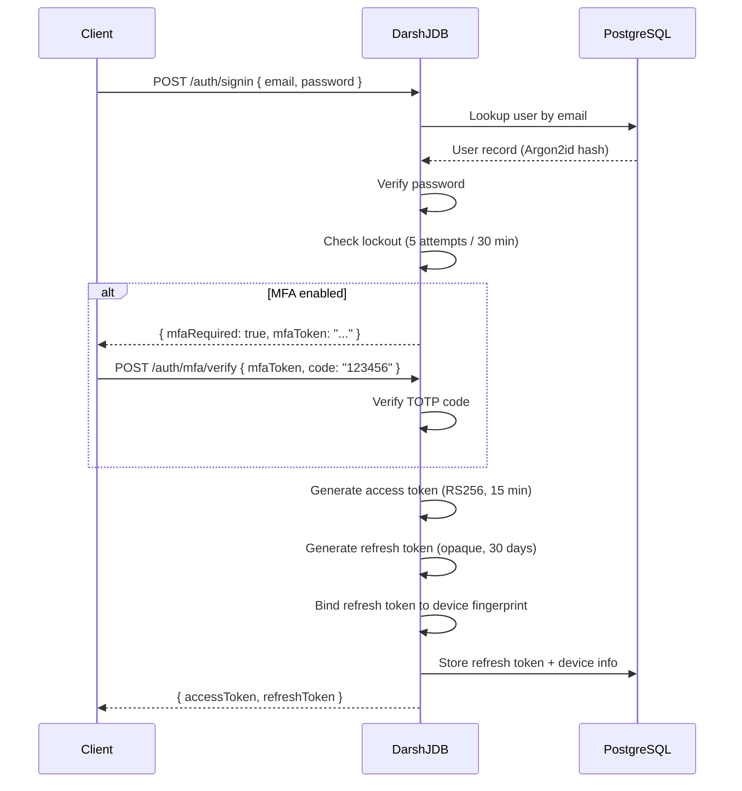
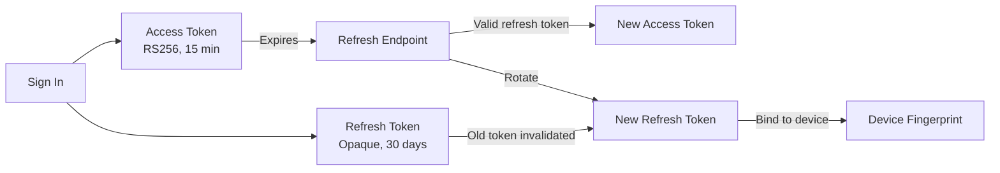

# Authentication

DarshJDB includes a complete auth system. No third-party services required.

## Auth Flow Overview



## Email / Password

```typescript
// Sign up
await db.auth.signUp({ email: 'user@example.com', password: 'SecurePass123!' });

// Sign in
await db.auth.signIn({ email: 'user@example.com', password: 'SecurePass123!' });

// Sign out
await db.auth.signOut();

// Get current user
const user = db.auth.getUser();
```

Passwords are hashed with **Argon2id** (memory=64MB, iterations=3, parallelism=4). Account locks after 5 failed attempts for 30 minutes.

### Password Requirements

- Minimum 8 characters
- Top 10,000 breached passwords are rejected at signup
- Password strength is evaluated server-side (not just character class rules)

## Magic Links

```typescript
// Request magic link (sent via email)
await db.auth.sendMagicLink({ email: 'user@example.com' });

// Verify (from the link callback)
await db.auth.verifyMagicLink({ token: 'abc123...' });
```

Magic link tokens are single-use and expire after 15 minutes.

## OAuth

```typescript
// Opens popup for OAuth flow
await db.auth.signInWithOAuth('google');
await db.auth.signInWithOAuth('github');
await db.auth.signInWithOAuth('apple');
await db.auth.signInWithOAuth('discord');
await db.auth.signInWithOAuth('microsoft');
await db.auth.signInWithOAuth('twitter');
await db.auth.signInWithOAuth('linkedin');
await db.auth.signInWithOAuth('slack');
await db.auth.signInWithOAuth('gitlab');
await db.auth.signInWithOAuth('bitbucket');
await db.auth.signInWithOAuth('facebook');
await db.auth.signInWithOAuth('spotify');
```

### Configuration

Set OAuth credentials via environment variables. Only providers with both
`CLIENT_ID` and `CLIENT_SECRET` set will be enabled (others are silently skipped).

```bash
# Google (OpenID Connect)
DDB_OAUTH_GOOGLE_CLIENT_ID=...
DDB_OAUTH_GOOGLE_CLIENT_SECRET=...

# GitHub
DDB_OAUTH_GITHUB_CLIENT_ID=...
DDB_OAUTH_GITHUB_CLIENT_SECRET=...

# Apple (Sign in with Apple)
DDB_OAUTH_APPLE_CLIENT_ID=...
DDB_OAUTH_APPLE_CLIENT_SECRET=...
DDB_OAUTH_APPLE_TEAM_ID=...
DDB_OAUTH_APPLE_KEY_ID=...

# Discord
DDB_OAUTH_DISCORD_CLIENT_ID=...
DDB_OAUTH_DISCORD_CLIENT_SECRET=...

# Microsoft (Azure AD / Entra ID) -- uses "common" tenant by default
DDB_OAUTH_MICROSOFT_CLIENT_ID=...
DDB_OAUTH_MICROSOFT_CLIENT_SECRET=...

# Twitter / X (OAuth 2.0 with PKCE)
DDB_OAUTH_TWITTER_CLIENT_ID=...
DDB_OAUTH_TWITTER_CLIENT_SECRET=...

# LinkedIn (OpenID Connect)
DDB_OAUTH_LINKEDIN_CLIENT_ID=...
DDB_OAUTH_LINKEDIN_CLIENT_SECRET=...

# Slack (OpenID Connect)
DDB_OAUTH_SLACK_CLIENT_ID=...
DDB_OAUTH_SLACK_CLIENT_SECRET=...

# GitLab
DDB_OAUTH_GITLAB_CLIENT_ID=...
DDB_OAUTH_GITLAB_CLIENT_SECRET=...

# Bitbucket (Atlassian)
DDB_OAUTH_BITBUCKET_CLIENT_ID=...
DDB_OAUTH_BITBUCKET_CLIENT_SECRET=...

# Facebook / Meta
DDB_OAUTH_FACEBOOK_CLIENT_ID=...
DDB_OAUTH_FACEBOOK_CLIENT_SECRET=...

# Spotify
DDB_OAUTH_SPOTIFY_CLIENT_ID=...
DDB_OAUTH_SPOTIFY_CLIENT_SECRET=...
```

Each provider also supports an optional `DDB_OAUTH_{PROVIDER}_REDIRECT_URI`
override. If not set, defaults to `{DDB_BASE_URL}/api/auth/oauth/{provider}/callback`.

### OAuth Callback URL

Configure the callback URL in your OAuth provider's settings:

```
https://your-domain.com/api/auth/callback/{provider}
```

For local development: `http://localhost:7700/api/auth/callback/google`

## Multi-Factor Authentication

### TOTP (Google Authenticator, Authy)

```typescript
// Enable MFA -- returns a secret and QR code URI
const { secret, qrCodeUri } = await db.auth.enableMFA();
// Show QR code to user, then verify their first code:
await db.auth.verifyMFA({ code: '123456' });

// Disable MFA
await db.auth.disableMFA({ code: '123456' }); // requires current TOTP code
```

### Recovery Codes

When MFA is enabled, 10 one-time recovery codes are generated. Display them once -- they cannot be retrieved again.

```typescript
const { recoveryCodes } = await db.auth.enableMFA();
// recoveryCodes: ['ABCD-1234', 'EFGH-5678', ...]
// Show these to the user and ask them to save securely

// Using a recovery code instead of TOTP
await db.auth.verifyMFA({ recoveryCode: 'ABCD-1234' });
// This code is now consumed and cannot be reused
```

### Regenerating Recovery Codes

```typescript
const { recoveryCodes } = await db.auth.regenerateRecoveryCodes({ code: '123456' });
// All previous recovery codes are invalidated
```

## Session Management



### Token Refresh Flow

The client SDK handles token refresh automatically. When the access token expires, the SDK uses the refresh token to obtain a new pair.

```typescript
// Manual refresh (usually handled by the SDK automatically)
const { accessToken, refreshToken } = await db.auth.refresh();
```

**Refresh token rotation:** Each time a refresh token is used, a new one is issued and the old one is invalidated. This prevents token theft from being useful after the first refresh.

**Device binding:** Refresh tokens are bound to a device fingerprint (User-Agent + IP range). If the fingerprint doesn't match, the refresh is rejected and all sessions for that user are revoked (potential token theft detected).

### Listing and Revoking Sessions

```typescript
// List active sessions
const sessions = await db.auth.listSessions();
// [
//   { id: "sess-1", device: "Chrome on macOS", ip: "1.2.3.4", lastUsedAt: 1712300000000, current: true },
//   { id: "sess-2", device: "Safari on iPhone", ip: "5.6.7.8", lastUsedAt: 1712290000000, current: false },
// ]

// Revoke a specific session
await db.auth.revokeSession('sess-2');

// Revoke all other sessions (keep current)
await db.auth.revokeAllSessions();
```

## Auth State Changes

```typescript
// Subscribe to auth state changes
const unsubscribe = db.auth.onAuthStateChange((user) => {
  if (user) {
    console.log('Signed in:', user.email);
  } else {
    console.log('Signed out');
  }
});

// Clean up
unsubscribe();
```

## React Hook

```tsx
function AuthButton() {
  const { user, signIn, signOut, signUp, isLoading } = db.useAuth();

  if (isLoading) return <Spinner />;

  if (user) {
    return (
      <div>
        <span>Signed in as {user.email}</span>
        <button onClick={signOut}>Sign Out</button>
      </div>
    );
  }

  return (
    <form onSubmit={(e) => {
      e.preventDefault();
      const data = new FormData(e.currentTarget);
      signIn({ email: data.get('email') as string, password: data.get('password') as string });
    }}>
      <input name="email" type="email" required />
      <input name="password" type="password" required />
      <button type="submit">Sign In</button>
    </form>
  );
}
```

## Angular Service

```typescript
import { Component, inject } from '@angular/core';
import { DarshJDBAuthService } from '@darshjdb/angular';

@Component({
  template: `
    @if (auth.user()) {
      <button (click)="auth.signOut()">Sign Out ({{ auth.user()?.email }})</button>
    } @else {
      <button (click)="auth.signInWithOAuth('google')">Sign In with Google</button>
    }
  `
})
export class AuthComponent {
  auth = inject(DarshJDBAuthService);
}
```

## Custom Claims

Attach custom data to the user's JWT token:

```typescript
// In a server function
import { mutation, v } from '@darshjdb/server';

export const setUserRole = mutation({
  args: { userId: v.id(), role: v.string() },
  handler: async (ctx, { userId, role }) => {
    await ctx.auth.setClaims(userId, { role, plan: 'pro' });
    // Claims are included in the next access token refresh
  },
});
```

Custom claims are available in permission rules via `ctx.auth`:

```typescript
// darshan/permissions.ts
delete: (ctx) => ctx.auth.role === 'admin'
read: (ctx) => ctx.auth.plan === 'pro' || ctx.auth.plan === 'enterprise'
```

Claims are also available on the client:

```typescript
const user = db.auth.getUser();
console.log(user.claims.role); // 'admin'
console.log(user.claims.plan); // 'pro'
```

## Server-Side Auth (Next.js)

```typescript
// middleware.ts
import { ddbMiddleware } from '@darshjdb/nextjs/middleware';

export default ddbMiddleware({
  publicRoutes: ['/', '/about', '/api/public(.*)'],
  signInUrl: '/sign-in',
});
```

```typescript
// app/page.tsx (Server Component)
import { getAuth } from '@darshjdb/nextjs/server';

export default async function Dashboard() {
  const auth = await getAuth();
  if (!auth.userId) redirect('/sign-in');

  return <h1>Welcome, {auth.email}</h1>;
}
```

## Configuration

| Variable | Default | Description |
|----------|---------|-------------|
| `DDB_JWT_SECRET` | auto-generated | RS256 signing key (provide your own for multi-instance) |
| `DDB_ACCESS_TOKEN_EXPIRY` | `900` | Access token lifetime in seconds (15 min) |
| `DDB_REFRESH_TOKEN_EXPIRY` | `2592000` | Refresh token lifetime in seconds (30 days) |
| `DDB_MFA_ISSUER` | `DarshJDB` | TOTP issuer name shown in authenticator apps |
| `DDB_LOCKOUT_ATTEMPTS` | `5` | Failed login attempts before lockout |
| `DDB_LOCKOUT_DURATION` | `1800` | Lockout duration in seconds (30 min) |
| `DDB_MAGIC_LINK_EXPIRY` | `900` | Magic link token lifetime in seconds (15 min) |
| `DDB_EMAIL_FROM` | `noreply@db.darshj.me` | From address for auth emails |

---

[Previous: Server Functions](server-functions.md) | [Next: Permissions](permissions.md) | [All Docs](README.md)
