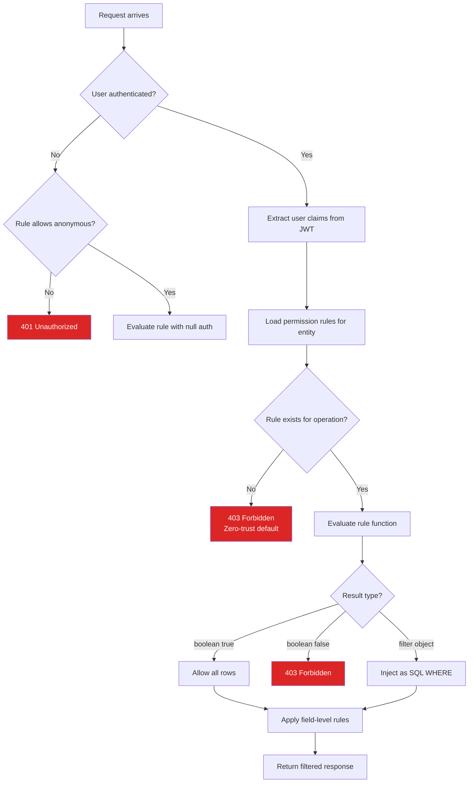

# Permissions

DarshJDB uses a **zero-trust** model: everything is denied unless explicitly allowed.

## Permission Evaluation Flow



## Permission DSL

Define permissions in `darshan/permissions.ts`:

```typescript
export default {
  todos: {
    // Only the owner can read their todos
    read: (ctx) => ({ userId: ctx.auth.userId }),

    // Any authenticated user can create
    create: (ctx) => !!ctx.auth,

    // Only the owner can update
    update: (ctx) => ({ userId: ctx.auth.userId }),

    // Only admins can delete
    delete: (ctx) => ctx.auth.role === 'admin',
  },

  users: {
    // Anyone can read users, but email is restricted
    read: {
      allow: true,
      fields: {
        email: (ctx, entity) => entity.id === ctx.auth.userId,
        passwordHash: false, // never exposed
      },
    },
  },
};
```

## How It Works

### Row-Level Security

For `read` operations, the permission function returns a **filter object** that becomes a SQL `WHERE` clause:

```typescript
read: (ctx) => ({ userId: ctx.auth.userId })
// Becomes: WHERE user_id = 'current-user-id'
```

Unauthorized data never leaves the database. It's not fetched and then filtered -- it's invisible at the query level.

### Field-Level Permissions

```typescript
fields: {
  email: (ctx, entity) => entity.id === ctx.auth.userId,  // only own email visible
  passwordHash: false,                                      // never returned
  publicName: true,                                         // always returned
}
```

### Role Hierarchy

```typescript
// Built-in roles: admin > editor > viewer
delete: (ctx) => ctx.auth.role === 'admin'
update: (ctx) => ['admin', 'editor'].includes(ctx.auth.role)
read: (ctx) => !!ctx.auth  // any authenticated user
```

## Permission Rules Reference

| Rule Type | Example | Behavior |
|-----------|---------|----------|
| Boolean | `true` / `false` | Allow or deny all |
| Auth check | `(ctx) => !!ctx.auth` | Require authentication |
| Filter object | `(ctx) => ({ userId: ctx.auth.userId })` | Row-level filtering |
| Role check | `(ctx) => ctx.auth.role === 'admin'` | Role-based access |
| Field restriction | `fields: { email: false }` | Hide specific fields |
| Combined filter | `(ctx) => ({ teamId: ctx.auth.teamId, status: { $ne: 'draft' } })` | Multiple conditions |

## Complex Permission Patterns

### Shared Access

Allow users to see their own items plus items explicitly shared with them:

```typescript
export default {
  documents: {
    read: (ctx) => ({
      $or: [
        { ownerId: ctx.auth.userId },
        { sharedWith: { $contains: ctx.auth.userId } },
        { visibility: 'public' },
      ],
    }),

    update: (ctx) => ({
      $or: [
        { ownerId: ctx.auth.userId },
        {
          $and: [
            { sharedWith: { $contains: ctx.auth.userId } },
            { sharedPermission: 'edit' },
          ],
        },
      ],
    }),

    delete: (ctx) => ({ ownerId: ctx.auth.userId }),
  },
};
```

### Organization-Scoped Access

```typescript
export default {
  projects: {
    read: (ctx) => ({
      organizationId: ctx.auth.claims.organizationId,
    }),

    create: (ctx) => ['admin', 'manager'].includes(ctx.auth.role),

    update: (ctx) => ({
      organizationId: ctx.auth.claims.organizationId,
      $or: [
        { managerId: ctx.auth.userId },
        // Admins can update any project in their org
        ...(ctx.auth.role === 'admin' ? [true] : []),
      ],
    }),

    delete: (ctx) => ctx.auth.role === 'admin' && {
      organizationId: ctx.auth.claims.organizationId,
    },
  },
};
```

### Multi-Tenant Isolation

For SaaS applications where tenants must never see each other's data:

```typescript
// darshan/permissions.ts
const tenantFilter = (ctx) => ({
  tenantId: ctx.auth.claims.tenantId,
});

export default {
  // Apply tenant isolation to every entity
  customers: {
    read: tenantFilter,
    create: (ctx) => !!ctx.auth,  // tenant ID injected automatically by mutation
    update: tenantFilter,
    delete: (ctx) => ctx.auth.role === 'admin' && tenantFilter(ctx),
  },

  invoices: {
    read: tenantFilter,
    create: (ctx) => ['admin', 'billing'].includes(ctx.auth.role),
    update: (ctx) => ctx.auth.role === 'admin' && tenantFilter(ctx),
    delete: (ctx) => ctx.auth.role === 'admin' && tenantFilter(ctx),
  },

  settings: {
    read: tenantFilter,
    update: (ctx) => ctx.auth.role === 'admin' && tenantFilter(ctx),
  },
};
```

Ensure the `tenantId` is set from the JWT claims (not from user input) in your mutations:

```typescript
// darshan/functions/createCustomer.ts
export const createCustomer = mutation({
  args: { name: v.string(), email: v.string().email() },
  handler: async (ctx, { name, email }) => {
    const id = ctx.db.id();
    await ctx.db.transact(
      ctx.db.tx.customers[id].set({
        name,
        email,
        tenantId: ctx.auth.claims.tenantId,  // from JWT, not from user input
        createdAt: Date.now(),
      })
    );
    return id;
  },
});
```

### Time-Based Access

```typescript
export default {
  exams: {
    read: (ctx) => {
      const now = Date.now();
      // Students can only see exams during the exam window
      if (ctx.auth.role === 'student') {
        return {
          courseId: ctx.auth.claims.courseId,
          startsAt: { $lte: now },
          endsAt: { $gte: now },
        };
      }
      // Teachers can see all exams for their courses
      return { courseId: ctx.auth.claims.courseId };
    },
  },
};
```

### Conditional Field Access by Role

```typescript
export default {
  employees: {
    read: {
      allow: (ctx) => !!ctx.auth,
      fields: {
        name: true,
        department: true,
        title: true,
        email: (ctx, entity) =>
          ctx.auth.role === 'admin' ||
          ctx.auth.role === 'hr' ||
          entity.id === ctx.auth.userId,
        salary: (ctx) => ['admin', 'hr'].includes(ctx.auth.role),
        ssn: (ctx) => ctx.auth.role === 'admin',
        performanceReview: (ctx, entity) =>
          ctx.auth.role === 'admin' ||
          ctx.auth.role === 'hr' ||
          entity.managerId === ctx.auth.userId,
      },
    },
  },
};
```

## Testing Permissions

### Admin Dashboard Impersonation

In the admin dashboard, use the "Impersonate" feature to test as any user. This lets you verify permission rules without signing in as different accounts.

### Admin SDK

```typescript
const adminDb = DarshJDB.admin({ adminToken: '...' });
const asUser = adminDb.asUser('user@example.com');
const data = await asUser.query({ todos: {} });
// Returns only what that user would see
```

### Permission Test Helper

```typescript
// darshan/functions/__tests__/permissions.test.ts
import { testPermissions } from '@darshjdb/server/testing';

describe('todo permissions', () => {
  it('users can only read their own todos', async () => {
    const result = await testPermissions({
      entity: 'todos',
      operation: 'read',
      auth: { userId: 'user-1', role: 'viewer' },
    });
    expect(result.filter).toEqual({ userId: 'user-1' });
  });

  it('admins can delete any todo', async () => {
    const result = await testPermissions({
      entity: 'todos',
      operation: 'delete',
      auth: { userId: 'admin-1', role: 'admin' },
    });
    expect(result.allowed).toBe(true);
  });

  it('viewers cannot delete todos', async () => {
    const result = await testPermissions({
      entity: 'todos',
      operation: 'delete',
      auth: { userId: 'user-1', role: 'viewer' },
    });
    expect(result.allowed).toBe(false);
  });
});
```

## Default Permissions

When no permissions are defined for an entity, DarshJDB denies all access. You must explicitly allow operations:

```typescript
// Minimum viable permissions for a new entity
export default {
  notes: {
    read: (ctx) => !!ctx.auth,
    create: (ctx) => !!ctx.auth,
    update: (ctx) => ({ userId: ctx.auth.userId }),
    delete: (ctx) => ({ userId: ctx.auth.userId }),
  },
};
```

## Debugging Permissions

Enable permission debug logging to see which rules are evaluated:

```bash
RUST_LOG=ddb_server::permissions=debug ddb dev
```

This logs every permission check with the rule that was matched, the resulting SQL WHERE clause, and whether access was granted or denied.

Example output:

```
DEBUG permissions: Evaluating read on todos for user-abc
DEBUG permissions:   Rule: (ctx) => ({ userId: ctx.auth.userId })
DEBUG permissions:   Filter: WHERE user_id = 'user-abc'
DEBUG permissions:   Result: ALLOWED (filtered)
```

---

[Previous: Authentication](authentication.md) | [Next: Presence](presence.md) | [All Docs](README.md)
