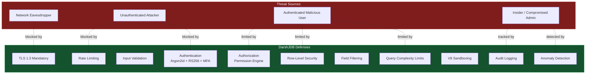

# Security Architecture

DarshJDB implements 11 layers of defense-in-depth security.

## Threat Model



## Defense-in-Depth Stack

| Layer | What | How |
|-------|------|-----|
| 0 | **TLS 1.3** | Mandatory encryption. No plaintext. No TLS 1.2 fallback. |
| 1 | **Rate Limiting** | Token bucket per IP, per user, per API key. |
| 2 | **Input Validation** | Schema-validated at the API boundary. |
| 3 | **Authentication** | JWT RS256 + refresh tokens + device fingerprint binding. |
| 4 | **Authorization** | Permission engine evaluates every single request. |
| 5 | **Row-Level Security** | SQL WHERE injection -- unauthorized data never leaves the DB. |
| 6 | **Field Filtering** | Restricted fields stripped from response server-side. |
| 7 | **Query Complexity** | Rejects queries that would scan too many triples. |
| 8 | **V8 Sandboxing** | Server functions run in isolated V8 contexts. |
| 9 | **Audit Logging** | Every mutation logged with actor, timestamp, and diff. |
| 10 | **Anomaly Detection** | Unusual access patterns trigger alerts. |

## Password Security

- **Argon2id** -- winner of the Password Hashing Competition
- Memory: 64MB, iterations: 3, parallelism: 4
- Top 10,000 breached passwords rejected at signup
- Account lockout after 5 failed attempts (30-minute cooldown)
- Password strength evaluated server-side (not just character class rules)

## Token Security

- Access tokens: RS256, 15-minute expiry
- Refresh tokens: opaque 32-byte, 30-day expiry, device-bound
- Key rotation: new keys issued monthly, old keys valid for verification during transition
- Refresh token rotation: old token invalidated on each use
- Device fingerprint mismatch triggers full session revocation

## Server Function Isolation

- CPU time limit: 30 seconds (configurable)
- Memory limit: 128MB (configurable)
- `fetch()` restricted to domain allowlist
- Private IP ranges blocked (SSRF prevention: 10.0.0.0/8, 172.16.0.0/12, 192.168.0.0/16, 127.0.0.0/8, ::1)
- DNS rebinding protection
- No filesystem access, no process spawning, no native module loading

## OWASP API Top 10 Coverage

| OWASP Risk | DarshJDB Mitigation |
|-----------|----------------------|
| **API1: BOLA** (Broken Object Level Auth) | Permission rules are SQL WHERE clauses -- unauthorized data never leaves the database |
| **API2: Broken Authentication** | Argon2id + RS256 JWT + device fingerprint + brute-force lockout + MFA |
| **API3: Broken Object Property Level Auth** | Field-level permissions strip attributes server-side |
| **API4: Unrestricted Resource Consumption** | Token-bucket rate limiting + query complexity analysis + function resource limits |
| **API5: Broken Function Level Auth** | Every function declares auth requirements, enforced before dispatch |
| **API6: SSRF** | `fetch()` restricted to domain allowlist, private IPs blocked, DNS rebinding protection |
| **API7: Security Misconfiguration** | Secure defaults: CORS off, debug off, admin behind auth, no default passwords |
| **API8: Lack of Protection from Automated Threats** | Rate limiting per IP/user/API key, anomaly detection |
| **API9: Improper Inventory Management** | Single binary, one API surface, auto-generated OpenAPI spec |
| **API10: Unsafe Consumption of APIs** | Responses validated against declared schemas, server function outputs sanitized |

## Encryption at Rest

DarshJDB supports AES-256-GCM encryption for sensitive fields stored in the database:

```typescript
// darshan/schema.ts
import { defineSchema, defineTable, v } from '@darshjdb/server';

export default defineSchema({
  users: defineTable({
    name: v.string(),
    email: v.string(),
    ssn: v.string().encrypted(), // Encrypted at rest
  }),
});
```

Encryption keys are derived from `DDB_ENCRYPTION_KEY`. Rotate keys with:

```bash
ddb keys rotate --old-key $OLD_KEY --new-key $NEW_KEY
```

Key rotation re-encrypts all encrypted fields in the background without downtime.

## Security Headers

DarshJDB sets the following response headers by default:

| Header | Value |
|--------|-------|
| `Strict-Transport-Security` | `max-age=63072000; includeSubDomains` |
| `X-Content-Type-Options` | `nosniff` |
| `X-Frame-Options` | `DENY` |
| `X-XSS-Protection` | `0` (relies on CSP instead) |
| `Content-Security-Policy` | Configured per deployment |
| `Referrer-Policy` | `strict-origin-when-cross-origin` |
| `Permissions-Policy` | `camera=(), microphone=(), geolocation=()` |

## Audit Logging

Every mutation is logged with:
- **Actor**: User ID, email, IP address
- **Timestamp**: Server-side UTC timestamp
- **Operation**: Entity, attribute, old value, new value
- **Request metadata**: User-Agent, origin, session ID

Query the audit log via the admin API:

```bash
curl "http://localhost:7700/api/admin/audit?entity=users&from=2026-04-01&to=2026-04-05" \
  -H "Authorization: Bearer ADMIN_TOKEN"
```

## Compliance Notes

### GDPR

- **Data export**: Use `ddb export --user user@example.com` to export all data for a user
- **Right to deletion**: Use `ddb delete-user --email user@example.com` to permanently remove all user data
- **Audit trail**: All data access and mutations are logged
- **Encryption at rest**: Available for sensitive fields via `.encrypted()` schema modifier

### SOC 2

- **Access controls**: Zero-trust permission model, MFA support, session management
- **Encryption**: TLS 1.3 in transit, AES-256-GCM at rest
- **Monitoring**: Prometheus metrics, audit logging, anomaly detection
- **Change management**: Migration system with rollback support

### HIPAA

- **PHI protection**: Use `.encrypted()` for all PHI fields
- **Access controls**: Row-level and field-level security with audit logging
- **Audit trail**: Complete mutation history with actor and timestamp
- **Note**: DarshJDB provides the technical controls; you must also implement organizational controls (BAA, training, etc.)

## Security Checklist for Production

- [ ] Set `DDB_JWT_SECRET` to a unique RS256 key pair (do not use auto-generated)
- [ ] Set `DDB_ENCRYPTION_KEY` for at-rest encryption of sensitive fields
- [ ] Configure CORS origins (`DDB_CORS_ORIGINS`)
- [ ] Enable TLS (via reverse proxy or the `--tls` flag)
- [ ] Configure rate limits appropriate for your traffic
- [ ] Review all permission rules -- ensure no entity has overly permissive rules
- [ ] Enable audit logging in production
- [ ] Set `RUST_LOG=warn` (avoid `debug` or `trace` in production)
- [ ] Restrict admin token access -- do not embed in client-side code
- [ ] Set up alerts on the anomaly detection webhook

## Reporting Vulnerabilities

If you discover a security vulnerability, please report it responsibly via email to security@db.darshj.me. Do not file a public GitHub issue.

We will acknowledge receipt within 48 hours and aim to provide a fix within 7 days for critical vulnerabilities.

---

[Previous: API Reference](api-reference.md) | [Next: Performance](performance.md) | [All Docs](README.md)
