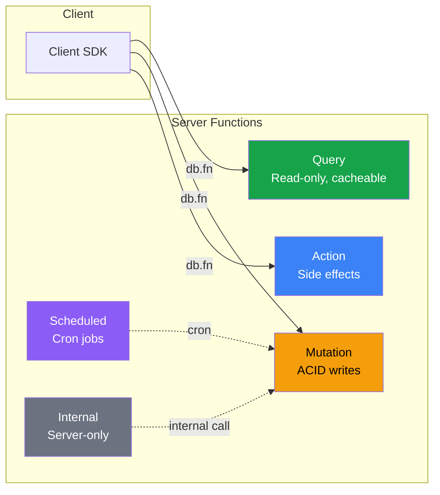

# Server Functions

Server functions are TypeScript files in `darshan/functions/` that run on the server with full database access. They execute inside sandboxed V8 isolates with strict resource limits.

## Function Types



### Query -- Read-only, cacheable, reactive

Queries can only read data. They are cacheable and can be used as reactive subscriptions.

```typescript
// darshan/functions/getTodos.ts
import { query, v } from '@darshjdb/server';

export const getTodos = query({
  args: { listId: v.id(), status: v.optional(v.string()) },
  handler: async (ctx, { listId, status }) => {
    const filter: any = { listId };
    if (status) filter.status = status;
    return ctx.db.query({ todos: { $where: filter } });
  },
});
```

### Mutation -- Transactional ACID writes

Mutations execute within a database transaction. If any step fails, the entire mutation rolls back.

```typescript
import { mutation, v } from '@darshjdb/server';

export const createTodo = mutation({
  args: {
    title: v.string().min(1).max(500),
    listId: v.id(),
  },
  handler: async (ctx, { title, listId }) => {
    const todoId = ctx.db.id();
    await ctx.db.transact([
      ctx.db.tx.todos[todoId].set({
        title,
        done: false,
        listId,
        userId: ctx.auth.userId,
        createdAt: Date.now(),
      }),
    ]);
    return todoId;
  },
});
```

### Action -- Side effects (HTTP, email, webhooks)

Actions can perform external HTTP requests, send emails, call webhooks, and other side effects that mutations cannot.

```typescript
import { action, v } from '@darshjdb/server';

export const sendWelcomeEmail = action({
  args: { userId: v.id() },
  handler: async (ctx, { userId }) => {
    const user = await ctx.db.query({ users: { $where: { id: userId } } });
    await ctx.fetch('https://api.sendgrid.com/v3/mail/send', {
      method: 'POST',
      headers: { Authorization: `Bearer ${process.env.SENDGRID_KEY}` },
      body: JSON.stringify({
        to: user.users[0].email,
        from: 'noreply@myapp.com',
        subject: 'Welcome!',
        text: `Welcome, ${user.users[0].name}!`,
      }),
    });
  },
});
```

### Scheduled -- Cron jobs

Scheduled functions run on a cron schedule. They have the same capabilities as mutations.

```typescript
import { scheduled } from '@darshjdb/server';

export const dailyCleanup = scheduled({
  cron: '0 3 * * *', // 3 AM daily
  handler: async (ctx) => {
    const thirtyDaysAgo = Date.now() - 30 * 86400000;
    const stale = await ctx.db.query({
      sessions: { $where: { lastUsedAt: { $lt: thirtyDaysAgo } } },
    });
    for (const session of stale.sessions) {
      await ctx.db.transact(ctx.db.tx.sessions[session.id].delete());
    }
    console.log(`Cleaned up ${stale.sessions.length} stale sessions`);
  },
});

// More cron examples:
// '*/5 * * * *'   -- every 5 minutes
// '0 */6 * * *'   -- every 6 hours
// '0 0 * * 0'     -- weekly (Sunday midnight)
// '0 0 1 * *'     -- monthly (1st of month)
```

### Internal -- Server-to-server only

Internal functions cannot be called from clients. They are only callable from other server functions.

```typescript
import { internal } from '@darshjdb/server';

export const computeAnalytics = internal({
  handler: async (ctx) => {
    const orders = await ctx.db.query({
      orders: { $where: { status: 'completed' }, $aggregate: { $sum: 'amount' } },
    });
    await ctx.db.transact(
      ctx.db.tx.analytics[ctx.db.id()].set({
        date: new Date().toISOString().split('T')[0],
        totalRevenue: orders.orders,
        computedAt: Date.now(),
      })
    );
  },
});

// Calling from another function:
import { mutation } from '@darshjdb/server';

export const completeOrder = mutation({
  args: { orderId: v.id() },
  handler: async (ctx, { orderId }) => {
    await ctx.db.transact(
      ctx.db.tx.orders[orderId].merge({ status: 'completed' })
    );
    // Trigger analytics recomputation
    await ctx.runInternal('computeAnalytics');
  },
});
```

## Argument Validation

The `v` validator provides type-safe argument validation:

```typescript
v.string()                          // string
v.string().min(1)                   // non-empty string
v.string().max(500)                 // max 500 chars
v.string().regex(/^[a-z]+$/)        // regex pattern
v.string().email()                  // valid email format
v.string().url()                    // valid URL format
v.number()                          // number
v.number().min(0)                   // non-negative
v.number().max(100)                 // max 100
v.number().int()                    // integer only
v.boolean()                         // boolean
v.id()                              // UUID entity reference
v.array(v.string())                 // array of strings
v.array(v.id()).min(1).max(50)      // 1-50 IDs
v.object({ key: v.string() })      // object with known shape
v.optional(v.string())             // optional field
v.union(v.string(), v.number())    // string or number
v.literal('active')                 // exact value
v.enum(['active', 'pending', 'done']) // one of listed values
```

## Calling Functions from Client

```typescript
// React hook
const { data, isLoading } = db.useFn('getTodos', { listId: 'list-1', status: 'active' });

// Imperative call
const result = await db.fn('createTodo', { title: 'Buy milk', listId: 'list-1' });

// Angular
const todos = this.ddb.fn('getTodos', { listId: 'list-1' });

// PHP
$result = $db->fn('createTodo', ['title' => 'Buy milk', 'listId' => 'list-1']);

// Python
result = await db.fn('createTodo', {'title': 'Buy milk', 'listId': 'list-1'})

// cURL
curl -X POST http://localhost:7700/api/fn/createTodo \
  -H "Authorization: Bearer TOKEN" \
  -H "Content-Type: application/json" \
  -d '{"title": "Buy milk", "listId": "list-1"}'
```

## Error Handling

### Throwing Structured Errors

```typescript
import { mutation, v, DarshanError } from '@darshjdb/server';

export const claimTodo = mutation({
  args: { todoId: v.id() },
  handler: async (ctx, { todoId }) => {
    const todo = await ctx.db.get(todoId);

    if (!todo) {
      throw new DarshanError('NOT_FOUND', 'Todo not found');
    }

    if (todo.claimedBy && todo.claimedBy !== ctx.auth.userId) {
      throw new DarshanError('CONFLICT', 'Todo already claimed by another user');
    }

    if (!ctx.auth) {
      throw new DarshanError('UNAUTHENTICATED', 'You must be signed in to claim todos');
    }

    await ctx.db.transact(
      ctx.db.tx.todos[todoId].merge({
        claimedBy: ctx.auth.userId,
        claimedAt: Date.now(),
      })
    );
  },
});
```

### Error Codes

| Code | HTTP Status | When to Use |
|------|-------------|-------------|
| `NOT_FOUND` | 404 | Entity does not exist |
| `CONFLICT` | 409 | Concurrent edit, duplicate key |
| `UNAUTHENTICATED` | 401 | User not signed in |
| `PERMISSION_DENIED` | 403 | User lacks access |
| `INVALID_ARGUMENT` | 400 | Validation failure beyond `v` checks |
| `RATE_LIMITED` | 429 | Too many requests |
| `INTERNAL` | 500 | Unexpected server error |

### Handling Errors on the Client

```typescript
try {
  await db.fn('claimTodo', { todoId: 'abc' });
} catch (error) {
  if (error.code === 'CONFLICT') {
    showToast('This todo was already claimed by someone else');
  } else if (error.code === 'NOT_FOUND') {
    showToast('Todo no longer exists');
  } else {
    showToast('Something went wrong');
    console.error(error);
  }
}
```

## Middleware Patterns

### Authentication Guard

```typescript
import { mutation, v, DarshanError } from '@darshjdb/server';

function requireAuth(ctx: any) {
  if (!ctx.auth) {
    throw new DarshanError('UNAUTHENTICATED', 'Authentication required');
  }
  return ctx.auth;
}

function requireRole(ctx: any, role: string) {
  const auth = requireAuth(ctx);
  if (auth.role !== role) {
    throw new DarshanError('PERMISSION_DENIED', `Requires ${role} role`);
  }
  return auth;
}

export const deleteUser = mutation({
  args: { userId: v.id() },
  handler: async (ctx, { userId }) => {
    requireRole(ctx, 'admin');
    await ctx.db.transact(ctx.db.tx.users[userId].delete());
  },
});
```

### Rate Limiting within Functions

```typescript
import { action, v, DarshanError } from '@darshjdb/server';

export const sendVerificationEmail = action({
  args: { email: v.string().email() },
  handler: async (ctx, { email }) => {
    // Check rate limit (max 3 emails per hour per user)
    const recentEmails = await ctx.db.query({
      emailLog: {
        $where: {
          email,
          sentAt: { $gt: Date.now() - 3600000 },
        },
        $aggregate: 'count',
      },
    });

    if (recentEmails.emailLog >= 3) {
      throw new DarshanError('RATE_LIMITED', 'Maximum 3 verification emails per hour');
    }

    // Send the email
    await ctx.fetch('https://api.sendgrid.com/v3/mail/send', { /* ... */ });

    // Log it
    await ctx.db.transact(
      ctx.db.tx.emailLog[ctx.db.id()].set({ email, sentAt: Date.now() })
    );
  },
});
```

### Composing Functions

```typescript
import { mutation, v } from '@darshjdb/server';

// Helper: validate and normalize input
function normalizeTitle(title: string): string {
  return title.trim().replace(/\s+/g, ' ');
}

// Helper: compute derived fields
function computePriority(title: string): number {
  if (title.toLowerCase().startsWith('urgent')) return 5;
  if (title.toLowerCase().startsWith('important')) return 3;
  return 1;
}

export const createTodo = mutation({
  args: { title: v.string().min(1).max(500), listId: v.id() },
  handler: async (ctx, { title, listId }) => {
    const normalized = normalizeTitle(title);
    const priority = computePriority(normalized);

    const id = ctx.db.id();
    await ctx.db.transact(
      ctx.db.tx.todos[id].set({
        title: normalized,
        priority,
        done: false,
        listId,
        userId: ctx.auth.userId,
        createdAt: Date.now(),
      })
    );
    return { id, priority };
  },
});
```

## Context Object (ctx)

Every handler receives a `ctx` object with the following methods:

| Property | Type | Description |
|----------|------|-------------|
| `ctx.db` | `Database` | Query and mutate data |
| `ctx.auth` | `AuthUser \| null` | Current authenticated user (null if anonymous) |
| `ctx.auth.userId` | `string` | User's entity ID |
| `ctx.auth.email` | `string` | User's email |
| `ctx.auth.role` | `string` | User's role |
| `ctx.auth.claims` | `Record<string, any>` | Custom JWT claims |
| `ctx.storage` | `Storage` | File storage operations |
| `ctx.fetch` | `typeof fetch` | Sandboxed HTTP client (allowlist enforced) |
| `ctx.runInternal` | `(name, args?) => Promise` | Call an internal function |

## Environment Variables

Access environment variables inside server functions:

```typescript
handler: async (ctx) => {
  const apiKey = process.env.SENDGRID_KEY;
}
```

Environment variables must be declared in `darshan/env.ts` for security. Undeclared variables are not accessible.

```typescript
// darshan/env.ts
export default {
  SENDGRID_KEY: { required: true },
  SLACK_WEBHOOK: { required: false, default: '' },
  API_VERSION: { required: false, default: 'v1' },
};
```

## Resource Limits

| Resource | Default | Configurable |
|----------|---------|-------------|
| CPU time | 30 seconds | `DDB_FN_CPU_LIMIT` (per function) |
| Memory | 128 MB | `DDB_FN_MEMORY_LIMIT` (per function) |
| Network | Allowlist only | `DDB_FN_NETWORK_ALLOWLIST` (global config) |
| Payload size | 1 MB | `DDB_FN_MAX_PAYLOAD` |

When a function exceeds its CPU or memory limit, it is terminated immediately and a `RESOURCE_EXCEEDED` error is returned to the client.

## Hot Reload

In development mode (`ddb dev`), server functions are reloaded automatically when you save a file. No restart needed.

In production, deploy updated functions with:

```bash
ddb deploy --functions
```

---

[Previous: Query Language](query-language.md) | [Next: Authentication](authentication.md) | [All Docs](README.md)
