# DarshanDB Enterprise Strategy: Self-Hosted + Managed SaaS/BaaS

> **Version:** 1.0  
> **Date:** 2026-04-05  
> **Author:** Darsh Joshi  
> **Status:** Strategic Blueprint

---

## Executive Summary

DarshanDB is a single-binary, self-hosted Backend-as-a-Service built in Rust. This document defines the strategy for expanding DarshanDB into a dual-mode platform: retaining full self-hosted sovereignty while introducing DarshanDB Cloud as a managed multi-tenant SaaS. The thesis is simple -- the open-source self-hosted product builds trust and adoption; the managed cloud product builds revenue. Both feed each other.

The model follows the playbook proven by PostgreSQL (open core) -> Supabase/Neon (managed), Redis -> Redis Cloud, and Grafana -> Grafana Cloud. DarshanDB's advantage is tighter: a single Rust binary with zero external service dependencies means the self-hosted-to-cloud gap is narrower than any competitor.

---

## Table of Contents

1. [Dual-Mode Architecture](#1-dual-mode-architecture)
2. [Multi-Tenancy for SaaS](#2-multi-tenancy-for-saas)
3. [Enterprise Features](#3-enterprise-features)
4. [Pricing Model](#4-pricing-model)
5. [Control Plane Architecture](#5-control-plane-architecture)
6. [Migration and Data Portability](#6-migration-and-data-portability)
7. [Go-to-Market Strategy](#7-go-to-market-strategy)
8. [Implementation Roadmap](#8-implementation-roadmap)

---

## 1. Dual-Mode Architecture

DarshanDB operates across four deployment modes. Every mode runs the same core binary -- the differentiation is in orchestration, not in forked codebases.

### 1.1 Deployment Modes

| Mode | Who Runs It | Data Location | Control Plane | Target Customer |
|------|-------------|---------------|---------------|-----------------|
| **Self-Hosted** | Customer | Customer's server | None (CLI only) | Indie devs, startups, hobbyists |
| **DarshanDB Cloud** | DarshanDB Inc. | DarshanDB-managed infra | Cloud dashboard | Teams wanting zero-ops |
| **Hybrid** | Both | Customer's infra | DarshanDB Cloud | Mid-market, regulated industries |
| **Air-Gapped** | Customer | Isolated network | On-prem dashboard | Government, defense, healthcare |

### 1.2 Architecture Overview

```mermaid
graph TB
    subgraph SelfHosted["Self-Hosted Mode"]
        SH_CLI["darshan CLI"]
        SH_BIN["DarshanDB Binary"]
        SH_PG[("PostgreSQL")]
        SH_CLI --> SH_BIN --> SH_PG
    end

    subgraph Cloud["DarshanDB Cloud Mode"]
        CP["Cloud Control Plane"]
        API["Tenant API Gateway"]
        POOL["Instance Pool Manager"]

        subgraph TenantCluster["Tenant Clusters"]
            T1["Tenant A Instance"]
            T2["Tenant B Instance"]
            T3["Tenant N Instance"]
        end

        subgraph DataTier["Managed Data Tier"]
            PG_P[("Postgres Primary")]
            PG_R1[("Replica 1")]
            PG_R2[("Replica 2")]
            PG_P -->|"Streaming"| PG_R1
            PG_P -->|"Streaming"| PG_R2
        end

        CP --> API --> POOL
        POOL --> T1 & T2 & T3
        T1 & T2 & T3 --> DataTier
    end

    subgraph Hybrid["Hybrid Mode"]
        H_CP["Cloud Control Plane\n(DarshanDB-managed)"]
        H_DP["Data Plane\n(Customer-managed)"]
        H_BIN["DarshanDB Binary"]
        H_PG[("Customer's PostgreSQL)"]
        H_CP -->|"Config + Telemetry\n(encrypted)"| H_DP
        H_DP --> H_BIN --> H_PG
    end

    subgraph AirGapped["Air-Gapped Mode"]
        AG_DASH["On-Prem Dashboard"]
        AG_BIN["DarshanDB Binary"]
        AG_PG[("Isolated PostgreSQL")]
        AG_LICENSE["License Server\n(offline activation)"]
        AG_DASH --> AG_BIN --> AG_PG
        AG_LICENSE -.->|"USB / Airgap token"| AG_BIN
    end

    style SelfHosted fill:#14532d,stroke:#86efac,color:#fff
    style Cloud fill:#1a1a2e,stroke:#F59E0B,color:#fff
    style Hybrid fill:#0f3460,stroke:#F59E0B,color:#fff
    style AirGapped fill:#7f1d1d,stroke:#fca5a5,color:#fff
    style TenantCluster fill:#16213e,stroke:#F59E0B,color:#fff
    style DataTier fill:#336791,stroke:#fff,color:#fff
```

### 1.3 Self-Hosted (Current)

The foundation. MIT-licensed, single binary, runs on anything from a $5 VPS to a bare-metal cluster. No phone-home, no telemetry, no license checks. This never changes -- it is the trust anchor for the entire ecosystem.

**What ships:**
- `darshan` CLI (Rust)
- DarshanDB server binary
- Docker Compose for one-command setup
- Helm chart for Kubernetes
- Admin dashboard (bundled)

**What the user manages:**
- PostgreSQL (or use the embedded dev mode)
- TLS termination
- Backups
- Scaling

### 1.4 DarshanDB Cloud

Fully managed. The user signs up, gets a project URL, drops the SDK into their app. Zero infrastructure decisions.

**What DarshanDB manages:**
- Provisioning (instant project creation)
- PostgreSQL with automated failover
- TLS, DNS, CDN for static assets
- Automated backups (point-in-time recovery)
- Auto-scaling based on connection count and query load
- Monitoring, alerting, log aggregation

**What the user manages:**
- Their application code
- Permission rules
- Server functions

### 1.5 Hybrid Mode

The cloud control plane manages configuration, monitoring, updates, and billing. The data plane runs on the customer's infrastructure. Data never leaves the customer's network. The control plane communicates via an encrypted, outbound-only tunnel (customer initiates; DarshanDB Cloud never connects inward).

This is the wedge into regulated industries. Banks and healthcare companies want managed convenience but cannot allow data to leave their VPC.

### 1.6 Air-Gapped Mode

For government, defense, and high-security enterprise. The entire stack -- including the admin dashboard, license server, and update mechanism -- runs offline. License activation uses offline tokens (USB or QR code). Updates are delivered as signed binary packages.

---

## 2. Multi-Tenancy for SaaS

### 2.1 Isolation Models

DarshanDB Cloud supports three isolation tiers. The choice is per-tenant, configurable at provisioning time.

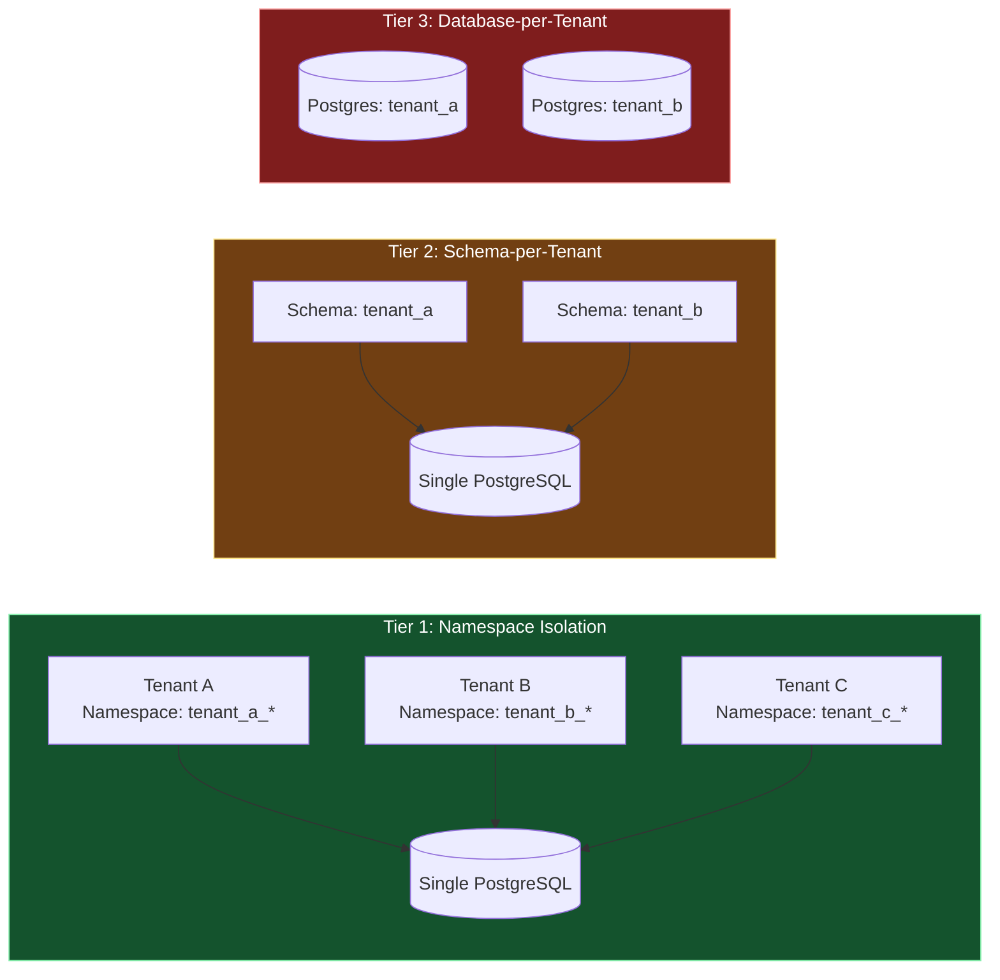

| Isolation Tier | When to Use | Cost Efficiency | Isolation Strength | Noisy Neighbor Risk |
|---------------|-------------|-----------------|-------------------|---------------------|
| **Namespace** (default) | Free/Starter plans | Highest (shared everything) | Logical (app-level) | Medium |
| **Schema-per-tenant** | Pro plans | Medium (shared Postgres, separate schemas) | Medium (Postgres schema isolation) | Low |
| **Database-per-tenant** | Enterprise plans | Lowest (dedicated Postgres per tenant) | Strongest (full DB isolation) | None |

### 2.2 Namespace Isolation (Current Model, Extended)

DarshanDB already uses namespace isolation for multi-tenancy. In the SaaS context, this extends as follows:

- Every tenant gets a unique `tenant_id` (UUIDv7 for time-ordering)
- All triple-store EAV rows are prefixed with the tenant's namespace
- The query engine injects `WHERE tenant_id = ?` on every query (same pattern as existing RLS)
- Connection pooling is shared; per-tenant connection limits enforced
- Indexes are shared but partition-pruned by tenant_id

**Verification:** Automated nightly cross-tenant leak tests. A canary tenant writes known data; a separate process queries as every other tenant and asserts zero visibility. Any leak triggers an immediate P0 alert.

### 2.3 Schema-per-Tenant

Each tenant gets a dedicated PostgreSQL schema within a shared database:

```sql
CREATE SCHEMA tenant_abc123;
SET search_path TO tenant_abc123;
-- All DarshanDB tables created within this schema
```

Benefits:
- `pg_dump` per schema for tenant-level backup/restore
- Schema-level `GRANT` for defense-in-depth
- Clean separation of indexes, sequences, and functions
- Easier compliance auditing (schema = boundary)

Cost: Higher connection overhead (schema switching), slightly more complex pooling.

### 2.4 Database-per-Tenant (Enterprise)

Each tenant gets a dedicated PostgreSQL instance (or a dedicated database within a cluster, configurable). This is the only option that provides:

- Independent `pg_hba.conf` (network-level isolation)
- Independent backup schedules and retention
- Independent resource limits (CPU, memory, IOPS)
- Ability to run on customer-designated hardware

### 2.5 Tenant Provisioning API

```
POST /api/v1/tenants
```

```json
{
  "name": "Acme Corp",
  "plan": "pro",
  "isolation": "schema",
  "region": "eu-west-1",
  "settings": {
    "max_records": 100000,
    "max_storage_gb": 10,
    "max_connections": 50,
    "max_functions": 20,
    "allowed_origins": ["https://app.acme.com"]
  }
}
```

Response:

```json
{
  "tenant_id": "01HZXYZ...",
  "project_url": "wss://acme-corp.darshandb.cloud",
  "api_key": "dk_live_...",
  "admin_url": "https://acme-corp.darshandb.cloud/admin",
  "status": "provisioning",
  "estimated_ready": "2026-04-05T12:00:05Z"
}
```

Provisioning SLA: < 5 seconds for namespace/schema tiers, < 60 seconds for database-per-tenant.

### 2.6 Usage Metering and Billing Hooks

Metering is built into the DarshanDB core as a Rust module, not bolted on externally. Every operation increments atomic counters that flush to a metering table every 10 seconds.

**Metered dimensions:**

| Dimension | Unit | Granularity |
|-----------|------|-------------|
| Records stored | Count | Per namespace |
| Storage consumed | Bytes | Per namespace (data + indexes + blobs) |
| WebSocket connections | Peak concurrent | Per minute |
| Bandwidth | Bytes in/out | Per request |
| Function invocations | Count | Per function |
| Function compute time | Wall-clock ms | Per invocation |
| Auth operations | Count | Per operation type |

**Billing integration:**

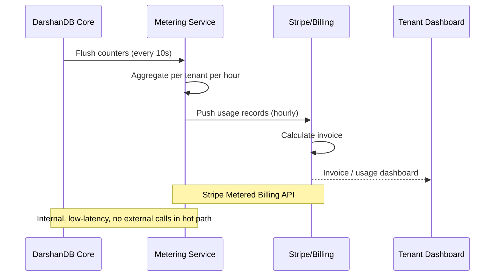

### 2.7 Tenant Data Isolation Verification

Continuous, automated, zero-trust verification:

1. **Canary tenants:** Synthetic tenants with known data in every isolation tier. Hourly cross-tenant query tests.
2. **Query plan analysis:** Sample 1% of queries and verify the `WHERE tenant_id = ?` clause is present in the Postgres `EXPLAIN` output.
3. **Network probes:** For database-per-tenant, automated port scans verify that tenant A's Postgres is not reachable from tenant B's network namespace.
4. **Audit log cross-reference:** Monthly automated report showing any query that touched rows outside its tenant boundary (should always be zero).

---

## 3. Enterprise Features

### 3.1 SSO: SAML 2.0 and OIDC

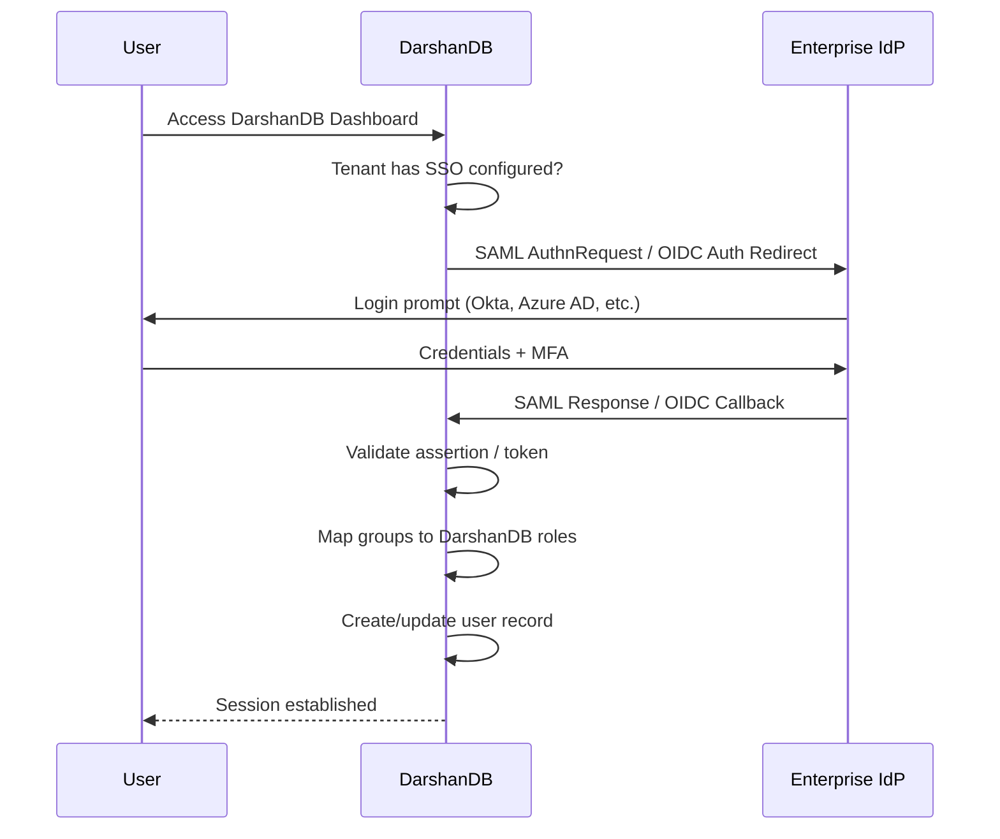

**Implementation details:**
- SAML 2.0 SP-initiated and IdP-initiated flows
- OIDC Authorization Code flow with PKCE
- Support for Okta, Azure AD, Google Workspace, OneLogin, PingIdentity, and generic SAML/OIDC
- JIT (Just-in-Time) user provisioning from SAML attributes
- Group-to-role mapping configured in DarshanDB admin
- Enforced SSO: option to disable password auth entirely for a tenant

### 3.2 SCIM 2.0 Directory Sync

Automated user and group lifecycle management:

```
SCIM Endpoints:
  POST   /scim/v2/Users           - Create user
  GET    /scim/v2/Users/:id       - Read user
  PUT    /scim/v2/Users/:id       - Replace user
  PATCH  /scim/v2/Users/:id       - Update user
  DELETE /scim/v2/Users/:id       - Deactivate user
  GET    /scim/v2/Groups          - List groups
  POST   /scim/v2/Groups          - Create group
  PATCH  /scim/v2/Groups/:id      - Update group membership
```

When a user is removed from the IdP directory, SCIM deactivation triggers:
1. All active sessions revoked
2. All API keys rotated/disabled
3. User marked as `deactivated` (not deleted -- audit trail preserved)
4. Real-time subscriptions terminated within 30 seconds

### 3.3 Audit Log Export and SIEM Integration

Every mutation in DarshanDB already produces an audit record (actor, timestamp, diff). Enterprise audit extends this to:

**Audit event schema:**

```json
{
  "event_id": "01HZXYZ...",
  "timestamp": "2026-04-05T12:00:00.000Z",
  "tenant_id": "01HZABC...",
  "actor": {
    "user_id": "01HZDEF...",
    "email": "jane@acme.com",
    "ip": "203.0.113.42",
    "user_agent": "Mozilla/5.0...",
    "session_id": "sess_..."
  },
  "action": "data.mutation",
  "resource": {
    "namespace": "todos",
    "record_id": "01HZGHI...",
    "operation": "update"
  },
  "before": { "done": false },
  "after": { "done": true },
  "permission_rule": "rule_todo_owner",
  "latency_ms": 3.2,
  "request_id": "req_..."
}
```

**Export targets:**

| Target | Protocol | Format |
|--------|----------|--------|
| S3/R2/GCS | Object upload | JSONL (gzipped, hourly batches) |
| Splunk | HEC (HTTP Event Collector) | JSON |
| Datadog | Log ingestion API | JSON |
| Elasticsearch | Bulk API | NDJSON |
| Webhook | HTTPS POST | JSON |
| Syslog | RFC 5424 | CEF or LEEF |
| Kafka | Producer | Avro or JSON |

Audit logs are immutable and append-only. Retention: configurable per tenant (minimum 90 days for SOC 2, minimum 6 years for HIPAA).

### 3.4 Compliance Readiness

#### SOC 2 Type II

DarshanDB Cloud will pursue SOC 2 Type II certification covering:

| Trust Service Criteria | DarshanDB Implementation |
|----------------------|--------------------------|
| **Security** | 11-layer defense-in-depth, Argon2id, RS256 JWT, TLS 1.3, V8 sandboxing |
| **Availability** | Multi-AZ PostgreSQL, automated failover, 99.95% SLA |
| **Processing Integrity** | ACID transactions, MVCC, audit trail on every mutation |
| **Confidentiality** | AES-256-GCM at rest, TLS 1.3 in transit, field-level encryption option |
| **Privacy** | Tenant isolation verification, data residency controls, right-to-erasure API |

#### HIPAA

For healthcare customers on Enterprise plans with database-per-tenant isolation:

- BAA (Business Associate Agreement) available
- PHI never stored in shared infrastructure
- Encryption at rest (AES-256-GCM) and in transit (TLS 1.3)
- Access audit logs with 6-year retention
- Automatic session timeout (configurable)
- IP allowlisting for admin dashboard access

#### GDPR

- Data residency (Section 3.5)
- Right to erasure: `DELETE /api/v1/tenants/:id/users/:user_id/erase` (hard delete with audit tombstone)
- Data portability: full export in JSON, CSV, or SQL format
- DPA (Data Processing Agreement) template provided
- Sub-processor list published and versioned

### 3.5 Data Residency (Geo-Pinned Storage)

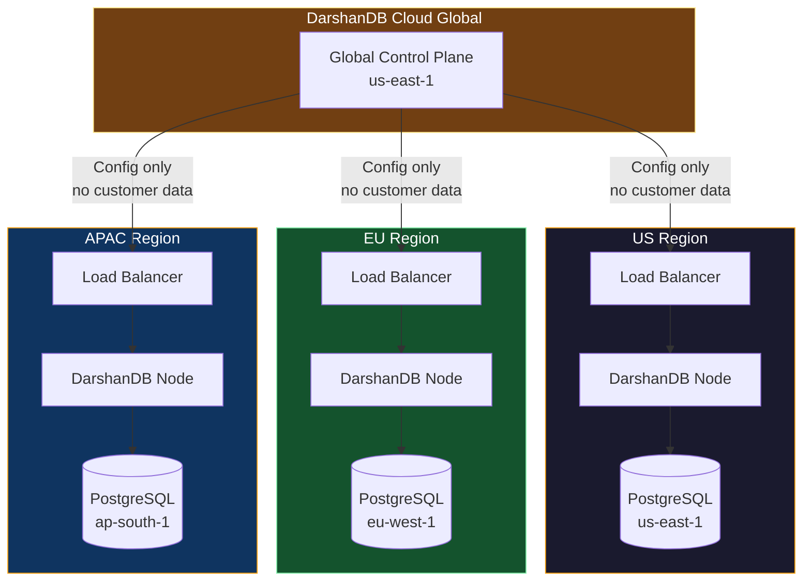

**Guarantees:**
- Tenant data (records, blobs, audit logs) never leaves the selected region
- The global control plane stores only metadata: tenant name, plan, config, billing. No application data.
- Region selection is immutable after provisioning (migration requires explicit export/import)
- Compliance certificates per region (SOC 2 scope includes specific regions)

**Initial regions:**
1. US East (us-east-1) -- Virginia
2. EU West (eu-west-1) -- Ireland
3. APAC South (ap-south-1) -- Mumbai

**Planned (Year 2):**
4. US West (us-west-2) -- Oregon
5. EU Central (eu-central-1) -- Frankfurt
6. APAC Southeast (ap-southeast-1) -- Singapore

### 3.6 Custom SLAs and Uptime Guarantees

| Plan | Uptime SLA | Support Response | Incident Credits |
|------|-----------|------------------|-----------------|
| Starter | 99.5% | Community (Discord) | None |
| Pro | 99.9% | Email < 24h | 10% for breach |
| Enterprise | 99.95% | Dedicated Slack, < 1h for P0 | 25% for breach, 50% for extended |
| Enterprise+ | 99.99% | Named engineer, < 15min for P0 | Custom |

The 99.99% SLA requires database-per-tenant isolation with multi-AZ PostgreSQL and active-passive DarshanDB failover.

---

## 4. Pricing Model

### 4.1 Pricing Tiers

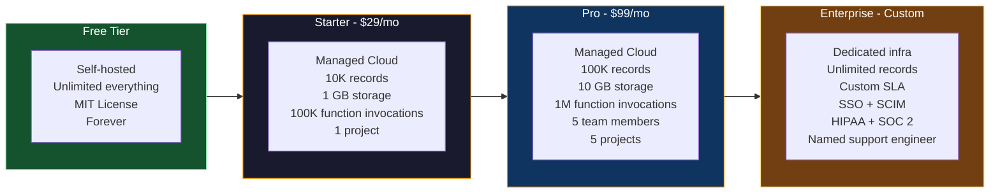

### 4.2 Detailed Pricing Breakdown

| Feature | Free (Self-Hosted) | Starter ($29/mo) | Pro ($99/mo) | Enterprise (Custom) |
|---------|:------------------:|:-----------------:|:------------:|:-------------------:|
| **Deployment** | Your server | DarshanDB Cloud | DarshanDB Cloud | Dedicated / Hybrid / Air-gapped |
| **Records** | Unlimited | 10,000 | 100,000 | Unlimited |
| **Storage** | Unlimited | 1 GB | 10 GB | Custom |
| **Bandwidth** | Unlimited | 5 GB/mo | 50 GB/mo | Custom |
| **WebSocket connections** | Unlimited | 100 concurrent | 1,000 concurrent | Custom |
| **Function invocations** | Unlimited | 100K/mo | 1M/mo | Custom |
| **Projects** | Unlimited | 1 | 5 | Unlimited |
| **Team members** | Unlimited | 1 | 5 | Unlimited |
| **Auth (MAU)** | Unlimited | 1,000 | 10,000 | Custom |
| **File storage** | Unlimited | 1 GB | 10 GB | Custom |
| **Backups** | Self-managed | Daily, 7-day retention | Hourly, 30-day retention | Custom PITR |
| **Support** | Community | Email | Priority email | Dedicated Slack + named engineer |
| **SSO/SCIM** | - | - | - | Included |
| **Audit log export** | - | - | 30-day | Custom retention |
| **SLA** | - | 99.5% | 99.9% | 99.95%+ |
| **Data residency** | Your choice | US | US, EU, APAC | Any + custom regions |
| **Isolation** | N/A | Namespace | Schema | Database-per-tenant |

### 4.3 Overage Pricing

All overages are billed at the end of the billing cycle. No service interruption -- soft limits with alerts.

| Dimension | Overage Rate |
|-----------|-------------|
| Records | $0.005 per 1,000 records |
| Storage | $0.10 per GB |
| Bandwidth | $0.08 per GB |
| Function invocations | $0.50 per 100K |
| Additional team member | $10/mo each |
| Additional project | $15/mo each |

### 4.4 Revenue Model Projections

The pricing is designed around a 70-80% gross margin target for cloud operations. Key unit economics:

- **Starter ($29/mo):** Infrastructure cost ~$5-8/tenant (shared Postgres, namespace isolation). Margin: ~75%.
- **Pro ($99/mo):** Infrastructure cost ~$15-25/tenant (dedicated schema, more resources). Margin: ~78%.
- **Enterprise ($X,XXX/mo):** Infrastructure cost varies. Target margin: 70%+. The margin comes from the software, not hosting.

The self-hosted free tier is the growth engine. It costs DarshanDB Inc. nothing to serve (no infrastructure) while building the community, ecosystem, and hiring pipeline that feed the cloud business.

---

## 5. Control Plane Architecture

### 5.1 Architecture Overview

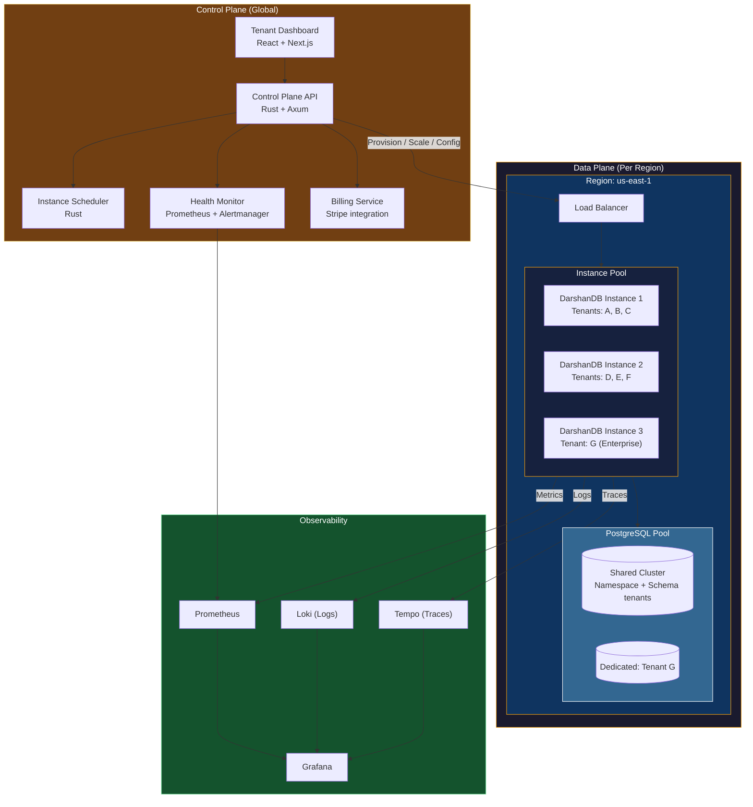

### 5.2 Tenant Management Dashboard

The tenant management dashboard is the internal operations view (not the per-tenant admin dashboard that already ships with DarshanDB).

**Capabilities:**

- **Tenant lifecycle:** Create, suspend, unsuspend, delete, migrate between regions
- **Resource monitoring:** Per-tenant real-time metrics (connections, queries/sec, storage, bandwidth)
- **Alerting:** Per-tenant health alerts (high error rate, approaching limits, slow queries)
- **Billing overview:** MRR, churn, usage trends, overage alerts
- **Support tools:** Impersonate tenant (read-only), view audit logs, run diagnostics
- **Fleet view:** All instances across all regions, health status, version, load

### 5.3 Auto-Scaling per Tenant

```mermaid
graph LR
    subgraph Signals["Scaling Signals"]
        S1["WebSocket\nconnection count"]
        S2["Query latency\np99"]
        S3["CPU utilization"]
        S4["Memory pressure"]
        S5["Queue depth\n(offline sync backlog)"]
    end

    subgraph Decisions["Scaling Decisions"]
        D1["Scale Up Instance\n(more CPU/RAM)"]
        D2["Scale Out\n(add read replicas)"]
        D3["Migrate to\nDedicated Postgres"]
        D4["Add DarshanDB Node\n(horizontal)"]
    end

    subgraph Actions["Automated Actions"]
        A1["Resize container"]
        A2["Provision replica"]
        A3["Create new PG instance\n+ migrate data"]
        A4["Update load balancer"]
    end

    Signals --> Decisions --> Actions

    style Signals fill:#1a1a2e,stroke:#F59E0B,color:#fff
    style Decisions fill:#713f12,stroke:#fde68a,color:#fff
    style Actions fill:#14532d,stroke:#86efac,color:#fff
```

**Scaling rules:**

| Signal | Threshold | Action | Cooldown |
|--------|-----------|--------|----------|
| WebSocket connections | > 80% of plan limit | Alert tenant, suggest upgrade | - |
| Query latency p99 | > 200ms for 5 min | Add read replica | 15 min |
| CPU | > 80% for 10 min | Vertical scale (more CPU) | 30 min |
| Memory | > 85% for 5 min | Vertical scale (more RAM) | 30 min |
| Sync queue depth | > 10,000 pending | Add DarshanDB node | 15 min |

**Enterprise auto-scaling** is fully automatic. Starter/Pro scaling is manual (user-initiated upgrade) with alerts at 80% of limits.

### 5.4 Resource Quotas and Limits

Enforced at the DarshanDB core level (not just billing -- hard limits that prevent noisy neighbor issues):

```rust
// Conceptual -- enforced in the query engine and connection handler
struct TenantQuota {
    max_records: u64,
    max_storage_bytes: u64,
    max_concurrent_connections: u32,
    max_queries_per_second: u32,
    max_function_invocations_per_hour: u64,
    max_function_wall_time_ms: u32,       // per invocation
    max_function_memory_bytes: u64,        // per invocation
    max_query_complexity: u32,             // AST node count
    max_batch_size: u32,                   // mutations per transaction
    max_file_upload_bytes: u64,            // per file
}
```

When a tenant hits a hard limit:
1. Operation returns `429 Quota Exceeded` with the specific limit and current usage
2. WebSocket subscription continues (reads are not blocked when write quotas are hit)
3. Alert sent to tenant dashboard
4. Metering records the overage for billing

### 5.5 Backup Automation per Tenant

| Isolation Tier | Backup Method | Granularity | Restore Method |
|---------------|---------------|-------------|----------------|
| Namespace | Full database `pg_dump` + namespace filter | Hourly (Pro), Daily (Starter) | `pg_restore` with namespace filter |
| Schema | Per-schema `pg_dump` | Hourly | Schema-level restore |
| Database-per-tenant | Full `pg_basebackup` + WAL archiving | Continuous PITR | Point-in-time restore |

**Backup storage:** S3-compatible (configurable: AWS S3, Cloudflare R2, MinIO). Encrypted with per-tenant AES-256-GCM keys. Cross-region replication for Enterprise.

**Restore SLA:**

| Plan | Restore Time |
|------|-------------|
| Starter | < 1 hour |
| Pro | < 15 minutes |
| Enterprise | < 5 minutes (PITR) |

### 5.6 Cross-Region Replication

For Enterprise tenants requiring geographic redundancy:

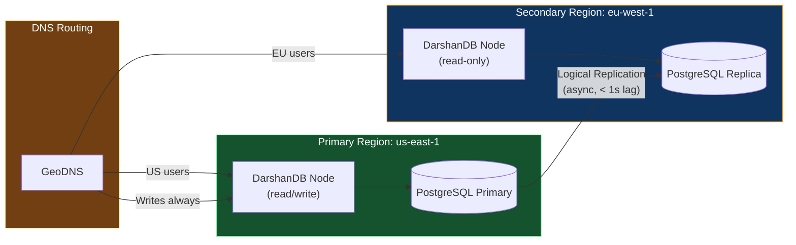

- Read replicas serve local reads with sub-millisecond latency
- Writes always route to primary (strong consistency)
- Automatic failover: if primary region goes down, secondary promotes within 60 seconds
- Replication lag monitoring: alert if > 5 seconds

---

## 6. Migration and Data Portability

### 6.1 Principle

DarshanDB does not lock in customers. Data portability is a core product value, not a reluctant compliance checkbox. Any customer can export 100% of their data at any time, in standard formats, with zero intervention from DarshanDB.

### 6.2 Migration Paths

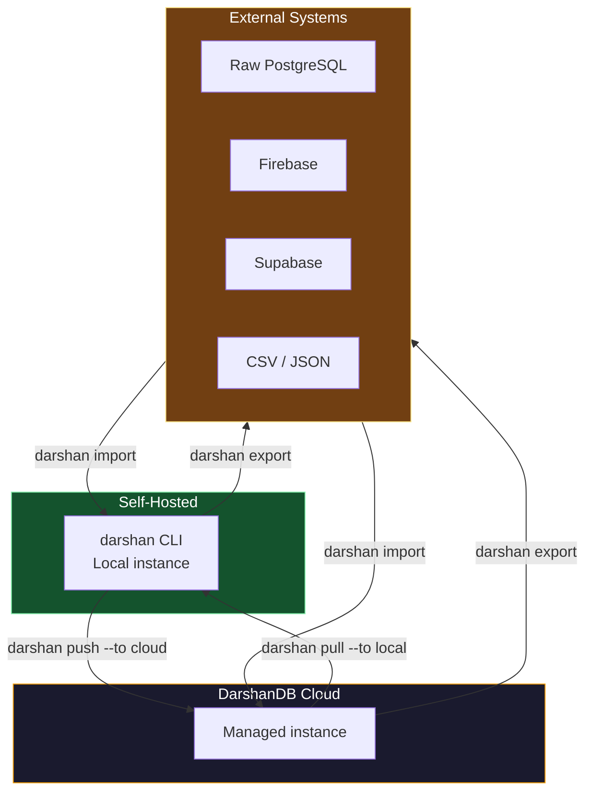

### 6.3 Self-Hosted to Cloud

```bash
# On the self-hosted instance
darshan push --to cloud \
  --project "my-project" \
  --region "eu-west-1" \
  --plan "pro"

# What happens:
# 1. darshan CLI authenticates with DarshanDB Cloud
# 2. Creates a new tenant with specified plan and region
# 3. Snapshots local PostgreSQL (triple store + auth + files metadata)
# 4. Streams snapshot to cloud instance via encrypted channel
# 5. Transfers blob storage (S3-compatible sync)
# 6. Verifies record counts match
# 7. Provides new project URL
# 8. Local instance continues running (no disruption)
```

### 6.4 Cloud to Self-Hosted

```bash
# On any machine with darshan CLI
darshan pull --from cloud \
  --project "my-project" \
  --target-pg "postgres://localhost:5432/mydb"

# What happens:
# 1. Authenticates with DarshanDB Cloud
# 2. Creates a consistent snapshot of the tenant
# 3. Streams triple store data to local PostgreSQL
# 4. Syncs blob storage to local S3-compatible target
# 5. Exports auth users (passwords are hashed, tokens invalidated)
# 6. Exports server functions
# 7. Exports permission rules
# 8. Verifies integrity
# 9. Outputs `darshan.toml` configured for the local setup
```

### 6.5 Import from Competitors

```bash
# Firebase
darshan import firebase \
  --credentials service-account.json \
  --collections "users,todos,comments"

# Supabase
darshan import supabase \
  --connection-string "postgres://..." \
  --tables "public.*"

# Raw PostgreSQL
darshan import postgres \
  --connection-string "postgres://..." \
  --tables "users,orders,products"

# CSV / JSON
darshan import csv --file data.csv --namespace "products"
darshan import json --file data.json --namespace "users"
```

### 6.6 Export to Standard Formats

```bash
# Full export (all namespaces, all data)
darshan export --format sql --output backup.sql
darshan export --format json --output backup.json
darshan export --format csv --output-dir ./csv-export/

# Selective export
darshan export --namespace "users" --format json
darshan export --namespace "orders" --where "created_at > '2026-01-01'"
```

---

## 7. Go-to-Market Strategy

### 7.1 Flywheel Model

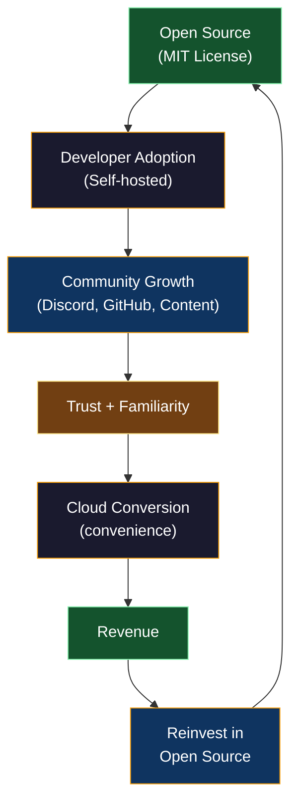

### 7.2 Phase 1: Open-Source Foundation (Months 0-6)

**Goal:** 5,000 GitHub stars, 500 Discord members, 50 production self-hosted deployments.

**Tactics:**

1. **Launch on Hacker News, Product Hunt, r/selfhosted, r/rust**
   - Position: "The Firebase alternative that's a single Rust binary"
   - Key differentiator: self-hosted, relational, real-time, single binary

2. **Developer content**
   - "Build a real-time todo app in 5 minutes with DarshanDB" (video + blog)
   - "Why we chose Rust for a BaaS" (technical deep-dive)
   - "DarshanDB vs Firebase vs Supabase: honest comparison" (SEO play)
   - "From zero to production on a $5 VPS" (self-hosted appeal)

3. **SDK ecosystem quality**
   - React, Next.js, Vue, Svelte SDKs must be flawless
   - TypeScript types must be perfect (this is the #1 developer experience signal)
   - Examples for every framework

4. **Community infrastructure**
   - Discord with channels: #help, #showcase, #contributing, #feature-requests
   - GitHub Discussions for long-form questions
   - Weekly "office hours" live stream

5. **Contributor pipeline**
   - "Good first issue" labels on GitHub
   - Contributor recognition in release notes
   - Swag for significant contributors

### 7.3 Phase 2: Cloud Launch (Months 6-12)

**Goal:** 200 paying cloud customers, $15K MRR.

**Tactics:**

1. **Waitlist during Phase 1**
   - Collect emails on darshandb.dev/cloud
   - Priority access for active self-hosted users and contributors

2. **Free-to-paid conversion**
   - One-command migration: `darshan push --to cloud`
   - "Your self-hosted DarshanDB, but we handle the ops"
   - Target: developers who love the product but don't want to manage PostgreSQL

3. **Startup program**
   - 6 months free Pro tier for YC, Techstars, and other accelerator companies
   - Creates lock-in at the architecture level (hardest to switch later)

4. **Integration partnerships**
   - Vercel: one-click deploy template
   - Railway, Fly.io, Render: managed DarshanDB add-on
   - Cloudflare: R2 integration for blob storage

### 7.4 Phase 3: Enterprise Sales (Months 12-24)

**Goal:** 10 Enterprise customers, $100K MRR.

**Tactics:**

1. **Enterprise features as the moat**
   - SSO, SCIM, audit export, compliance certifications
   - These features are cloud/enterprise only (not in the open-source binary)
   - This is the business model: open core + enterprise features

2. **Sales motion**
   - Inbound-led: developer at BigCo uses self-hosted DarshanDB for a side project, introduces it to their team, team needs SSO/compliance, becomes Enterprise customer
   - This is the Datadog/Grafana playbook

3. **Compliance certifications**
   - SOC 2 Type II audit (6-month process, start at month 12)
   - HIPAA compliance documentation
   - GDPR DPA template

4. **Enterprise sales team**
   - Hire 1-2 solution engineers who can do technical demos
   - Sales-assisted, not sales-led (developers must champion internally first)

### 7.5 Phase 4: Platform Ecosystem (Months 24+)

**Goal:** Marketplace, third-party integrations, partner channel.

**Tactics:**

1. **Function marketplace**
   - Third-party server functions (auth providers, payment integrations, AI/ML)
   - Revenue share: 70/30 (developer/DarshanDB)

2. **Managed services partners**
   - Consulting firms that deploy and manage DarshanDB for enterprises
   - Certification program for partners

3. **Regional expansion**
   - Local data centers in high-demand regions
   - Local-language documentation (Hindi, Portuguese, Japanese)

---

## 8. Implementation Roadmap

### 8.1 Milestone Timeline

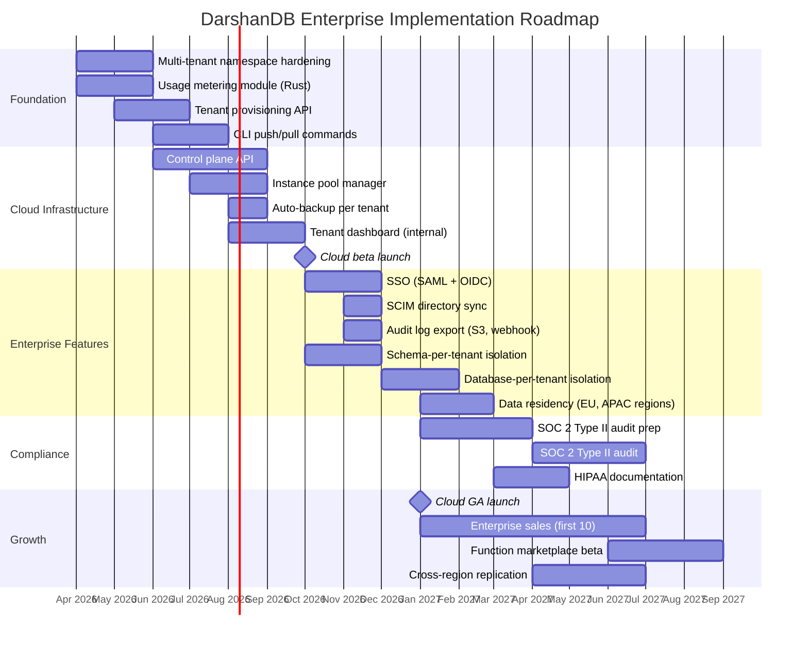

### 8.2 Priority Matrix

| Priority | Feature | Revenue Impact | Engineering Effort | Dependencies |
|----------|---------|---------------|-------------------|--------------|
| P0 | Usage metering | Enables all billing | Medium | None |
| P0 | Tenant provisioning API | Enables cloud product | Medium | Metering |
| P0 | Namespace hardening | Required for SaaS | Low (extend existing) | None |
| P1 | Control plane API | Manages fleet | High | Provisioning API |
| P1 | Auto-backup | Customer expectation | Medium | Control plane |
| P1 | `darshan push/pull` | Conversion enabler | Medium | Provisioning API |
| P2 | SSO/SCIM | Enterprise gate | Medium | Auth engine extension |
| P2 | Schema-per-tenant | Pro plan enabler | Medium | Provisioning API |
| P2 | Audit export | Enterprise gate | Low | Existing audit logs |
| P3 | Database-per-tenant | Enterprise enabler | High | Control plane, infra |
| P3 | Cross-region replication | Enterprise upsell | High | Database-per-tenant |
| P3 | SOC 2 certification | Enterprise gate | Process, not code | Audit export, data residency |

### 8.3 Open Core Boundary

What stays MIT (open source forever):

- DarshanDB server binary (all current features)
- All SDKs (React, Next.js, Angular, Vue, Svelte, PHP, Python)
- CLI (`darshan dev`, `darshan start`, `darshan deploy`)
- Admin dashboard
- Single-node and cluster deployment
- Namespace multi-tenancy
- All security features (RLS, ABAC, field-level, etc.)
- Server functions runtime
- Real-time sync engine
- Offline-first client
- Import/export tools

What is cloud/enterprise only (proprietary):

- DarshanDB Cloud control plane
- Tenant management dashboard
- Auto-scaling and fleet management
- SSO (SAML 2.0, OIDC)
- SCIM directory sync
- Audit log export to SIEM
- Schema-per-tenant and database-per-tenant isolation
- Cross-region replication
- Managed backups with PITR
- Data residency controls
- SLA guarantees
- Priority support

This boundary ensures the open-source product is genuinely complete and useful. No developer should ever feel that features were artificially withheld. The enterprise features are genuinely enterprise concerns -- SSO, SCIM, compliance, fleet management -- that individual developers and small teams do not need.

---

## Appendix A: Competitive Positioning

| Competitor | Model | Self-Hosted | DarshanDB Advantage |
|-----------|-------|-------------|---------------------|
| Firebase | Proprietary SaaS | No | Self-hosted option, relational, open source |
| Supabase | Open core + Cloud | Difficult (10+ services) | Single binary, native real-time, offline-first |
| Convex | Proprietary SaaS | No | Self-hosted, MIT license, no lock-in |
| InstantDB | Partially open + Cloud | No | Self-hosted, server functions, full security stack |
| PocketBase | Open source, self-hosted only | Yes | Cloud offering, enterprise features, SDKs |
| Appwrite | Open source + Cloud | Yes | Single binary (vs Docker Compose), Rust performance |

DarshanDB's unique position: the only BaaS that is simultaneously a single Rust binary for self-hosting AND a managed cloud service, with full data portability between the two.

## Appendix B: Key Metrics to Track

| Metric | Phase 1 Target | Phase 2 Target | Phase 3 Target |
|--------|---------------|---------------|---------------|
| GitHub stars | 5,000 | 15,000 | 30,000 |
| Discord members | 500 | 2,000 | 5,000 |
| Self-hosted deployments | 50 | 500 | 2,000 |
| Cloud customers | - | 200 | 1,000 |
| Enterprise customers | - | - | 10 |
| MRR | $0 | $15,000 | $100,000 |
| ARR | $0 | $180,000 | $1,200,000 |
| Cloud → Self-hosted migrations | - | < 5% churn | < 3% churn |
| Self-hosted → Cloud conversions | - | 5% of active users | 8% of active users |
| NPS | > 50 | > 60 | > 70 |

---

*This strategy document is a living artifact. It should be revisited quarterly and updated based on market feedback, customer conversations, and engineering capacity.*
