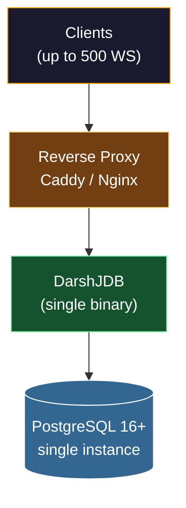
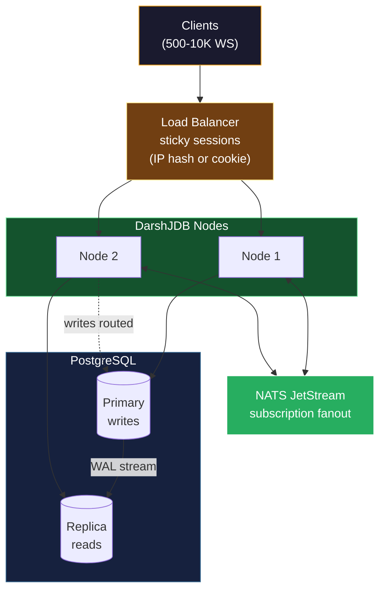
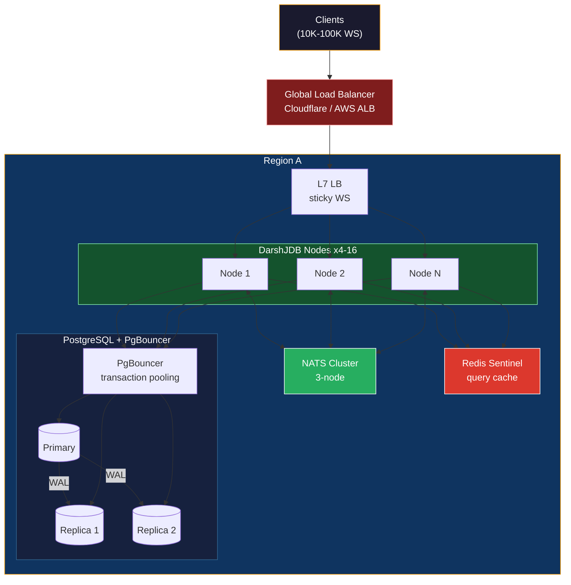
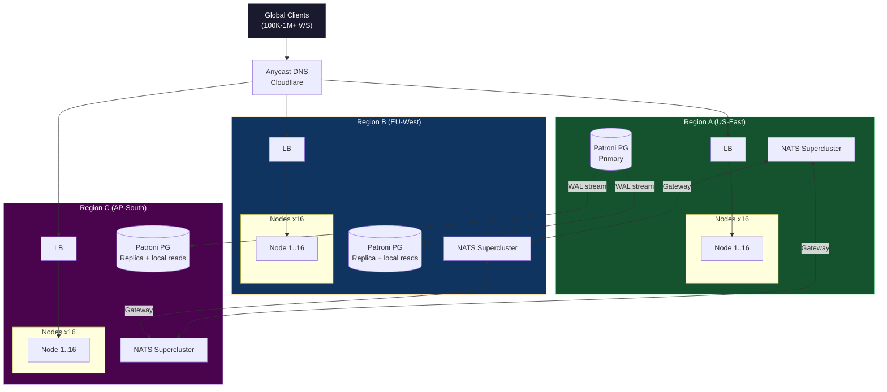
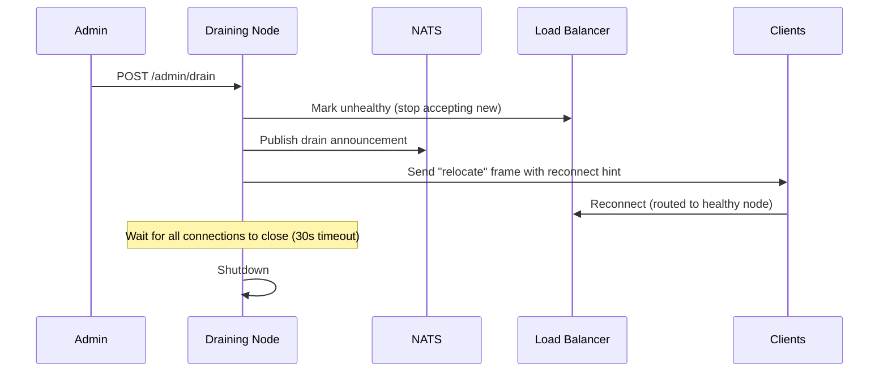
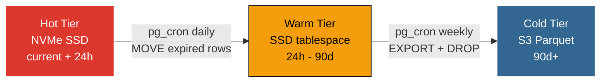
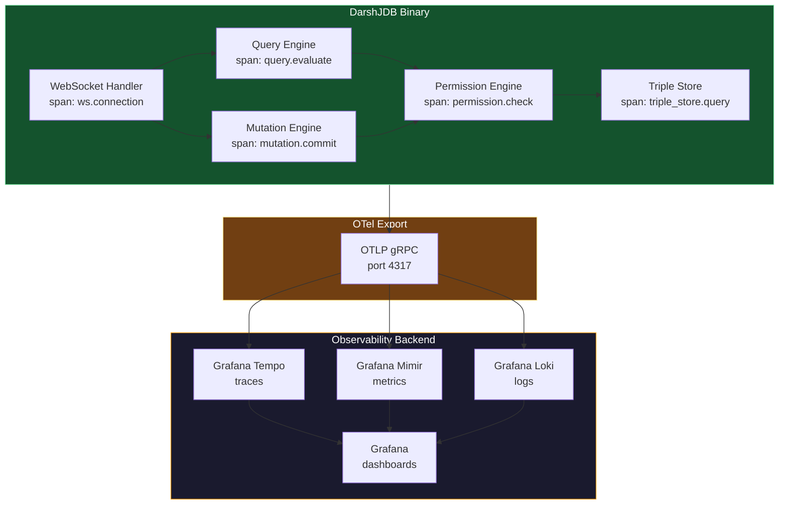
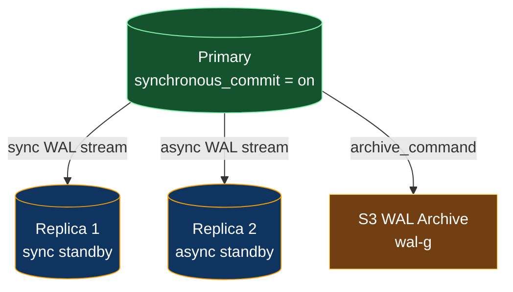
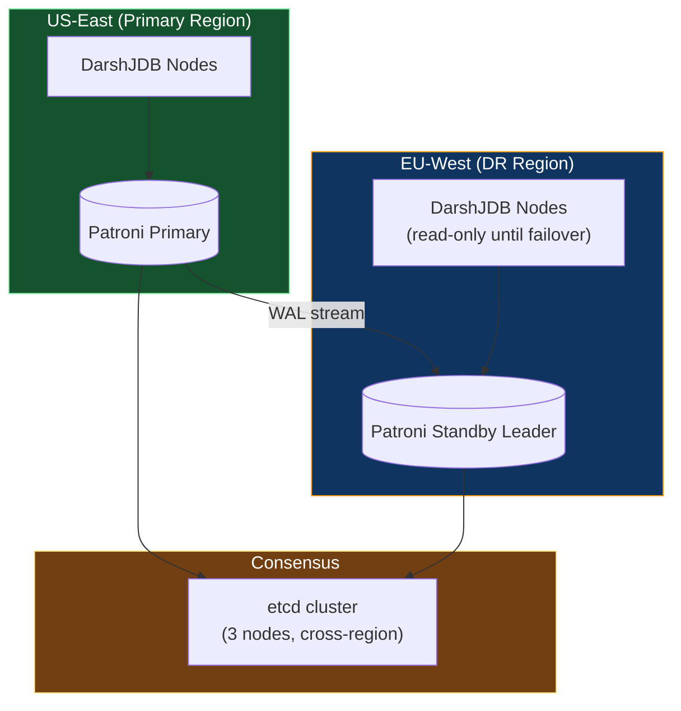
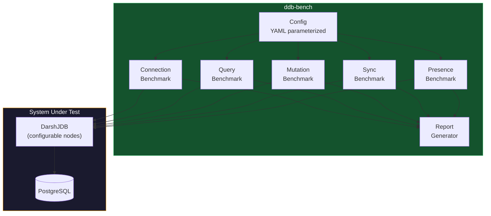

# DarshJDB Scalability and Reliability Engineering Strategy

> Version 1.0 | April 2026
> Authors: Darsh Joshi, DarshJDB Core Team

This document defines the engineering strategy for scaling DarshJDB from a single-node deployment serving hundreds of connections to a geo-distributed cluster handling millions. Every recommendation is grounded in the current architecture: a stateless Rust (Axum + Tokio) server, PostgreSQL 16+ triple store, MsgPack-over-WebSocket wire protocol, and the in-process sync engine that powers reactive queries.

---

## Table of Contents

1. [Scale Tiers Overview](#1-scale-tiers-overview)
2. [Horizontal Scaling](#2-horizontal-scaling)
3. [Database Scaling](#3-database-scaling)
4. [Observability](#4-observability)
5. [Disaster Recovery](#5-disaster-recovery)
6. [Performance Optimization](#6-performance-optimization)
7. [Benchmarking Suite](#7-benchmarking-suite)

---

## 1. Scale Tiers Overview

DarshJDB defines four operational tiers. Each tier has an architecture diagram, a set of infrastructure requirements, and clear criteria for when to graduate to the next tier.

| Tier | Connections | Queries/sec | Mutations/sec | Nodes | Postgres |
|------|------------|-------------|---------------|-------|----------|
| **T0 -- Solo** | 0-500 | 0-1K | 0-200 | 1 | 1 (embedded or external) |
| **T1 -- Startup** | 500-10K | 1K-20K | 200-5K | 2-4 | Primary + 1 replica |
| **T2 -- Growth** | 10K-100K | 20K-200K | 5K-50K | 4-16 | Primary + 2 replicas + PgBouncer |
| **T3 -- Scale** | 100K-1M+ | 200K-2M+ | 50K-500K+ | 16-64+ | Multi-region Patroni cluster |

### Tier Architecture Diagrams

#### T0 -- Solo (single node, single Postgres)



#### T1 -- Startup (load-balanced nodes, streaming replica)



#### T2 -- Growth (regional cluster, connection pooling, distributed cache)



#### T3 -- Scale (multi-region, partitioned triple store, global presence)



---

## 2. Horizontal Scaling

### 2.1 Stateless Node Architecture

The current DarshJDB binary is designed to be stateless at the process level. All durable state lives in PostgreSQL. The in-process sync engine (the `SubscriptionRegistry`, `SyncSessionManager`, and `PresenceManager` visible in `main.rs`) holds ephemeral subscription and presence state in memory. This is correct for T0 and manageable at T1, but requires shared state infrastructure starting at T2.

**Current state (T0):**
- `SubscriptionRegistry` -- in-process `DashMap<QueryHash, Vec<SessionId>>`
- `SyncSessionManager` -- in-process session-to-connection map
- `PresenceManager` -- in-process presence heartbeat store
- `diff_tx` channel -- in-process `mpsc` for mutation broadcast

**No changes needed** for single-node deployment. The binary remains self-contained.

### 2.2 Sticky Sessions for WebSocket (T1+)

WebSocket connections are long-lived and stateful at the transport layer. When running multiple DarshJDB nodes behind a load balancer, a client must reconnect to the same node for the lifetime of its session (or perform a coordinated migration -- see 2.5).

**Load balancer configuration:**

```nginx
# Nginx -- sticky via $cookie_darshan_node or IP hash fallback
upstream darshjdb {
    ip_hash;
    server node1:7700;
    server node2:7700;
    server node3:7700;
}

map $http_upgrade $connection_upgrade {
    default upgrade;
    ''      close;
}

server {
    listen 443 ssl http2;
    server_name api.example.com;

    location /ws {
        proxy_pass http://darshjdb;
        proxy_http_version 1.1;
        proxy_set_header Upgrade $http_upgrade;
        proxy_set_header Connection $connection_upgrade;
        proxy_set_header X-Real-IP $remote_addr;
        proxy_set_header X-Forwarded-For $proxy_add_x_forwarded_for;

        # Critical: keep WebSocket alive through idle periods
        proxy_read_timeout 3600s;
        proxy_send_timeout 3600s;

        # Sticky cookie for reconnection affinity
        sticky cookie darshan_node expires=1h path=/ws httponly;
    }

    location /api {
        proxy_pass http://darshjdb;
        # REST is stateless -- round-robin is fine
    }
}
```

**Key decisions:**
- REST endpoints (`/api/*`) use round-robin -- they are fully stateless.
- WebSocket endpoints (`/ws`) use cookie-based stickiness with IP-hash fallback.
- The `proxy_read_timeout` must exceed the heartbeat interval (currently 30s) with margin.

### 2.3 Shared Subscription State (T1+)

When a mutation occurs on Node A, clients connected to Node B must also receive the diff if they are subscribed to affected queries. This requires a cross-node broadcast channel.

**Recommended: NATS JetStream**

NATS is chosen over Redis pub/sub for three reasons:
1. **At-least-once delivery** -- JetStream provides durable subscriptions. Redis pub/sub is fire-and-forget; if a node is temporarily unreachable, it misses messages permanently.
2. **Backpressure** -- NATS flow control prevents fast publishers from overwhelming slow consumers. Redis pub/sub has no backpressure mechanism.
3. **Cluster topology** -- NATS superclusters natively support multi-region gateway routing (critical for T3).

**Subject hierarchy:**

```
ddb.{tenant}.mutations        -- mutation events (entity, attribute, value, tx_id)
ddb.{tenant}.invalidations    -- query hash invalidation signals
ddb.{tenant}.presence.{room}  -- presence heartbeats
ddb.internal.node.{id}.drain  -- node drain / shutdown coordination
```

**Integration pattern:**

```rust
// Pseudocode for cross-node mutation broadcast
async fn on_mutation_committed(mutation: &Mutation, nats: &async_nats::Client) {
    // 1. Compute which query hashes are affected by this mutation
    let affected = subscription_registry.match_mutation(mutation);

    // 2. Publish invalidation to NATS so other nodes re-evaluate
    let subject = format!("ddb.{}.invalidations", mutation.tenant);
    let payload = InvalidationEvent {
        query_hashes: affected,
        tx_id: mutation.tx_id,
        source_node: NODE_ID,
    };
    nats.publish(subject, serde_json::to_vec(&payload)?.into()).await?;
}

// On each node: background subscriber
async fn invalidation_listener(nats: &async_nats::Client) {
    let mut sub = nats.subscribe("ddb.*.invalidations").await?;
    while let Some(msg) = sub.next().await {
        let event: InvalidationEvent = serde_json::from_slice(&msg.payload)?;
        if event.source_node == NODE_ID {
            continue; // already handled locally
        }
        // Re-evaluate affected queries for local subscribers
        for hash in &event.query_hashes {
            sync_engine.re_evaluate_query(hash).await;
        }
    }
}
```

**Sizing guidance:**
- T1 (2-4 nodes): Single NATS server, in-memory streams. ~50K msgs/sec is typical.
- T2 (4-16 nodes): 3-node NATS cluster with file-backed JetStream.
- T3 (16-64+ nodes): NATS supercluster with gateway routes per region.

### 2.4 Distributed Query Result Cache (T2+)

The current architecture evaluates every reactive query directly against Postgres. At T2 scale (20K+ queries/sec), this becomes the bottleneck. A distributed cache layer reduces read load on Postgres by 60-80%.

**Cache architecture:**


**Cache key design:**

```
ddb:cache:{tenant}:{query_hash}:{permission_hash}:{tx_id}
```

- `query_hash` -- deterministic hash of the DarshanQL AST (normalized, parameter-independent).
- `permission_hash` -- hash of the effective RLS WHERE clause for the requesting user's role set. Two users with identical roles hit the same cache entry.
- `tx_id` -- the transaction watermark. When a mutation commits at `tx_id = N`, all cache entries with `tx_id < N` for affected entity types are invalidated.

**Invalidation strategy:**
- **Eager invalidation via NATS.** On mutation commit, publish affected entity types. Each node evicts L1 entries; a background worker evicts L2 entries from Redis using `UNLINK` (non-blocking delete).
- **TTL safety net.** All cache entries carry a 60-second TTL. Even if invalidation is delayed, stale data is bounded.
- **No cache-aside for mutations.** Writes always go to Postgres. The cache is read-only.

**Sizing:**
- L1 (in-process): 50MB per node. Eviction: LRU with 10K entry cap.
- L2 (Redis): Start with 1GB. Scale linearly with distinct `(query_hash, permission_hash)` combinations. Monitor `redis-cli info memory` and the custom `darshan_cache_hit_ratio` metric.

### 2.5 Connection Migration on Node Failure (T2+)

When a DarshJDB node crashes or is drained for maintenance, its connected clients must reconnect. The goal is to make this seamless: the client reconnects to any available node and resumes its subscription state without re-fetching full datasets.

**Protocol:**

1. **Client reconnects** to any node (load balancer picks the next healthy node).
2. Client sends `resume` frame: `{ session_id, last_tx_id, query_hashes: [...] }`.
3. New node looks up the session in Postgres (sessions table) to verify identity.
4. New node re-registers subscriptions from the provided `query_hashes`.
5. For each query, the node computes a diff between `last_tx_id` and current `HEAD` tx.
6. Client receives catch-up diffs and returns to live sync.

**Drain protocol (graceful):**



**Failure detection (ungraceful):**
- Load balancer health checks (`/health` endpoint, 5s interval, 3 failures = unhealthy).
- Clients detect disconnect via WebSocket `close` event or missed heartbeat (45s timeout).
- Client SDK automatically reconnects with exponential backoff (1s, 2s, 4s, 8s, cap 30s).
- The SDK includes the `resume` frame on reconnect, making migration transparent.

---

## 3. Database Scaling

### 3.1 Read Replicas for Query Distribution

DarshJDB's workload is heavily read-biased. Reactive queries continuously evaluate against Postgres. Mutations are comparatively rare (typical ratio: 20:1 reads-to-writes for most applications).

**Read routing strategy:**

| Operation | Target | Rationale |
|-----------|--------|-----------|
| Mutation (INSERT/UPDATE/DELETE) | Primary | ACID guarantees require single-writer |
| Initial query load (`q-init`) | Replica (preferred) | Tolerate ~100ms replication lag |
| Reactive re-evaluation | Replica (preferred) | Same tolerance; invalidation is tx-based |
| Auth token verification | Primary | Must read latest revocation state |
| Permission rule loading | Replica | Rules change infrequently; cache locally |
| Time-travel queries | Replica | Historical reads are inherently stale |

**Implementation with sqlx:**

```rust
// In connection pool initialization
let write_pool = PgPoolOptions::new()
    .max_connections(max_connections / 4)  // 25% of pool for writes
    .connect(&primary_url).await?;

let read_pool = PgPoolOptions::new()
    .max_connections(max_connections * 3 / 4)  // 75% for reads
    .connect(&replica_url).await?;

// Query engine selects pool based on operation type
impl QueryEngine {
    fn pool_for(&self, op: &Operation) -> &PgPool {
        match op {
            Operation::Read { .. } => &self.read_pool,
            Operation::Write { .. } => &self.write_pool,
        }
    }
}
```

**Replication lag monitoring:**
- Query `pg_stat_replication` on primary for `sent_lsn - replay_lsn` delta.
- If lag exceeds 500ms, route reads to primary temporarily.
- Expose as `darshan_pg_replication_lag_ms` Prometheus metric.

### 3.2 Connection Pooling (PgBouncer / Supavisor)

DarshJDB currently creates a `sqlx::PgPool` with `max_connections = 20`. This works at T0 but becomes a bottleneck at T1+ when multiple nodes compete for a limited number of Postgres connections (default `max_connections = 100`).

**Recommendation: PgBouncer in transaction mode (T1-T2), Supavisor for T3.**

| Setting | T0 | T1 | T2 | T3 |
|---------|----|----|----|----|
| Pooler | None (sqlx direct) | PgBouncer | PgBouncer | Supavisor |
| Mode | N/A | Transaction | Transaction | Transaction |
| `pool_size` (per pooler) | N/A | 50 | 200 | 500 |
| `max_client_conn` | N/A | 1000 | 5000 | 20000 |
| `default_pool_size` | N/A | 25 | 50 | 100 |
| PG `max_connections` | 100 | 150 | 300 | 500 |
| Nodes per pooler | 1 | 2-4 | 4-16 | 16+ |

**PgBouncer configuration (T2 example):**

```ini
[databases]
darshjdb_primary = host=pg-primary port=5432 dbname=darshjdb
darshjdb_replica = host=pg-replica-1 port=5432 dbname=darshjdb

[pgbouncer]
listen_addr = 0.0.0.0
listen_port = 6432
auth_type = scram-sha-256
pool_mode = transaction
max_client_conn = 5000
default_pool_size = 50
reserve_pool_size = 10
reserve_pool_timeout = 3
server_idle_timeout = 300
server_lifetime = 3600
log_connections = 0
log_disconnections = 0

# Critical for DarshJDB: disable prepared statement caching
# at PgBouncer level (DarshJDB handles this internally)
max_prepared_statements = 0
```

**Why transaction mode:** DarshJDB does not use session-level features (advisory locks, SET variables, LISTEN/NOTIFY through the pooler). All queries are self-contained transactions. Transaction mode allows maximum connection multiplexing.

**Supavisor (T3):** Supavisor is an Elixir-based pooler that supports tenant-aware routing, built-in metrics, and native multi-tenant connection management. At T3, where DarshJDB serves thousands of tenants, Supavisor's per-tenant pool isolation prevents noisy-neighbor effects.

### 3.3 Partitioning Strategy for Triple Store

DarshJDB's triple store uses an EAV (Entity-Attribute-Value) model stored in PostgreSQL. The core table schema is approximately:

```sql
CREATE TABLE triples (
    entity_id   UUID NOT NULL,
    attribute   TEXT NOT NULL,
    value_type  SMALLINT NOT NULL,
    value       JSONB NOT NULL,
    tx_id       BIGINT NOT NULL,
    tenant_id   UUID NOT NULL,
    created_at  TIMESTAMPTZ NOT NULL DEFAULT now(),
    expired_at  TIMESTAMPTZ,  -- NULL = current; set on update/delete for time-travel
    PRIMARY KEY (tenant_id, entity_id, attribute, tx_id)
);
```

**Partitioning strategy (two-level):**

**Level 1: Partition by tenant (LIST partitioning)**

```sql
-- Parent table
CREATE TABLE triples (
    -- columns as above
) PARTITION BY LIST (tenant_id);

-- Per-tenant partitions (created dynamically on tenant provisioning)
CREATE TABLE triples_tenant_abc123 PARTITION OF triples
    FOR VALUES IN ('abc123-...');
```

Benefits:
- Complete data isolation per tenant (critical for compliance and `DROP` on tenant deletion).
- Index scans never cross tenant boundaries.
- Enables per-tenant `VACUUM` and `ANALYZE` schedules.

**Level 2: Sub-partition by time (RANGE on tx_id)**

```sql
-- Each tenant partition is further sub-partitioned by tx_id range
CREATE TABLE triples_tenant_abc123 PARTITION OF triples
    FOR VALUES IN ('abc123-...')
    PARTITION BY RANGE (tx_id);

CREATE TABLE triples_tenant_abc123_tx_0_1m
    PARTITION OF triples_tenant_abc123
    FOR VALUES FROM (0) TO (1000000);
```

Benefits:
- Old transaction ranges can be moved to cold storage (see 3.4).
- Partition pruning eliminates scanning historical data for current-state queries.
- `DROP` a partition is O(1) vs. `DELETE` which requires `VACUUM`.

**Index strategy per partition:**

```sql
-- Primary lookup: current state of an entity
CREATE INDEX idx_entity_current ON triples_tenant_xxx (entity_id, attribute)
    WHERE expired_at IS NULL;

-- Reverse lookup: find entities by attribute value
CREATE INDEX idx_attr_value ON triples_tenant_xxx (attribute, value)
    WHERE expired_at IS NULL;

-- Time-travel: find state at a specific tx_id
CREATE INDEX idx_entity_timetravel ON triples_tenant_xxx (entity_id, attribute, tx_id DESC);

-- Full-text search (conditional, only on text attributes)
CREATE INDEX idx_fts ON triples_tenant_xxx USING GIN (to_tsvector('english', value #>> '{}'))
    WHERE value_type = 1;  -- 1 = string type

-- Vector search (conditional, only on vector attributes)
CREATE INDEX idx_vector ON triples_tenant_xxx USING ivfflat ((value->'embedding')::vector(1536))
    WITH (lists = 100)
    WHERE value_type = 7;  -- 7 = vector type
```

### 3.4 Archival and Cold Storage for Time-Travel Data

Time-travel queries are a core DarshJDB feature, but historical triple versions accumulate rapidly. A tiered storage strategy keeps current-state queries fast while preserving full history.

**Storage tiers:**

| Tier | Data | Storage | Retention | Access Pattern |
|------|------|---------|-----------|----------------|
| **Hot** | Current state (`expired_at IS NULL`) + last 24h of history | NVMe SSD Postgres | Always | Live queries, reactive sync |
| **Warm** | 24h - 90 days of history | SSD Postgres (separate tablespace) | 90 days default | Time-travel queries, audit |
| **Cold** | 90+ days | S3-compatible object storage (Parquet) | Configurable (1yr, forever) | Compliance, forensics |

**Migration pipeline:**



**Implementation:**

```sql
-- Warm tier tablespace (separate disk mount)
CREATE TABLESPACE warm_storage LOCATION '/mnt/ssd-warm/pg_data';

-- Move old partitions to warm tablespace
ALTER TABLE triples_tenant_abc123_tx_0_1m SET TABLESPACE warm_storage;

-- Cold tier export (run via pg_cron)
-- Uses pg_dump or COPY TO for Parquet via pg_parquet extension
COPY (
    SELECT * FROM triples_tenant_abc123_tx_0_1m
    WHERE expired_at < now() - interval '90 days'
) TO PROGRAM 's3-upload --bucket ddb-archive --key tenant/abc123/tx_0_1m.parquet'
WITH (FORMAT parquet);
```

### 3.5 pg_cron Maintenance Tasks

```sql
-- Install extension
CREATE EXTENSION IF NOT EXISTS pg_cron;

-- 1. Nightly VACUUM ANALYZE on hot partitions (2 AM UTC)
SELECT cron.schedule('vacuum-hot', '0 2 * * *',
    $$VACUUM (ANALYZE, VERBOSE) triples$$
);

-- 2. Daily archive migration: move expired rows older than 24h to warm tier
SELECT cron.schedule('archive-to-warm', '0 3 * * *',
    $$SELECT darshan_archive_to_warm()$$
);

-- 3. Weekly cold storage export: export warm rows older than 90d
SELECT cron.schedule('archive-to-cold', '0 4 * * 0',
    $$SELECT darshan_archive_to_cold()$$
);

-- 4. Hourly replication lag check
SELECT cron.schedule('replication-lag-check', '0 * * * *',
    $$SELECT darshan_check_replication_lag()$$
);

-- 5. Daily index bloat monitoring
SELECT cron.schedule('index-bloat-check', '30 2 * * *',
    $$SELECT darshan_check_index_bloat()$$
);

-- 6. Weekly pg_stat_statements reset (after metrics scrape)
SELECT cron.schedule('pgss-reset', '0 5 * * 1',
    $$SELECT pg_stat_statements_reset()$$
);
```

---

## 4. Observability

### 4.1 OpenTelemetry Integration

DarshJDB adopts the OpenTelemetry (OTel) standard for all three pillars: traces, metrics, and logs. The Rust ecosystem provides first-class support via `tracing` + `opentelemetry-rust`.

**Instrumentation layers:**



**Rust integration:**

```toml
# Cargo.toml additions
[dependencies]
opentelemetry = { version = "0.27", features = ["trace", "metrics"] }
opentelemetry-otlp = { version = "0.27", features = ["grpc-tonic"] }
opentelemetry_sdk = { version = "0.27", features = ["rt-tokio"] }
tracing-opentelemetry = "0.28"
```

```rust
// Initialization in main.rs (replaces current tracing_subscriber::fmt)
use opentelemetry::global;
use opentelemetry_otlp::WithExportConfig;
use tracing_subscriber::layer::SubscriberExt;

fn init_telemetry() -> Result<()> {
    // Traces
    let tracer = opentelemetry_otlp::new_pipeline()
        .tracing()
        .with_exporter(
            opentelemetry_otlp::new_exporter()
                .tonic()
                .with_endpoint("http://otel-collector:4317"),
        )
        .install_batch(opentelemetry_sdk::runtime::Tokio)?;

    // Metrics
    let meter = opentelemetry_otlp::new_pipeline()
        .metrics(opentelemetry_sdk::runtime::Tokio)
        .with_exporter(
            opentelemetry_otlp::new_exporter()
                .tonic()
                .with_endpoint("http://otel-collector:4317"),
        )
        .build()?;

    // Compose layers
    let telemetry = tracing_opentelemetry::layer().with_tracer(tracer);
    let fmt = tracing_subscriber::fmt::layer().json();
    let filter = tracing_subscriber::EnvFilter::try_from_default_env()
        .unwrap_or_else(|_| "info,darshjdb=debug".into());

    tracing_subscriber::registry()
        .with(filter)
        .with(telemetry)
        .with(fmt)
        .init();

    Ok(())
}
```

### 4.2 Distributed Tracing: WebSocket to Query to Postgres

A single user action (e.g., clicking "Add Todo") generates a trace that spans:

```
Client SDK (browser span)
  -> WebSocket frame received (server span)
    -> Mutation parsed (server span)
      -> Permission check (server span)
        -> Role resolution (server span, DB query)
        -> RLS WHERE injection (server span)
      -> Triple store write (server span, DB query)
        -> sqlx query (server span, includes pg stats)
      -> Sync engine: compute affected queries (server span)
      -> NATS publish invalidation (server span)
    -> WebSocket frame sent: confirm (server span)
    -> [on other nodes] Re-evaluate + diff + push (separate traces, linked by tx_id)
```

**Context propagation:**
- Client SDK injects `traceparent` header (W3C Trace Context) in the WebSocket upgrade request.
- All subsequent frames on that connection inherit the trace context.
- Mutations carry `trace_id` in the MsgPack payload for cross-node correlation via NATS headers.

### 4.3 Custom Metrics

All metrics use the `darshan_` prefix and are exposed via OTel (scraped by Prometheus or pushed via OTLP).

| Metric | Type | Labels | Description |
|--------|------|--------|-------------|
| `darshan_ws_connections_active` | Gauge | `node`, `tenant` | Current WebSocket connections |
| `darshan_ws_connections_total` | Counter | `node`, `tenant` | Total connections since startup |
| `darshan_query_latency_seconds` | Histogram | `node`, `tenant`, `query_type` | Query evaluation latency (buckets: 1ms, 5ms, 10ms, 25ms, 50ms, 100ms, 250ms, 500ms, 1s, 5s) |
| `darshan_mutation_latency_seconds` | Histogram | `node`, `tenant` | Mutation commit latency |
| `darshan_mutation_throughput` | Counter | `node`, `tenant` | Mutations committed per second |
| `darshan_sync_diffs_sent_total` | Counter | `node`, `tenant` | Diff frames pushed to clients |
| `darshan_sync_diff_bytes` | Histogram | `node`, `tenant` | Size of diff payloads |
| `darshan_cache_hits_total` | Counter | `node`, `tier` (L1/L2) | Cache hit count |
| `darshan_cache_misses_total` | Counter | `node`, `tier` | Cache miss count |
| `darshan_pg_pool_active` | Gauge | `node`, `pool` (read/write) | Active Postgres connections |
| `darshan_pg_pool_idle` | Gauge | `node`, `pool` | Idle Postgres connections |
| `darshan_pg_query_duration_seconds` | Histogram | `node`, `query_name` | Individual SQL query timing |
| `darshan_pg_replication_lag_ms` | Gauge | `replica` | Replication lag from primary |
| `darshan_nats_publish_total` | Counter | `node`, `subject` | NATS messages published |
| `darshan_nats_subscribe_latency_seconds` | Histogram | `node` | Time from NATS receive to local processing |
| `darshan_auth_attempts_total` | Counter | `node`, `method`, `result` | Authentication attempts (success/fail) |
| `darshan_presence_rooms_active` | Gauge | `node` | Active presence rooms |
| `darshan_function_executions_total` | Counter | `node`, `function_name`, `result` | Server function invocations |
| `darshan_function_duration_seconds` | Histogram | `node`, `function_name` | V8 function execution time |

### 4.4 Alerting Rules for Prometheus

```yaml
# prometheus-rules.yml
groups:
  - name: darshjdb.critical
    interval: 15s
    rules:
      # High error rate on mutations
      - alert: DarshanMutationErrorRate
        expr: |
          rate(darshan_mutation_latency_seconds_count{status="error"}[5m])
          / rate(darshan_mutation_latency_seconds_count[5m]) > 0.05
        for: 2m
        labels:
          severity: critical
        annotations:
          summary: "Mutation error rate > 5% on {{ $labels.node }}"

      # Query latency P99 exceeding 500ms
      - alert: DarshanQueryLatencyP99
        expr: |
          histogram_quantile(0.99, rate(darshan_query_latency_seconds_bucket[5m])) > 0.5
        for: 5m
        labels:
          severity: warning
        annotations:
          summary: "Query P99 latency > 500ms on {{ $labels.node }}"

      # Connection count approaching limit
      - alert: DarshanConnectionsHigh
        expr: darshan_ws_connections_active > 0.8 * darshan_ws_connections_limit
        for: 5m
        labels:
          severity: warning
        annotations:
          summary: "WebSocket connections at {{ $value | humanize }} (>80% limit)"

      # Postgres replication lag
      - alert: DarshanReplicationLag
        expr: darshan_pg_replication_lag_ms > 1000
        for: 2m
        labels:
          severity: critical
        annotations:
          summary: "PG replication lag {{ $value }}ms on {{ $labels.replica }}"

      # Postgres pool exhaustion
      - alert: DarshanPgPoolExhausted
        expr: darshan_pg_pool_idle == 0 and darshan_pg_pool_active > 0.9 * darshan_pg_pool_max
        for: 1m
        labels:
          severity: critical
        annotations:
          summary: "PG connection pool near exhaustion on {{ $labels.node }}"

      # Cache hit ratio drop
      - alert: DarshanCacheHitRatioLow
        expr: |
          darshan_cache_hits_total / (darshan_cache_hits_total + darshan_cache_misses_total) < 0.5
        for: 10m
        labels:
          severity: warning
        annotations:
          summary: "Cache hit ratio below 50% -- possible cache thrashing"

      # Node down (no heartbeat)
      - alert: DarshanNodeDown
        expr: up{job="darshjdb"} == 0
        for: 30s
        labels:
          severity: critical
        annotations:
          summary: "DarshJDB node {{ $labels.instance }} is unreachable"

      # NATS subscription backlog
      - alert: DarshanNATSBacklog
        expr: nats_consumer_num_pending > 10000
        for: 2m
        labels:
          severity: warning
        annotations:
          summary: "NATS consumer backlog > 10K messages"

      # V8 function timeout rate
      - alert: DarshanFunctionTimeouts
        expr: |
          rate(darshan_function_executions_total{result="timeout"}[5m]) > 0.1
        for: 5m
        labels:
          severity: warning
        annotations:
          summary: "Server function timeout rate elevated on {{ $labels.node }}"
```

### 4.5 Grafana Dashboard Templates

Three dashboards are provided as JSON models (stored in `deploy/grafana/`):

**Dashboard 1: DarshJDB Overview**
- Row 1: Active connections (gauge), connection rate (graph), connections by tenant (table)
- Row 2: Query latency heatmap (P50/P95/P99), mutation throughput (graph)
- Row 3: Cache hit ratio (gauge), sync diffs/sec (graph), presence rooms (stat)
- Row 4: Error rates by type (graph), auth failure rate (graph)

**Dashboard 2: PostgreSQL Deep Dive**
- Row 1: Connection pool utilization (stacked bar), replication lag (graph)
- Row 2: Top 10 slow queries from `pg_stat_statements` (table)
- Row 3: Tuple activity (inserts/updates/deletes per table), dead tuples (graph)
- Row 4: Disk I/O, buffer cache hit ratio, WAL write rate

**Dashboard 3: Per-Tenant Analytics**
- Variable: `tenant_id` (dropdown, populated from label values)
- Row 1: Connections, query rate, mutation rate (all filtered by tenant)
- Row 2: Top queries by latency, top entities by mutation frequency
- Row 3: Storage usage (triple count, index size), function invocations

---

## 5. Disaster Recovery

### 5.1 RPO/RTO Targets

| Tier | RPO (max data loss) | RTO (max downtime) | Strategy |
|------|--------------------|--------------------|----------|
| **T0 -- Solo** | 24 hours | 4 hours | Daily `pg_dump` to S3 + manual restore |
| **T1 -- Startup** | 5 minutes | 15 minutes | WAL archiving to S3 + PITR |
| **T2 -- Growth** | 30 seconds | 2 minutes | Streaming replication + automatic failover |
| **T3 -- Scale** | ~0 (async lag) | 30 seconds | Patroni HA + cross-region standby + auto-promote |

### 5.2 WAL Streaming Replication

PostgreSQL WAL (Write-Ahead Log) streaming is the foundation of all DR strategies from T1 upward.

**Primary configuration (`postgresql.conf`):**

```ini
# WAL settings
wal_level = replica
max_wal_senders = 10
wal_keep_size = '2GB'
max_replication_slots = 10

# WAL archiving to S3 (via wal-g or pgBackRest)
archive_mode = on
archive_command = 'wal-g wal-push %p'
archive_timeout = 60

# Synchronous replication (T2+, for RPO ~0)
# synchronous_standby_names = 'ANY 1 (replica_1, replica_2)'
# synchronous_commit = on
```

**Replica configuration:**

```ini
# recovery.conf equivalent (PG 16+ uses postgresql.conf)
primary_conninfo = 'host=pg-primary port=5432 user=replicator password=xxx application_name=replica_1'
primary_slot_name = 'replica_1_slot'
restore_command = 'wal-g wal-fetch %f %p'
```

**Replication topology (T2):**



### 5.3 Point-in-Time Recovery (PITR)

PITR allows restoring the database to any moment in time, down to the transaction. This is critical for recovering from logical errors (accidental `DELETE`, bad migration, application bug).

**Backup strategy using pgBackRest:**

```ini
# /etc/pgbackrest/pgbackrest.conf
[global]
repo1-type=s3
repo1-s3-bucket=ddb-backups
repo1-s3-region=us-east-1
repo1-path=/pgbackrest
repo1-retention-full=4
repo1-retention-diff=14
repo1-cipher-type=aes-256-cbc
repo1-cipher-pass=<KMS-managed>
compress-type=zst
compress-level=6

[darshjdb]
pg1-path=/var/lib/postgresql/16/main

# Schedule (via pg_cron or system cron):
# Full backup: Sunday 2 AM
# Differential: Daily 2 AM
# WAL archiving: Continuous
```

**Recovery procedure:**

```bash
# 1. Stop DarshJDB server
systemctl stop darshjdb

# 2. Restore to specific point in time
pgbackrest restore \
    --stanza=darshjdb \
    --type=time \
    --target="2026-04-05 14:30:00+00" \
    --target-action=promote

# 3. Start PostgreSQL (will replay WAL to target time)
systemctl start postgresql

# 4. Verify data integrity
psql -c "SELECT count(*) FROM triples WHERE expired_at IS NULL;"

# 5. Restart DarshJDB
systemctl start darshjdb
```

### 5.4 Cross-Region Failover

At T3, DarshJDB operates across multiple regions. The failover process must be automated and well-tested.

**Architecture using Patroni:**



**Failover sequence:**

1. Patroni detects primary failure (health check timeout: 10s, failover delay: 30s).
2. etcd consensus: standby leader in EU-West is promoted.
3. EU-West Patroni promotes its PostgreSQL to read-write.
4. DNS update: `pg-primary.ddb.internal` points to EU-West (TTL: 30s).
5. DarshJDB nodes in EU-West switch from read-only to full operation.
6. DarshJDB nodes in US-East detect primary change, reconnect to new primary.
7. NATS supercluster reroutes mutation subjects to EU-West nodes.

**Testing cadence:**
- Monthly: Automated failover drill (non-production environment).
- Quarterly: Full cross-region failover test in production during maintenance window.
- Annually: Region-down simulation (disable all US-East resources for 1 hour).

### 5.5 Automated Backup Verification

Backups are worthless if they cannot be restored. DarshJDB mandates automated verification.

**Verification pipeline (runs after every full backup):**


**Verification checks:**
1. Restore completes without error.
2. `SELECT count(*) FROM triples` matches expected range (within 1% of production).
3. All indexes are valid: `SELECT * FROM pg_catalog.pg_indexes WHERE NOT indisvalid`.
4. Schema matches production: compare `pg_dump --schema-only` output.
5. Sample queries return expected results (canary queries defined per tenant).
6. Time-travel queries work on archived data.

**Result:** Verification status is exposed as `darshan_backup_verification_status` metric (1 = pass, 0 = fail). Failure triggers a P1 alert.

---

## 6. Performance Optimization

### 6.1 Query Plan Caching

DarshJDB's query engine translates DarshanQL to SQL. The generated SQL for a given query AST + permission context is deterministic. Caching the query plan eliminates repeated planning overhead.

**Three-level plan cache:**

| Level | Scope | Key | Value | Eviction |
|-------|-------|-----|-------|----------|
| **L0: AST cache** | Per-connection | DarshanQL string hash | Parsed AST | LRU, 1K entries |
| **L1: SQL cache** | Per-node | AST hash + permission hash | Generated SQL string | LRU, 10K entries |
| **L2: PG prepared statement** | Per-PG-connection | SQL hash | Prepared statement handle | Connection lifetime |

**Impact:** Eliminates ~40% of query evaluation overhead for repeated queries. Particularly effective for reactive re-evaluation, where the same query is re-run on every mutation.

### 6.2 Connection Pool Tuning

**sqlx pool parameters (recommended for production):**

```rust
let pool = PgPoolOptions::new()
    .max_connections(max_connections)
    .min_connections(max_connections / 4)        // keep warm connections
    .acquire_timeout(Duration::from_secs(5))     // fail fast on pool exhaustion
    .idle_timeout(Duration::from_secs(300))      // recycle idle connections
    .max_lifetime(Duration::from_secs(3600))     // prevent stale connections
    .test_before_acquire(false)                  // trust the pool; health checks are slow
    .connect(&database_url)
    .await?;
```

**Tuning guidance:**

| Workload | `max_connections` | `min_connections` | Rationale |
|----------|------------------|-------------------|-----------|
| Development | 5 | 1 | Minimal resource usage |
| T0 (small prod) | 20 | 5 | Matches PG default `max_connections=100` |
| T1 (behind PgBouncer) | 50 | 10 | PgBouncer multiplexes to fewer PG connections |
| T2+ | 100 | 25 | PgBouncer handles multiplexing; DarshJDB pool is for local concurrency |

### 6.3 Prepared Statement Caching

When using PgBouncer in transaction mode, traditional prepared statements break because they are session-scoped. DarshJDB solves this with protocol-level statement caching.

**Strategy:**

1. **Without PgBouncer (T0):** Use standard `sqlx` prepared statements. The pool caches them per connection.
2. **With PgBouncer (T1+):** Use `DEALLOCATE ALL` at transaction boundaries, and inline parameter binding via `$1, $2, ...` syntax. Alternatively, use PgBouncer 1.21+ which supports `prepared_statement_cache_size`.

```rust
// For PgBouncer compatibility: use query_as with inline parameters
// instead of persistent prepared statements
sqlx::query_as::<_, TripleRow>(
    "SELECT entity_id, attribute, value FROM triples
     WHERE tenant_id = $1 AND entity_id = $2 AND expired_at IS NULL"
)
.bind(&tenant_id)
.bind(&entity_id)
.fetch_all(&pool)
.await?;
```

### 6.4 Zero-Copy Serialization Paths

DarshJDB uses MsgPack as its wire protocol. The current path involves:
1. Postgres returns rows as `PgRow` (owned memory).
2. DarshJDB maps rows to Rust structs (owned `String`, `Vec<u8>`).
3. Structs are serialized to MsgPack bytes (another allocation).
4. MsgPack bytes are written to the WebSocket frame (final copy).

**Optimization target: reduce from 4 copies to 2.**

**Approach: `rmp-serde` with `Bytes` and `zerocopy` patterns.**

```rust
use bytes::Bytes;
use rmp_serde::encode::write_named;

// Instead of materializing full Rust structs, stream Postgres rows
// directly into a MsgPack encoder backed by a BytesMut buffer.
async fn stream_query_result(
    rows: impl Stream<Item = PgRow>,
    ws_sink: &mut WsSink,
) -> Result<()> {
    let mut buf = bytes::BytesMut::with_capacity(4096);
    let mut encoder = MsgPackEncoder::new(&mut buf);

    encoder.write_array_header(row_count)?;
    while let Some(row) = rows.next().await {
        // Write directly from PgRow column bytes to MsgPack buffer
        // without intermediate Rust struct allocation
        encoder.write_row_raw(&row)?;
    }

    ws_sink.send(Message::Binary(buf.freeze())).await?;
    Ok(())
}
```

**Expected impact:** ~30% reduction in per-query memory allocation, ~15% reduction in serialization CPU time. Most significant for large result sets (>1000 rows).

### 6.5 io_uring for File Storage

DarshJDB's storage engine handles file uploads (S3-compatible local filesystem). The current implementation uses `tokio::fs` (which uses a thread pool for blocking I/O on Linux). `io_uring` eliminates the thread pool overhead entirely.

**Implementation using `tokio-uring` or `monoio`:**

```rust
// Feature-gated: only on Linux 5.11+
#[cfg(target_os = "linux")]
mod storage_uring {
    use tokio_uring::fs::File;

    pub async fn write_upload(path: &Path, data: Vec<u8>) -> io::Result<()> {
        let file = File::create(path).await?;
        let (result, _buf) = file.write_all_at(data, 0).await;
        result?;
        file.sync_all().await?;
        Ok(())
    }

    pub async fn read_download(path: &Path) -> io::Result<Vec<u8>> {
        let file = File::open(path).await?;
        let metadata = file.statx().await?;
        let buf = vec![0u8; metadata.stx_size as usize];
        let (result, buf) = file.read_exact_at(buf, 0).await;
        result?;
        Ok(buf)
    }
}

// Fallback for non-Linux
#[cfg(not(target_os = "linux"))]
mod storage_uring {
    pub use tokio::fs::*;  // standard async FS
}
```

**Expected impact:**
- 2-3x throughput improvement for file uploads under high concurrency.
- Eliminates the `spawn_blocking` thread pool bottleneck for storage operations.
- Only applicable when deployed on Linux 5.11+ (kernel io_uring maturity threshold).

---

## 7. Benchmarking Suite

### 7.1 Design Principles

The DarshJDB benchmark suite (`ddb-bench`) is a standalone Rust binary that measures the five core dimensions of the system. All benchmarks are reproducible, parameterized, and emit results in both human-readable and machine-parseable (JSON) formats.

**Dimensions:**

| Dimension | What it measures | Key metric |
|-----------|-----------------|------------|
| **Connections** | WebSocket handshake, auth, session establishment | Connections/sec, P99 handshake latency |
| **Queries** | DarshanQL evaluation, permission injection, result serialization | Queries/sec, P50/P95/P99 latency |
| **Mutations** | ACID write, triple store insert, sync invalidation | Mutations/sec, P50/P95/P99 latency |
| **Sync** | Reactive push: mutation-to-client-notification delay | E2E sync latency (P50/P95/P99), diffs/sec |
| **Presence** | Heartbeat propagation, room join/leave, cursor updates | Presence update latency, rooms/sec |

### 7.2 Benchmark Architecture



### 7.3 Benchmark Specifications

#### 7.3.1 Connection Benchmark

```yaml
# bench/connection.yaml
name: connection_ramp
description: Measure WebSocket connection establishment under load
parameters:
  target_connections: [100, 500, 1000, 5000, 10000]
  ramp_rate: 100/s     # new connections per second
  hold_duration: 60s   # hold all connections open
  auth_method: jwt      # or anonymous, oauth
  protocol: msgpack     # or json

measurements:
  - handshake_latency_ms (histogram)
  - connections_established (counter)
  - connections_failed (counter)
  - memory_usage_mb (gauge, sampled from /health)
  - cpu_usage_percent (gauge)
```

**Methodology:**
1. Pre-generate JWT tokens for all simulated users.
2. Ramp connections at the specified rate.
3. Each connection performs: TCP connect, TLS handshake, HTTP upgrade, WebSocket open, auth frame, wait for `auth-ok`.
4. Hold all connections open for `hold_duration`, sending periodic heartbeats.
5. Measure: time from TCP SYN to `auth-ok` frame received.

#### 7.3.2 Query Benchmark

```yaml
# bench/query.yaml
name: query_throughput
description: Measure query evaluation under concurrent load
parameters:
  concurrent_connections: [10, 50, 100, 500]
  queries_per_connection: 1000
  query_types:
    - simple_lookup:    { todos: { $where: { id: "$id" } } }
    - filtered_list:    { todos: { $where: { done: false }, $limit: 50 } }
    - nested_join:      { todos: { $where: { done: false }, owner: { profile: {} } } }
    - graph_traversal:  { users: { $where: { id: "$id" }, friends: { friends: {} } } }
    - full_text_search: { posts: { $search: "distributed systems" } }
    - vector_search:    { docs: { $semantic: "machine learning basics" } }
  dataset_size: [1K, 10K, 100K, 1M]  # rows in triple store

measurements:
  - query_latency_ms (histogram per query_type)
  - queries_per_second (counter)
  - bytes_transferred (counter)
  - pg_query_time_ms (histogram, from pg_stat_statements)
```

#### 7.3.3 Mutation Benchmark

```yaml
# bench/mutation.yaml
name: mutation_throughput
description: Measure transactional write performance
parameters:
  concurrent_connections: [10, 50, 100]
  mutations_per_connection: 1000
  mutation_types:
    - single_set:    tx.todos["$id"].set({ title: "...", done: false })
    - batch_set:     [tx.todos["$id1"].set(...), tx.todos["$id2"].set(...), ...]
    - update:        tx.todos["$id"].merge({ done: true })
    - delete:        tx.todos["$id"].delete()
    - nested_create: tx.todos["$id"].set({ ..., owner: tx.users["$uid"] })
  batch_sizes: [1, 5, 10, 50]
  conflict_rate: [0%, 10%, 50%]  # percentage of mutations targeting same entity

measurements:
  - mutation_latency_ms (histogram per type)
  - mutations_per_second (counter)
  - conflict_resolution_count (counter)
  - wal_bytes_written (gauge, from pg_stat_wal)
```

#### 7.3.4 Sync Benchmark

```yaml
# bench/sync.yaml
name: sync_e2e_latency
description: Measure mutation-to-subscriber notification delay
parameters:
  subscribers: [10, 100, 500, 1000]
  publisher_rate: [10/s, 100/s, 1000/s]
  query_overlap: [0%, 25%, 75%, 100%]  # % of subscribers watching same query
  nodes: [1, 2, 4]  # multi-node scenarios

measurements:
  - e2e_latency_ms (histogram: time from mutation send to diff received by subscriber)
  - diff_size_bytes (histogram)
  - invalidations_per_mutation (counter)
  - nats_latency_ms (histogram, multi-node only)
```

**Methodology:**
1. Establish `N` subscriber connections, each with a query subscription.
2. A separate publisher connection sends mutations at the specified rate.
3. Each subscriber records the timestamp when it receives the corresponding diff.
4. E2E latency = diff_received_time - mutation_sent_time (clock-synchronized via NTP or monotonic offsets).

#### 7.3.5 Presence Benchmark

```yaml
# bench/presence.yaml
name: presence_throughput
description: Measure presence system under load
parameters:
  rooms: [1, 10, 100]
  users_per_room: [10, 50, 100, 500]
  update_rate: [1/s, 10/s]  # cursor/state updates per user
  payload_size: [64B, 256B, 1KB]  # presence state size

measurements:
  - presence_update_latency_ms (histogram)
  - presence_fanout_latency_ms (histogram: time for all room members to receive update)
  - presence_throughput (counter: updates/sec)
```

### 7.4 Benchmark Execution and Reporting

```bash
# Run full suite
ddb-bench --config bench/full-suite.yaml --output results/

# Run specific benchmark
ddb-bench --config bench/query.yaml --dataset-size 100K --connections 50

# Compare two runs
ddb-bench compare results/v0.1.0/ results/v0.2.0/ --format markdown
```

**Output format (JSON + Markdown):**

```json
{
  "benchmark": "query_throughput",
  "timestamp": "2026-04-05T12:00:00Z",
  "config": { "connections": 50, "dataset_size": "100K" },
  "results": {
    "simple_lookup": {
      "p50_ms": 1.2,
      "p95_ms": 3.8,
      "p99_ms": 8.1,
      "qps": 12400,
      "errors": 0
    }
  },
  "system": {
    "cpu_cores": 8,
    "memory_gb": 32,
    "os": "Linux 6.8",
    "pg_version": "16.2",
    "darshjdb_version": "0.1.0"
  }
}
```

### 7.5 CI Integration

Every PR runs a subset of benchmarks against a fixed dataset (10K rows, 10 connections) to detect regressions.

**Regression thresholds:**
- P99 latency increase > 20%: Warning
- P99 latency increase > 50%: CI failure
- Throughput decrease > 15%: Warning
- Throughput decrease > 30%: CI failure

**Benchmark results are committed to `bench/results/` and tracked over time** to produce trend graphs in the Grafana dashboard (Dashboard 4: Performance Trends).

---

## Appendix A: Graduation Checklist

Use this checklist when graduating between tiers.

### T0 to T1

- [ ] Deploy second DarshJDB node behind load balancer
- [ ] Configure sticky sessions for WebSocket
- [ ] Deploy NATS server, integrate cross-node subscription broadcast
- [ ] Configure PostgreSQL streaming replication (1 replica)
- [ ] Enable WAL archiving to S3
- [ ] Set up daily backup with pgBackRest
- [ ] Deploy Prometheus + Grafana with DarshJDB dashboards
- [ ] Run `ddb-bench` connection and sync benchmarks to validate
- [ ] Document runbook for manual failover

### T1 to T2

- [ ] Deploy PgBouncer in transaction mode
- [ ] Add second PostgreSQL replica
- [ ] Deploy Redis for L2 query cache
- [ ] Scale NATS to 3-node cluster
- [ ] Implement partition-by-tenant for triple store
- [ ] Enable automated backup verification pipeline
- [ ] Configure Patroni for automatic PG failover
- [ ] Deploy OpenTelemetry collector and distributed tracing
- [ ] Run full benchmark suite at target scale
- [ ] Conduct first failover drill

### T2 to T3

- [ ] Deploy to second region (read-only standby)
- [ ] Configure NATS supercluster with gateway routes
- [ ] Implement cross-region DNS failover (Cloudflare or Route53)
- [ ] Deploy Supavisor for per-tenant connection management
- [ ] Implement time-based sub-partitioning for triple store
- [ ] Set up cold storage archival pipeline (S3 Parquet)
- [ ] Quarterly cross-region failover drill
- [ ] Run benchmark suite at 100K+ connections

---

## Appendix B: Configuration Reference

All scaling-related configuration is controlled via environment variables, following the existing pattern in `main.rs`.

| Variable | Default | Tier | Description |
|----------|---------|------|-------------|
| `DDB_PORT` | 7700 | T0+ | Server listen port |
| `DDB_MAX_CONNECTIONS` | 20 | T0+ | sqlx pool max connections |
| `DDB_MIN_CONNECTIONS` | 1 | T1+ | sqlx pool min connections |
| `DDB_READ_REPLICA_URL` | (none) | T1+ | PostgreSQL read replica connection string |
| `DDB_NATS_URL` | (none) | T1+ | NATS server URL (`nats://host:4222`) |
| `DDB_REDIS_URL` | (none) | T2+ | Redis URL for L2 cache |
| `DDB_CACHE_L1_MAX_MB` | 50 | T2+ | In-process cache size limit |
| `DDB_CACHE_TTL_SECS` | 60 | T2+ | Cache entry TTL |
| `DDB_OTEL_ENDPOINT` | (none) | T1+ | OpenTelemetry OTLP endpoint |
| `DDB_OTEL_SERVICE_NAME` | darshjdb | T1+ | OTel service name |
| `DDB_NODE_ID` | (auto) | T1+ | Unique node identifier for cluster |
| `DDB_DRAIN_TIMEOUT_SECS` | 30 | T1+ | Graceful drain timeout |
| `DDB_URING_ENABLED` | false | T2+ | Enable io_uring for storage (Linux only) |

---

*This document is a living engineering plan. It will be updated as DarshJDB evolves through each scale tier. All recommendations are based on production experience with PostgreSQL, Rust async runtimes, and distributed systems at scale.*
