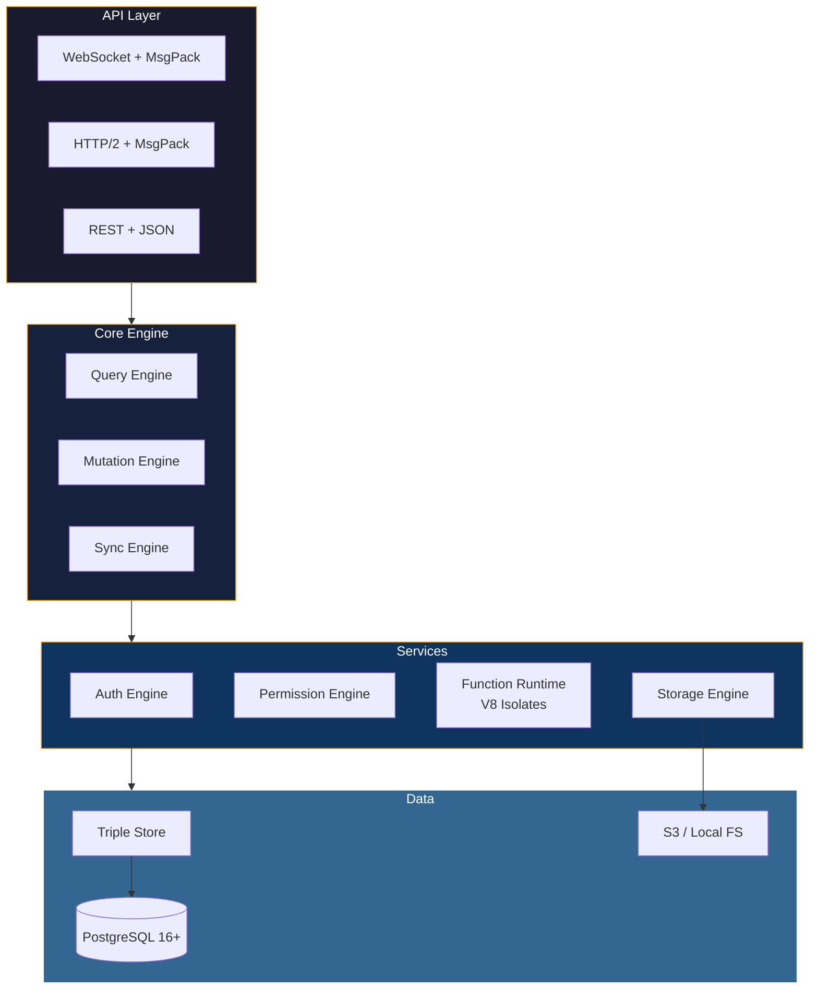

# ddb-server

The DarshJDB server -- a single Rust binary that provides the complete backend: triple-store database engine, DarshanQL query compiler, reactive sync engine, authentication, permissions, file storage, and the V8 function runtime.

## Architecture



| Component | Description |
|-----------|-------------|
| **Triple Store** | EAV (Entity-Attribute-Value) data model over PostgreSQL 16+ with pgvector |
| **Query Engine** | Compiles DarshanQL into optimized SQL with permission injection |
| **Sync Engine** | Tracks query dependencies and pushes delta diffs over WebSocket |
| **Auth Engine** | Email/password (Argon2id), OAuth, magic links, MFA (TOTP), JWT RS256 |
| **Permission Engine** | Row-level and field-level security evaluated on every request |
| **Function Runtime** | V8 isolates (via Deno Core) for sandboxed TypeScript execution |
| **Storage Engine** | S3-compatible file storage with signed URLs and image transforms |
| **REST Handler** | Full CRUD API for clients that cannot use WebSocket |

## Source Structure

```
src/
  main.rs              # Entry point, server bootstrap
  lib.rs               # Library root, module declarations
  error.rs             # Error types and conversions
  api/                 # HTTP and WebSocket route handlers
  auth/                # Authentication engine (Argon2id, JWT, OAuth, MFA)
  functions/           # V8 function runtime (queries, mutations, actions, cron)
  query/               # DarshanQL parser, compiler, and SQL generator
  storage/             # File storage engine (local, S3, R2, MinIO)
  sync/                # Reactive sync engine (dependency tracking, delta diffs)
  triple_store/        # EAV data model, CRUD operations, indexing
```

## Building

```bash
# From the workspace root
cargo build --release -p ddb-server
```

The binary is output to `target/release/ddb-server`.

## Running

```bash
# Development
DATABASE_URL="postgres://localhost/darshjdb" cargo run -p ddb-server

# Production
DATABASE_URL="postgres://user:pass@db:5432/darshjdb" \
  DDB_PORT=7700 \
  RUST_LOG=warn \
  ./target/release/ddb-server
```

## Configuration

All configuration is via environment variables. See the [Self-Hosting Guide](../../docs/self-hosting.md) for the full list.

## Key Dependencies

| Crate | Purpose |
|-------|---------|
| **axum** + **tokio** | Async HTTP/WebSocket server |
| **sqlx** | Async PostgreSQL driver with compile-time query checking |
| **jsonwebtoken** | JWT signing and verification (RS256) |
| **argon2** | Password hashing (Argon2id) |
| **rmp-serde** | MessagePack serialization for the wire protocol |
| **dashmap** | Lock-free concurrent hash map for subscription tracking |
| **oauth2** | OAuth 2.0 client for Google, GitHub, Apple, Discord |
| **tower** + **tower-http** | Middleware stack (CORS, rate limiting, compression) |
| **notify** | File system watcher for hot reload |
| **cron** | Cron expression parser for scheduled functions |

## Testing

```bash
# Run server tests
cargo test -p ddb-server

# Run with logging
RUST_LOG=debug cargo test -p ddb-server -- --nocapture
```

## Documentation

- [Architecture](../../docs/architecture.md)
- [Getting Started](../../docs/getting-started.md)
- [Self-Hosting](../../docs/self-hosting.md)
- [Security Architecture](../../docs/security.md)
- [Performance Tuning](../../docs/performance.md)
